# Gator Quant Hacks 2026 — Trade the 8-K

This repository contains a modular version of the Massive 8-K options challenge starter. The notebook remains the visual research walkthrough; `run_all.py` is a command-line entry point for one study window. Both use the same `src/` implementation and ship without saved results.

## Offline backtest and Jupyter notebook

Start with [the reproducible backtest notebook](notebooks/repository-data-and-backtest.ipynb) and [its setup guide](docs/repository-data-workflow.md). It runs the existing options engine twice on a small SHA-256-pinned synthetic snapshot, verifies matching results, and displays its inputs, assumptions and outputs. It needs no API key or market-data download. The synthetic example demonstrates reproducibility; it does not establish qualified historical strategy performance, net portfolio NAV or Sharpe.

Use Python 3.11 in a dedicated environment. On Windows:

```powershell
py -3.11 -m venv .venv-notebook
.venv-notebook\Scripts\python.exe -m pip install -r requirements-notebook-lock.txt
.venv-notebook\Scripts\python.exe -m ipykernel install --user --name quanthaxs-offline --display-name "QuantHaxs offline (Python 3.11)"
.venv-notebook\Scripts\python.exe -m jupyterlab notebooks/repository-data-and-backtest.ipynb
```

On macOS/Linux, create the environment with `python3.11 -m venv .venv-notebook` and use `.venv-notebook/bin/python` for the remaining commands. Select **QuantHaxs offline (Python 3.11)** and run all cells from a fresh kernel. The pinned file contains direct package versions; installed versions are recorded in each run receipt.

The notebook also invokes the existing canonical wording/account runner in engineering mode. Its frozen long/short protocol exports every 2024 calendar session for strategy and matched baseline, using explicitly fabricated inputs. Real historical use still requires the exact qualified text/model/source, executable market, cost, borrowing and account evidence.

For a terminal replay or a headless notebook execution:

```bash
python scripts/reproduce_backtest.py --output-dir data/processed/replay-check/run-1
python scripts/reproduce_backtest.py --output-dir data/processed/replay-check/run-2 --compare data/processed/replay-check/run-1
python scripts/execute_repository_notebook.py --output data/processed/notebook-executions/repository-data-and-backtest.ipynb
python scripts/run_simple_wording_backtest.py --root . --mode engineering --output-dir data/processed/wording-demo
```

Use your environment's Python and fresh output paths. The runner rejects changed input hashes and existing outputs. Generated data, executed notebooks and credentials stay outside Git. The Backtest and notebook workflow verifies the bundled replay and notebook on GitHub.

## Run the licensed-data challenge notebook

You need Python 3.10+ and a Massive API key with access to the challenge data.

1. Run `powershell -ExecutionPolicy Bypass -File setup.ps1` on Windows, or `./setup.sh` on macOS or Linux. This creates `.venv`, installs `requirements.txt`, registers a Jupyter kernel, and copies `.env.example` to `.env`.
2. Put your key in the local `.env` file by replacing `your-key-here` there. Keep this file private; leave `.env.example` as the public template.
3. Start JupyterLab with `.venv\Scripts\activate; jupyter lab` on Windows, or `source .venv/bin/activate && jupyter lab` on macOS or Linux.
4. Edit [`src/config.py`](src/config.py) for the research tag, date windows, universe, and assumptions. Restart the notebook kernel after a change.
5. Open [`gator-quant-hacks-8k-options-challenge.ipynb`](gator-quant-hacks-8k-options-challenge.ipynb), select **Python (Gator Quant Hacks .venv)**, and run all cells.

For a repeatable single-window run, use:

```bash
python run_all.py --tag cfo_appointment --start 2024-01-01 --end 2025-12-31
```

Use `--max-events 1` for an API-access smoke test. The runner writes `events.csv`, `dropped.csv`, `results.csv`, `scoreboard.csv`, `capacity.csv`, and `manifest.json` to ignored `data/processed/`. It accepts `--capital`, `--risk-fraction`, `--participation`, and `--cost-haircut` to state sizing assumptions. Run `python run_all.py --help` for all arguments. To compare windows, run it once per window with different `--output-dir` values; the notebook includes the in-sample, placebo, and out-of-sample comparison plots.

The client also accepts `MASSIVE_API_KEY` from the environment. A first full notebook run can take around ten minutes; later runs reuse `.massive_cache/`.

**Timing rule:** the raw 8-K API gives a filing date without an acceptance time. To avoid entering before an after-close filing, `post` enters at the close of the first trading session strictly **after** that date. `pre` is the last trading close strictly **before** the filing date. The placebo uses the same one-session lag. This conservative rule can miss a same-day opportunity after a morning filing; it prevents timing lookahead without requiring a second data source. The notebook's optional SEC section audits acceptance times but does not change a completed backtest.
This changes the starter notebook's same-day entry assumption, so its P&L can differ from an unmodified starter run.

## Repository layout

| Path | Purpose |
|---|---|
| `gator-quant-hacks-8k-options-challenge.ipynb` | Visual research walkthrough and comparative analysis |
| `run_all.py`, `src/main.py` | Reproducible command-line runner and CSV/manifest output |
| `src/data.py` | API access, cache, calendar, disclosure events, and options bars |
| `src/document_ocr.py` | Optional scanned-document OCR with per-page text and source hashes |
| `src/implementation.py` | Option leg pricing and six-strategy P&L engine |
| `src/risk_management.py` | Bootstrap uncertainty, comparison tables, and loss budget |
| `src/capital_liquidity.py` | Cash collateral, option volume limits, and cost assumptions |
| `src/config.py` | Shared study parameters |
| `scripts/import_tiger.py` | Repeatable import of local API cache and study outputs into Tiger Cloud |
| `tests/` | Offline tests for event construction, P&L, risk, and capacity |
| `requirements.txt`, `setup.ps1`, `setup.sh`, `.env.example` | Reproducible setup and key template |
| `requirements-ocr.txt` | Optional OCR Python dependencies |
| `data/README.md` | Data handling and download notes |
| `docs/financial-profile-research.md` | SEC form coverage, no-key data sources, document/OCR access, and financial reconciliation design for the Tiger CIK universe |
| `docs/company-sector-breakdown.md` | SIC-based industry split of the 1,630 Tiger 8-K filers, with counts, definitions, sources, and limits |
| `examples/` | Documentation example showing the raw API response shape; **not** study data |
| `references/` | Downloaded challenge briefs and original starter archives |

The general [systematic-trading brief](references/systematic-trading-track-brief.txt) shows a separate `data/`, `src/`, and `run_all.py` layout as an **example**. The [Massive challenge brief](references/massive-bonus-challenge-brief.txt) specifies a notebook that runs the whole comparative study, so this repository also keeps the notebook as a runnable report.

## Risk and capacity assumptions

`src/risk_management.py` limits whole contracts by a chosen maximum loss per event. `src/capital_liquidity.py` further limits contracts by available cash and a chosen fraction of the least-traded required option leg's daily volume. A cash-secured put reserves the full strike amount. Strategies that represent stock with an ATM call and put reserve a 100-share stock equivalent. The cost model applies a configurable fraction of each option premium on each side, including the ATM synthetic pair. These are research assumptions from last-trade marks and daily volume, not live quotes or broker margin checks.
Both cash and maximum-loss contract limits include the modeled round-trip costs. Each event is sized independently; simultaneous positions need a portfolio-level allocation rule before trading.

Run offline checks with `.venv\Scripts\python.exe -m unittest discover -s tests -v`.

## Data and secrets

The notebook fetches disclosures from Massive's `/stocks/filings/8-K/vX/disclosures` endpoint and obtains options data from Massive. Its raw API responses are cached in `.massive_cache/`. The cache, `.env`, and any downloaded raw or processed data under `data/` are ignored by Git. Do not commit licensed market data or API keys.

The JSON file in `examples/` is copied from [Massive's public 8-K Disclosures documentation](https://massive.com/docs/rest/stocks/filings/8-k-disclosures) solely to explain the response format. It is not a live query or a result from the notebook.

The repository contains the runner, notebook, tests, downloaded challenge references, and a public API response example. A Massive API key is required to download the study data and reproduce event rows and results.

For a proposed company-financials dataset based on the 1,630 CIKs exported from Tiger, read the [financial profile research](docs/financial-profile-research.md). SEC public filing and XBRL APIs require no API key. The proposed financial statements and documents have not yet been imported into Tiger.

## OCR scanned documents

Install optional Python dependencies with `.venv\Scripts\python.exe -m pip install -r requirements-ocr.txt` on Windows (or `.venv/bin/python -m pip install -r requirements-ocr.txt` on macOS/Linux). Install the [Tesseract executable](https://tesseract-ocr.github.io/tessdoc/Installation.html) separately and make it available on `PATH`. The module reads PNG, JPEG, TIFF (including all pages), BMP, WebP, and scanned PDF files. PDF pages are rendered with pypdfium2 before OCR.

```powershell
.venv\Scripts\python.exe -m src.document_ocr data\raw\sample-scan.pdf --output data\processed\ocr\sample-scan.json
```

The module also detects common Windows user and system installation paths. For another location, add `--tesseract-cmd "C:\path\to\tesseract.exe"`. The output contains full text, per-page text, page count, Tesseract word-confidence averages, the OCR settings and engine version, and a SHA-256 hash of the input file. Confidence is a recognition diagnostic, **not** proof that amounts or tables were read correctly. OCR text is not yet parsed into financial statements or imported into Tiger. Prefer direct text/XBRL extraction for documents that already contain machine-readable data.

This module uses the image-to-text architecture reviewed in [Sun-Biz-Aggregator](https://github.com/IlanDanial/Sun-Biz-Aggregator/tree/060050d6daa376049e0fe60edf8ee27c0d3a7e40). It is independently implemented here because that repository does not include a license file; its Florida UCC form parsers and training scripts are not bundled.

## Copy local data to Tiger Cloud

After authenticating with the Tiger CLI (`tiger auth login`) and running a study, import the local cache and all manifested runs under `data/processed/`:

```bash
python scripts/import_tiger.py --service-id YOUR_TIGER_SERVICE_ID
```

Use `--dry-run` to see the file and row counts without writing. The importer uses the CLI's saved credentials; no database password enters the repository. It creates the `quant_hacks` schema with `source_files` (exact file bytes and SHA-256 hashes), `study_runs` (manifests), `study_rows` (CSV rows as JSON), and an `api_responses` JSON view. Repeating the import updates the same files and study run instead of adding duplicate rows. See [data/README.md](data/README.md) for example queries. Local files remain in place as a second copy.

## Teammate sources and passing PR merges

Benchmark and Benchmark Part 2 contributors use this repository's shared document schema and independent `codex/source-<source-id>-<owner>` branches. Start with the [team data guide](docs/team-data/README.md), [source contract](docs/team-data/source-contract.md) and [agent instructions](AGENTS.md). The guide includes a copyable agent prompt, source registration, OCR setup, synthetic fixtures, safe rebasing and exact-head merging.

Register `configs/sources/<source-id>/{source.json,manifest.jsonl,README.md}` using the [source metadata](templates/team-data/source.template.json) and [manifest](templates/team-data/manifest.template.jsonl) templates. Commit URLs, adapters, matching tests and small synthetic fixtures. Download originals into ignored `data/raw/team_sources/<source-id>/` and write results into ignored `data/processed/team_sources/<source-id>/`; full-data storage will be decided later.

Run these setup checks before opening a source PR:

```powershell
python scripts/validate_team_sources.py --repo-root .
python scripts/run_document_batch.py --manifest examples/team_data/manifest.jsonl --output-dir data/processed/team_sources/onboarding-smoke --engine native
python -m unittest tests.test_source_validation tests.test_source_pr_policy tests.test_shared_review tests.test_document_manifest tests.test_document_transcript tests.test_document_evidence tests.test_document_language tests.test_document_report tests.test_analyze_8k_documents
git fetch origin
python scripts/check_source_pr.py --repo-root . --base origin/main --head HEAD --branch YOUR_SOURCE_BRANCH
```

Run source adapter tests as well. The validator rejects missing metadata, unresolved placeholders, duplicate or unnamespaced IDs, invalid URLs/paths/hashes and invalid UTC fields. Sources marked extracted also need a hashed synthetic TXT/HTML fixture; validation runs extraction and checks transcript hashes and evidence slices. Discovery registrations can pass without downloading originals and do not claim OCR readiness.

Teammate agents are authorized to merge passing **source-only** PRs using the [source PR checklist](.github/PULL_REQUEST_TEMPLATE/data-source.md). GitHub requires `source-configuration` and `Source adapter tests` on the current PR version. The first uses trusted base code to validate candidate configuration and source-only scope; the second runs the published offline suite and adapter tests without write credentials. Main must be up to date, and the merge command must use `--match-head-commit` as shown in the guide. Shared schema, pipeline, workflow or validator changes need a separate maintainer-reviewed PR.

For shared changes, the repository owner must approve the current commit in GitHub. For a PR they authored, they can instead post the exact comment `approve-shared-change: FULL_HEAD_SHA`. The owner then applies or reapplies a label (for example, run-source-checks) to rerun the trusted check. A new push invalidates the previous approval. Using a different branch name does not bypass this review requirement.

These checks establish configuration and reproducible intake behavior. Actual scanned-page recognition requires a local OCR pilot with the selected backend; accepted benchmark features still require the relevant producer/consumer checks.

# Soybean weather-signal backtester

A walk-forward backtester that tests whether U.S. Corn Belt weather predicts soybean futures returns during the pod-set and seed-fill window (July–August). The project also tests the same rules on corn, wheat, cocoa, sugar, coffee and cotton, to see whether any effect is specific to soybeans.

**Status: no edge demonstrated.** The frozen soybean spec was run once on its holdout (June 2025 onward). The pre-registered pass rule needs at least 10 trade episodes. The v1 engine run gave 9 episodes and FAILED. The later v2 engine run gave 10 episodes and met that count, but the holdout had already been seen during development, so it cannot be treated as a clean test. Full-history results are not clearly distinguishable from zero. See [Results](#results) and [Caveats](#caveats).

---

## Contents

1. [Research question and economic rationale](#1-research-question-and-economic-rationale)
2. [Instruments and data sources](#2-instruments-and-data-sources)
3. [Regions and production weights](#3-regions-and-production-weights)
4. [Signal construction](#4-signal-construction)
5. [Trading rules and position sizing](#5-trading-rules-and-position-sizing)
6. [Risk controls](#6-risk-controls)
7. [Execution and costs](#7-execution-and-costs)
8. [Performance metrics and statistical tests](#8-performance-metrics-and-statistical-tests)
9. [Research method and governance](#9-research-method-and-governance)
10. [Experiment log](#10-experiment-log)
11. [Results](#results)
12. [Configuration](#12-configuration)
13. [Project layout](#13-project-layout)
14. [Running it](#14-running-it)
15. [Caveats and known limitations](#caveats)
16. [Glossary](#16-glossary)

---

## 1. Research question and economic rationale

**Question.** Does daily weather in the main U.S. soybean states, during the reproductive stages of the crop, predict the soybean futures return over the following weeks?

**Why this window.** Soybean yield is most sensitive to stress during pod set and seed fill (growth stages R3–R6), which fall in roughly July and August in the Corn Belt. Heat above about 35 °C, cold below about 15 °C, and a dry week (under 30 mm rainfall) are the stresses the model watches. A poor August can cut expected yield, and markets revalue expected supply as crop-condition reports and weather forecasts arrive.

**The mechanism being tested.** Weather → crop stress → expected yield → expected supply → futures price. The strategy is designed to trade the price move that follows a stress signal before it fully reflects the damage.

**Why it might not work (and the reason the project tests it rather than assumes it).**
- Weather forecasts and crop-condition data are public and widely followed. Prices may already reflect expected weather damage, leaving little to trade after the fact.
- The yield relationship is noisy. Soybean yield also depends on disease, pests, planting date, and genetics, none of which the model sees.
- Weather is measured on a coarse grid (0.5°) and averaged across four states, so the signal may not match field conditions.
- Price data is a continuous front-month series, so roll dates and contract changes can add noise.

**Other commodities.** The same engine is run on corn (Illinois, Indiana, Iowa, Nebraska), wheat (Kansas, Oklahoma, Texas), cocoa (West Africa), sugar and coffee (Brazil), and cotton (U.S. South). Each has a biological reason to expect a weather window (for example, Brazilian coffee frost risk in June–August). The cross-commodity tests show whether results hold beyond soybeans, or whether they are an artefact of one period.

---

## 2. Instruments and data sources

### 2.1 Futures prices

Prices come from Yahoo Finance (`yfinance`), daily OHLCV. The tickers below are mapped in `soyweather/data/futures_prices.py`:

| Commodity | Yahoo ticker | Exchange | Used in |
|---|---|---|---|
| Soybeans | `ZS=F` | CBOT | Main strategy |
| Corn | `ZC=F` | CBOT | Price-ratio feature; cross-check |
| Wheat | `ZW=F` | CBOT | Cross-check; wheat specs |
| Soybean oil | `ZL=F` | CBOT | Mapped, not tested |
| Soybean meal | `ZM=F` | CBOT | Mapped, not tested |
| Sugar | `SB=F` | ICE | Development-only spec |
| Coffee (arabica) | `KC=F` | ICE | Development-only spec |
| Cotton | `CT=F` | ICE | Development-only spec |
| Cocoa | `CC=F` | ICE | Cocoa tests (archive) |
| Natural gas | `NG=F` | NYMEX | Mapped, not tested |
| Live cattle | `LE=F` | CME | Mapped, not tested |
| Lean hogs | `HE=F` | CME | Mapped, not tested |

**Caveat.** Yahoo returns continuous front-month series. Their roll rules are not documented here, so price jumps at contract roll dates are possible. The project does not adjust for them.

Prices are cached per request for one day (`ttl_days=1`). Requests fail loudly; there is no synthetic fallback.

### 2.2 Weather (NASA POWER)

Daily values for each region from the NASA POWER API (`community=AG`):

| NASA POWER field | Engine name | Meaning |
|---|---|---|
| `T2M` | `temp_avg` | Mean air temperature at 2 m (°C) |
| `T2M_MAX` | `temp_max` | Daily maximum temperature (°C) |
| `T2M_MIN` | `temp_min` | Daily minimum temperature (°C) |
| `PRECTOTCORR` | `precipitation` | Precipitation (mm/day, bias-corrected) |
| `ALLSKY_SFC_SW_DWN` | `solar_radiation` | All-sky surface solar radiation (MJ/m²/day) |
| `WS2M` | `wind_speed` | Wind speed at 2 m (m/s) |
| `RH2M` | `relative_humidity` | Relative humidity at 2 m (%) |
| `CLRSKY_SFC_SW_DWN` | `clear_sky_solar` | Clear-sky solar radiation (soybean extra) |
| `GWETROOT` | `soil_moisture_root` | Root-zone soil wetness, 0–1 (soybean extra) |

Missing values (−999) are converted to NaN. Requests are paced at one second per call to respect NASA's rate limit.

### 2.3 Climate indices (NOAA ONI)

The Oceanic Niño Index (ONI) comes from NOAA's CPC ASCII file. ONI is a three-month running mean of Niño 3.4 sea-surface temperature anomalies. Positive values mean El Niño; negative values mean La Niña. NOAA publishes each value about two months after its centre month, so the engine makes each value available only from centre month + 2 months. This avoids look-ahead.

### 2.4 USDA NASS

- **National soybean yield** (bushels/acre): August and September Crop Production forecasts and the final yield, from the QuickStats API. Used in `usda_yield_test.py`.
- **Weekly crop condition**: percent good and excellent, national, 2000–2025. Used in `crop_condition_test.py`.

Both need `NASS_API_KEY` in `.env`. The key is never printed or written to output.

---

## 3. Regions and production weights

Soybean weather is averaged across four states, weighted by approximate production share. Coordinates are the sampling points used for the NASA POWER requests (`soyweather/regions.py`):

| Region | Latitude | Longitude | Weight |
|---|---|---|---|
| Iowa | 42.0 | −93.5 | 0.30 |
| Illinois | 40.0 | −89.0 | 0.30 |
| Minnesota | 45.0 | −94.0 | 0.20 |
| Indiana | 40.3 | −86.1 | 0.20 |

Weights sum to 1.0 (checked by `validate_weights`). Each regional value is multiplied by its weight and summed to give one commodity-level series per day. When a region is missing a value, the remaining weights are renormalised (in the soybean-only extras).

---

## 4. Signal construction

The pipeline runs in this order. Each step uses only information available on the day it is applied.

### Step 1: seasonal z-scores (`features/seasonal.py`)

For each weather variable (`temp_avg`, `temp_max`, `temp_min`, `precipitation`) and each calendar day (month-day key):

```
z_t = (X_t − μ_season,t) / (σ_season,t + 1e-6)
```

`μ` and `σ` are the expanding mean and standard deviation of earlier observations on the same calendar day, shifted by one year. Missing history falls back to the full-sample mean and standard deviation. The shift guarantees no look-ahead.

### Step 2: stress indicators (`features/stress.py`)

Using soybean thresholds from `soyweather/stress_thresholds.py`:

| Indicator | Definition | Threshold |
|---|---|---|
| `heat_stress` | `temp_max > 35 °C` (flag) | `temp_critical_high = 35` |
| `cold_stress` | `temp_min < 15 °C` (flag) | `temp_critical_low = 15` |
| `dry_stress` | 7-day rainfall sum `< 30 mm` (flag) | `precip_threshold_dry = 30` |
| `heat_stress_z` | `max(temp_max_z, 0)` | upward deviations only |
| `cold_stress_z` | `|min(temp_min_z, 0)|` | downward deviations, sign flipped |
| `dry_stress_z` | `|min(precipitation_z, 0)|` | downward deviations, sign flipped |

Every stress column (flags and z-scores) is then summed over trailing windows of 7, 14 and 30 days, giving columns such as `heat_stress_7d`, `cold_stress_14d`, `dry_stress_30d_z`.

The soybean thresholds also list growing degree-day values (`gdd_base = 10`, `gdd_optimal = 30`). The current stress code does not compute GDD columns, so these values are not used by the signal.

### Step 3: regional aggregation (`features/regional.py`)

Every column whose name contains `stress` or `gdd` is combined across regions with the production weights:

```
F_soy,t = Σ_i  w_i · F_region_i,t        (missing regions filled 0, then forward-filled)
```

Output columns carry the suffix `_agg`, for example `heat_stress_7d_agg`. Raw weather is not aggregated, only stress and GDD indicators.

### Step 4: soybean-only extras (`features/soybean_extras.py`)

Each extra is a switch in `SOYBEAN_FEATURE_SWITCHES`. Feature tests (section 10) chose which to keep on.

| Feature | Default | Definition |
|---|---|---|
| `price_ratio` | **on** | Soybean ÷ corn front-month close, with 7/14/30-day rolling means |
| `enso` | **on** | NOAA ONI (lagged two months), with 7/14/30-day rolling means |
| `cloud` | off | Cloud fraction = 1 − all-sky ÷ clear-sky solar, production-weighted |
| `soil_moisture` | off | Root-zone soil wetness, production-weighted |
| `disease` | off | Share of humid, mild days (RH > 85% and 18–30 °C), a proxy for fungal pressure |

Rolling extras are named `{feature}_agg`, `{feature}_agg_7d`, `_14d`, `_30d`.

### Step 5: feature selection (`models/ridge.py`, `models/direction.py`)

1. Keep only columns containing `_agg` and one of `_7d`, `_14d`, `_30d`. If none exist, fall back to all `_agg` columns, then to all numeric columns.
2. If more than `MAX_FEATURES` (default 15) remain, keep the 15 with the highest absolute correlation to the forward-return target over the training window.
3. Fill missing values with 0.

### Step 6: forecast (`models/ridge.py`)

- **Target:** the forward return over `FORWARD_RETURN_DAYS` (default 10 sessions): `Y_t = (P_{t+10} − P_t) / P_t`.
- **Scaling:** `StandardScaler` fitted on the training window only.
- **PCA:** keeps enough principal components to explain 95% of variance (`PCA_N_COMPONENTS = 0.95`). The engine applies it before both the Ridge model and the direction classifier. It is disabled for tree models.
- **Model:** Ridge regression, `alpha = 1.0`.
- **Training window:** the trailing `TRAIN_WINDOW_YEARS × 252` sessions (code default 3 years, see section 12 for the `.env` override).
- **Refit:** once per commodity per calendar month. The fitted models are cached and reused through that month.
- **Minimum history:** the engine waits for at least 252 sessions before forecasting, and the training window needs at least 252 labelled rows.

### Step 7: direction classifier (`models/direction.py`)

A logistic regression (`C = 1.0`, `max_iter = 1000`, `random_state = 42`) is trained on the same scaled features and window, with label 1 when the forward return is positive and 0 otherwise. If the training window has only one class, the classifier is skipped.

### Step 8: confirmation veto (`simulation.py`)

If the Ridge forecast and the classifier disagree on direction, and the classifier's probability for its own call is above **0.65**, the signal is set to zero. A disagreement the classifier is not confident about is allowed through.

### Step 9: signal normalisation (`simulation.py`)

The raw forecast is converted to a z-score against the last 60 forecasts for that commodity:

```
signal_t = clip( (f_t − mean(last 60 f)) / std(last 60 f),  −3, +3 )
```

Until five forecasts exist, the signal is `f_t / (20-day realised vol × √252)` instead.

Note the signal is relative: it is high when today's forecast is unusually high compared with recent forecasts, not when the forecast is high in absolute terms.

---

## 5. Trading rules and position sizing

### 5.1 Trading window

- **Soybeans default in code:** July and August only (`COMMODITY_TRADE_MONTHS`).
- **Gate:** on the first day of a non-trading month, any open position is closed and its queued fill is discarded. No new position is opened outside the window.

### 5.2 From signal to target position (`simulation.py`)

In **directional** mode (the default, `STRATEGY_MODE = directional`):

```
target = sign(signal) × FIXED_POSITION_SIZE    if |signal| ≥ MIN_SIGNAL_STRENGTH
target = 0                                     otherwise
```

Then clipped to `±MAX_SINGLE_POSITION`, and to `±max_gross = 1.0` at execution.

In **magnitude** mode (`STRATEGY_MODE = magnitude`), the target is scaled by volatility: `signal × TARGET_PORTFOLIO_VOL / realised_vol`. This mode is implemented but was not used in any reported test.

The position is a fraction of equity. With `FIXED_POSITION_SIZE = 0.5` (code default), a long position has 50% of equity exposed to the futures return.

### 5.3 Position filters (`POSITION_FILTERS`)

These are applied to the signal before sizing. Each can be switched off by setting it to `None`.

| Filter | Default | Effect |
|---|---|---|
| `vol_percentile_hi` | 0.80 | Skip a signal when today's 20-day realised volatility is in the top 20% of the prior year's values (needs at least 60 values) |
| Fixed volatility cap | 10.0 for soybeans (disabled) | Skip when realised volatility exceeds the commodity's cap. Corn/wheat/cocoa tests used 0.30 |
| `trend_sma` | `None` (off) | Long only above, and short only below, an N-day moving average |
| `stop_loss_pct` | 0.05 | Close after a 5% loss from the entry price |

---

## 6. Risk controls

| Control | Where | Behaviour |
|---|---|---|
| Season exit | `simulation.py` | Position flattened at the first session outside the trade months |
| Stop-loss | `simulation.py` | Position closed when unrealised loss exceeds 5% of entry price. The sign is flipped for shorts. Later signals may re-open the position |
| Volatility filter | `simulation.py` | No new position when volatility is in its top 20% of the prior year |
| Classifier veto | `simulation.py` | No trade when the classifier strongly disagrees with the forecast |
| Position cap | `simulation.py` | `|position| ≤ MAX_SINGLE_POSITION` (1.0 in code, 0.20 in `.env`) |
| Gross cap | `simulation.py` | `Σ |position| ≤ 1.0` of equity |
| Margin | `simulation.py` | Margin held = 10% of gross exposure; cash = equity − margin |

**What is not modelled.** Margin calls, forced liquidation, contract multipliers, daily settlement, financing costs on margin, and exchange position limits. Equity is marked to market on closing prices only.

---

## 7. Execution and costs

- **Fill timing.** A signal at day *t*'s close is filled at day *t+1*'s close (`EXECUTION_ASSUMPTIONS['next_day_fill'] = True`). A signal computed on the last day of a season is discarded.
- **Transaction cost.** `cost = equity × |Δposition| × (TRANSACTION_COST_BPS + half_spread) / 10,000`.
  - `TRANSACTION_COST_BPS` = 10 bps base case; stress tests at 25 and 50 bps.
  - `half_spread` = 1 bp for soybeans (`half_spread_bps`), 2 bps default for other commodities.
- **Slippage.** Beyond the half-spread, none. Fills are at the close price.
- **Margin.** Initial margin 10% of gross exposure (`margin_pct`). Used only to compute cash.
- **Capital.** Starting capital 1,000,000 (the `INITIAL_CAPITAL` setting).

---

## 8. Performance metrics and statistical tests

### 8.1 Definitions (`metrics.py`, `summary.py`)

| Metric | Definition |
|---|---|
| Total return | Final ÷ initial portfolio value − 1 |
| Annualised return | `(1 + total)^(252 / n_sessions) − 1` |
| Annualised volatility | Standard deviation of daily returns × √252, computed on active days only |
| Sharpe ratio | Annualised mean ÷ annualised standard deviation of daily returns, risk-free rate taken as 0 |
| Sortino ratio | As Sharpe, with downside deviation (negative returns only) |
| Calmar ratio | Annualised return ÷ |max drawdown| |
| Max drawdown | Largest peak-to-trough fall in portfolio value |
| Win rate | Share of trades (episodes) with positive net P&L |
| Profit factor | Gross gains ÷ gross losses |
| Episodes (trades) | A continuous run of one position sign, from entry to exit. A flip from long to short counts as a new episode. P&L is the sum of daily P&L minus costs over the run |
| Active days | Sessions with a non-zero return |

### 8.2 Confidence intervals

The 95% interval for Sharpe uses a **block bootstrap**. Daily returns are resampled in contiguous 21-session blocks (about one month), 2,000 draws, fixed seed 0. Daily returns are autocorrelated, so a plain bootstrap would understate uncertainty. The reported interval is the 2.5th to 97.5th percentile of the bootstrapped Sharpe ratios.

### 8.3 Pass and fail rules (set before each run)

Rules are written into each spec document before its test is run. The main soybean rule (`SOY_JULAUG_PCT80_v1.md`):

- **PASS** only if all of the following hold on the holdout at 10 bps: net Sharpe > 0; max drawdown no worse than −25%; at least 10 independent trade episodes.
- **Robust PASS** additionally requires net Sharpe > 0 at 25 bps.
- Anything else is **FAIL**. A fail rejects the spec. It does not justify changing settings and retesting on the same holdout.

The development-only specs (sugar, coffee, cotton, wheat May–June) use a different rule: development Sharpe > 0, 95% confidence interval excluding zero, and at least 20 episodes.

---

### 8.4 Statistical inference on the frozen spec

Run by `soybean/experiments/inference_suite.py` on the saved daily output (`reference_frozen_exec2_full.csv`, verified by `regression_check.py`) and the soybean futures closes. Some of these tests were new; the rest were already in the repo, as noted below.

Already done before this run: block-bootstrap Sharpe CIs (`run_summary.py`), the forecast-skill Spearman test (`skill_and_cost_check.py`), the pre-registered season tests with Bonferroni correction (section 10.2), and the cost break-even (S9).

New in this run:

| Test | Full history (2000–2026, 5,794 days) | Holdout (Jun 2025 on, 336 days) |
|---|---|---|
| Sharpe (annualised, net) | +0.35 | +1.81 |
| Block-bootstrap 95% CI (5,000 draws) | −0.10 to +0.74 | +0.50 to +3.20 |
| Bootstrap p-value, one-sided H₀: Sharpe ≤ 0 | 0.056 | 0.016 |
| Probabilistic Sharpe ratio, P(true Sharpe > 0) | 0.96 | 0.99 |
| Deflated Sharpe ratio (47 configurations tried) | **0.27** | 0.42 |
| Permutation p-value, gross Sharpe (5,000 circular shifts) | 0.028 | 0.023 |
| Episodes / wins | 67 / 32 | 10 / 9 |
| Win rate, Wilson 95% CI | 47.8% (36% to 60%) | 90% (60% to 98%) |
| Win rate vs 50%, exact binomial p (two-sided) | 0.81 | 0.021 |
| Sharpe minus in-season buy-and-hold, 95% CI (paired bootstrap) | +0.23 to +1.37, p = 0.003 | −0.78 to +2.21, p = 0.21 |
| Skewness / excess kurtosis (daily net returns) | 5.8 / 138 | 3.4 / 26 |

**How to read these.**

- **Full history.** The Sharpe is positive, but its bootstrap interval includes zero. The permutation test says the timing carries information before costs: shifting the same positions to random dates beats the observed gross Sharpe only 2.8% of the time (figure below). After correcting for about 47 configurations tried, the deflated Sharpe of 0.27 is far from conventional significance. Win rate does not differ from 50%.
- **Holdout.** The Sharpe and win rate look strong, but this is 10 episodes from a period that was already used in development. The deflated Sharpe is 0.42, and the Sharpe does not beat simply holding soybeans through July and August (p = 0.21). Treat it as a hypothesis for the forward test, not as confirmation.
- **The forecast itself has no detectable rank skill** on development data (Spearman −0.04, p = 0.20). The trading rule uses a z-score of the forecast against its recent history, not the raw forecast, so the forecast's ranking and the traded signal are not the same thing. This should be checked before the forward test.


*Equity and drawdown for the frozen spec. The shaded holdout is not clean evidence (section 9.1).*


*The 21-session block bootstrap. Dashed lines are the observed Sharpes; the black line marks zero. The holdout distribution is wide because it has only 336 days.*


*Timing test. The grey histogram is the gross Sharpe when the same position series is circularly shifted against the returns. The red line is the observed gross Sharpe (+0.39, p = 0.028). It is a one-sided test, before costs.*


*Left: development forecasts against realised 10-session returns. Right: mean outcome per forecast decile. The relationship is flat, which matches the non-significant Spearman test.*


*Net P&L of each trade episode, as a percentage of starting capital. Gains are concentrated: the 10 best days produce 22% of gross gains.*

**Caveats specific to this section.**

- The deflated Sharpe uses N = 47 trials and approximates the variance of Sharpe estimates as 1/T. The true number of configurations and their correlation both affect the result.
- Skewness and kurtosis are computed over all calendar days. Most days are flat (557 active days of 5,794), which inflates kurtosis. Active-day statistics would be less extreme.
- The permutation test is gross of costs and uses circular shifts, which preserve the position structure but break its timing. It tests timing against this specific position pattern.
- The in-season buy-and-hold benchmark is fully invested, while the strategy sizes at 50% of equity, so the comparison is not exposure-matched.

## 9. Research method and governance

### 9.1 Periods

| Period | Use |
|---|---|
| 2000-01-01 to 2025-05-31 | **Development.** Every soybean and cocoa test has used these years to choose settings. Not clean for final evaluation |
| 2025-06-01 to 2026-10-02 | **Holdout** for the frozen soybean spec. Used in the v1 and v2 runs; now spent |
| 2025-06-01 onward | Already scored by the wheat and cross-commodity tests |

```mermaid
flowchart LR
    A[Prices, weather, ONI, USDA] --> B[Seasonal z-scores<br/>expanding, shifted 1 yr]
    B --> C[Stress flags and z-scores<br/>heat, cold, dry]
    C --> D[Rolling 7/14/30-day sums]
    D --> E[Production-weighted<br/>regional _agg]
    E --> F[Soybean extras<br/>price ratio, ENSO]
    F --> G[Feature selection<br/>max 15 by correlation]
    G --> H[Ridge forecast<br/>PCA 95%, refit monthly]
    G --> I[Logistic direction<br/>classifier]
    H --> J{Disagree and<br/>confidence > 0.65?}
    I --> J
    J -- yes --> K[Signal = 0]
    J -- no --> L[Z-score vs last 60 forecasts<br/>clip to ±3]
    L --> M[Filters: season, vol percentile,<br/>5% stop]
    M --> N[Target position, filled next close,<br/>costs 10 bps + half-spread]
```



*Signal pipeline, from raw inputs to the traded position (sections 4 and 5).*

### 9.2 Pre-registration

Each frozen spec is a document in `soybean/spec/`, written before the run it governs, with the rule, the periods, and the pass and fail criteria. The spec documents are not edited after a run. A changed rule must become a new spec (for example v2) with its own untouched holdout.

### 9.3 Trial log

Every run that produces a result is recorded, whether it looks good or not.

- `soybean/spec/trial_log.jsonl`: append-only machine log. Each line has the configuration, a SHA-256 hash of it, the period, and the report. Written by `log_trial()`.
- `soybean/spec/trial_log.md`: human summary. About **47 distinct soybean and cocoa configurations** have been tried, plus repeated runs. Any claim should be discounted accordingly (see section 15).

### 9.4 Regression check

`soybean/experiments/regression_check.py` reruns the frozen spec with the code defaults pinned (not the `.env` values) and compares the daily output with the saved reference, `soybean/results/reference_frozen_exec2_full.csv`. It reports MATCH or DIFFERENT for portfolio value, daily P&L, costs, returns and positions. On the current code it passes with differences below 1e-9.

---

## 10. Experiment log

Settings were chosen during development, and each test's period is shown. "Verdict" is against the test's own pre-stated rule.

### 10.1 Soybean-specific tests

| # | Test (script) | Period | Configurations | Finding | Verdict |
|---|---|---|---|---|---|
| S1 | Trade-month × volatility grid (`grid_soy.py`) | 2010–2023 | 9 (Apr–Jun, May–Aug, Jun–Aug × cap 0.15, 0.20, 0.30) | Sharpe from −0.37 to +0.27; only May–Aug with cap 0.30 was positive | Not robust: one winner out of nine |
| S2 | Wet-stress holdout (`holdout_soy.py`) | Tune 2010–16, holdout 2017–22 | 6 | Mixed; the best holdout (wet stress on, Apr–Jun) had Sharpe +0.23 and did not hold in its tune period | Not supported |
| S3 | Feature holdout (`feature_test.py`) | Tune 2010–16, holdout 2017–22 | 7 (none, each feature alone, all) | `enso` lifted tune Sharpe to +1.06 (holdout +0.29). `cloud`, `soil_moisture` and `disease` hurt. All-on was the worst holdout (Sharpe −0.79) | `price_ratio` and `enso` kept on |
| S4 | Extended validation (`extended_validation.py`) | 2000–09, 2010–16, 2017–22, 2023–25 | 2 (baseline, price+ENSO) | Reported per period; not summarised here | Descriptive |
| S5 | Biology windows (`soy_phenology.py`) | 2000–09 to 2023–25 | 4 (Jun–Aug or Jul–Aug × cap 0.30 or 80th percentile) | Jul–Aug with 80th percentile had Sharpe +0.37, +0.64, −0.86 and +2.72 across the four periods. The 2017–22 period is negative | Chosen for the frozen spec; mixed across periods |
| S6 | Frozen spec `SOY_JULAUG_PCT80_v1` | Holdout 2025-06 to 2026-10 | 1 (run once per engine version) | See [Results](#results) | Holdout spent; see section 11 |
| S7 | Walk-forward selection (`walk_forward.py`) | 2005–2025 | 4 configs per commodity, chosen each year from prior years only | The four fixed soybean configs range from −0.12 to +0.02 Sharpe over 2005–2025 (see 10.3) | Not supported |
| S8 | Forecast skill (`skill_and_cost_check.py`) | Dev 2005–2025, holdout 2025-06 on | Frozen spec | Sign hit rate 52.9% (dev), 43.0% (holdout). Spearman −0.04 (dev, p = 0.20), +0.19 (holdout, p = 0.09) | No significant forecast skill |
| S9 | Cost break-even (same script) | Holdout | Frozen spec at 10, 25, 50 bps | Gross return +8.2% before costs; costs consume 100 bps, 249 bps and 492 bps of starting capital respectively | Costs decide the outcome |
| S10 | Always-long benchmark (`always_long_check.py`) | Jul–Aug 2025, 2026 | Buy and hold | Compares buy-and-hold with the strategy in the same windows | Descriptive |
| S11 | Side and turnover breakdown (`side_pnl_turnover.py`) | Dev and holdout | Frozen spec, 10 bps | Splits P&L between long and short legs and reports turnover | Descriptive |
| S12 | Regression check (`regression_check.py`) | Full history | Frozen spec, code defaults | Reproduces the saved reference exactly | Engine integrity check (passes) |
| S13 | Statistical inference suite (`inference_suite.py`) | Full history and holdout | Frozen spec, saved output | Bootstrap, PSR, DSR, permutation, win-rate and benchmark tests (section 8.4) | Full history not significant after multiple-testing correction; holdout not clean |

### 10.2 Pre-registered season-level tests (development 2000–2024)

Each test fixes its predictors and alpha before running. Bonferroni correction is applied across the predictors in each test.

| # | Test (script) | Predictors | Target | Result | Verdict |
|---|---|---|---|---|---|
| P1 | August weather (`aug_weather_test.py`) | Heat days > 30 °C, August rainfall, night temperature | Aug 1 → Sep 30 soybean return | No predictor significant | Not supported |
| P2 | Air and soil (`air_soil_test.py`) | August soil wetness, cloud fraction, humidity | Same | No predictor significant | Not supported |
| P3 | Crop condition (`crop_condition_test.py`) | Good+excellent % in August; change from July | Same | No predictor significant | Not supported |
| P4 | USDA yield surprise (`usda_yield_test.py`) | August and September forecast minus the trailing five-year final yield | Return over five sessions after the report | Descriptive; see script output | Not supported at the pre-set alpha |
| P5 | Trend into July (`regime_test_dev.py`) | 60-session return to July 1 | Jul–Aug return | Spearman −0.03 | Not supported |

### 10.3 Cross-commodity and other commodities

| # | Test | Result | Verdict |
|---|---|---|---|
| C1 | Soybean Jul–Aug rule on corn (`cross_check_julaug.py`), dev / holdout | Dev Sharpe +0.02 (36 episodes). Holdout Sharpe −1.26 (7 episodes), CI −2.15 to −0.37 | Does not generalise |
| C2 | Soybean Jul–Aug rule on wheat, dev / holdout | Dev Sharpe +0.04 (47 episodes). Holdout Sharpe −1.74 (8 episodes) | Does not generalise |
| C3 | Corn Apr–Jun fixed cap translated to wheat (`run_frozen_wheat.py`), dev / holdout | Dev Sharpe −0.11, CI −0.62 to +0.47 (46 episodes). Holdout Sharpe +0.42, CI −0.85 to +1.25 (7 episodes) | Not significant |
| C4 | Wheat May–June, dev only (`run_wheat_mj_dev.py`) | Sharpe −0.37, CI −0.84 to +0.20 (31 episodes) | FAIL (pre-stated rule) |
| C5 | Sugar, Nov–Feb, dev only (`run_softs_dev.py`) | Sharpe +0.17, CI −0.35 to +0.66 (112 episodes) | FAIL (CI includes zero) |
| C6 | Coffee, Jun–Aug, dev only | Sharpe −0.37, CI −0.90 to +0.15 (57 episodes) | FAIL |
| C7 | Cotton, Jun–Aug, dev only | Sharpe −0.14, CI −0.54 to +0.36 (70 episodes) | FAIL |
| C8 | Cocoa seasons × volatility (`cocoa_validation.py`); fixed configs in the walk-forward comparison | Sharpe varies by window. In the walk-forward comparison the Jun–Sep window was −0.42 (cap 0.30) and −0.34 (80th percentile) | Not robust |
| C9 | Cocoa filters (`cocoa_filters.py`) | Stop-loss and trend variants; results in `soybean/results/cocoa_filters.out` | Descriptive |

The commodity-level walk-forward (S7) also shows that corn with the Apr–Jun fixed cap had the best full-period Sharpe (+0.56, total return +75%). Soybeans were negative in most configurations. That result comes from the corn configuration, not the soybean rule, and it is not a pre-registered test.

---

### 10.4 Parameter sensitivity (development period)

`soybean/experiments/sensitivity_grid.py` varies the two main parameters of the frozen spec over the development period (2000-01-01 to 2025-05-31) and leaves everything else frozen. The holdout is not used. This is descriptive: it shows how fragile the choice is, and it does not pass or fail anything.


*Development Sharpe (net, annualised) for each combination of volatility percentile cap (rows) and stop-loss (columns). "none" removes the percentile filter.*

| Volatility cap | Stop 3% | Stop 5% | Stop 10% | Stop 100% (off) |
|---|---|---|---|---|
| 60th percentile | +0.33 | +0.32 | +0.37 | +0.37 |
| 70th percentile | +0.18 | +0.18 | +0.17 | +0.15 |
| **80th percentile (frozen)** | +0.26 | **+0.27** | +0.28 | +0.25 |
| 90th percentile | +0.04 | +0.03 | +0.03 | +0.01 |
| No percentile filter | +0.14 | +0.11 | +0.12 | +0.12 |

What this shows:

- **Every one of the 20 cells has a positive development Sharpe**, between +0.01 and +0.37. That is a consistent sign, but these are the same years used to choose the spec, so it is not a confirmation.
- **The stop-loss barely matters.** Within each volatility row, the stop moves the Sharpe by at most about 0.05, which is small next to the effect of the volatility filter. The 5% stop is therefore not what carries the result.
- **The volatility filter matters, and the choice is not at a spike.** Removing it roughly halves the Sharpe (+0.12 vs +0.27). The 80th percentile sits on a broad band from the 60th to the 80th percentile, rather than at a single peak. The 60th percentile scores slightly higher on development, but it trades fewer episodes, and it was not the spec's choice.
- **The result weakens sharply above the 80th percentile.** At the 90th percentile the Sharpe is close to zero, so the filter's exact threshold is the most sensitive parameter.
- The episode counts behind these cells range from 34 to 115, so the cells are not independent tests.

**Engine note.** The engine's documentation says any filter can be turned off by setting it to `None`. The stop-loss cannot be: `simulation.py` negates the stop value in its loss check, which fails on `None`. The grid therefore uses 100% as "off". This should be fixed in the engine together with the return-definition issue in the caveats.

## Results

### 11.1 Frozen spec: SOY_JULAUG_PCT80_v1

Rule: soybeans, trade months July–August, 80th-percentile volatility filter, no fixed cap, 5% stop, price-ratio and ENSO features on, starting capital 1,000,000. Numbers below use the code defaults, verified by `regression_check.py`. Inference on these numbers is in section 8.4.


**Holdout, June 2025 onward, execution v2, 10 bps (`frozen_v1_exec2_holdout_report.json`)**

| Measure | Value |
|---|---|
| Sharpe | +1.81 |
| 95% block-bootstrap CI | +0.48 to +3.18 |
| Trade episodes | 10 |
| Win rate | 90% |
| Total return | +10.0% |
| Max drawdown | −2.5% |

**Full history 2000–2026, execution v2, 10 bps (`reference_frozen_exec2_full.csv`)**

| Measure | Value |
|---|---|
| Sharpe | +0.35 |
| 95% block-bootstrap CI | −0.10 to +0.73 |
| Trade episodes | 67 |
| Win rate | 48% |
| Total return | +41.7% |
| Max drawdown | −14.5% |

**Holdout under the earlier execution v1 engine (`frozen_v1.out`, recorded in the trial log)**

| Cost | Sharpe | Return | Max DD | Episodes | Costs |
|---|---|---|---|---|---|
| 10 bps | +1.28 | +7.1% | −3.2% | 9 | $11,868 |
| 25 bps | +1.01 | +5.5% | −3.5% | 9 | $27,247 |
| 50 bps | +0.54 | +2.9% | −4.7% | 9 | $47,277 |

Under the pre-registered rule, the v1 run **FAILED** (9 episodes, below the required 10). The v2 run has 10 episodes, so it met the episode count, but a v2 cost sweep is not in the record, so the 25 bps robustness check cannot be confirmed. The v2 holdout had already been seen during development, so it cannot be treated as a clean pass.

Forecast skill for the same spec was not significant (see S8), and costs consume most of the gross return (see S9).

### 11.2 Live re-run with the `.env` configuration (not the frozen spec)

On 2026-10-04, `run_frozen_spec.py` was run in a scratch copy with caches cleared, so all market and climate data was fetched fresh. This run used the `.env` values (section 12), not the code defaults.

| Measure (10 bps) | Full history 2000–2026 | Holdout Jun 2025 onward |
|---|---|---|
| Sharpe | +0.52 (CI +0.09 to +0.91) | +0.93 (CI −1.15 to +2.37) |
| Trade episodes | 52 | 9 |
| Win rate | 44% | 56% |
| Total return | +5.6% | +0.9% |
| Max drawdown | −1.4% | −0.5% |

These numbers are **not** the frozen spec. The `.env` file sets a 10-year training window, a 0.10 position size, a 0.20 position cap and a 0.5 minimum signal, none of which match the spec's code defaults. This run is a sensitivity result, not the frozen result.

### 11.3 Where the numbers disagree

Three holdout figures exist for the same spec. The frozen-spec and sensitivity results should be read separately:

1. **+1.81 Sharpe, 10 episodes**: v2 engine, code defaults (the frozen result).
2. **+1.28 Sharpe, 9 episodes**: v1 engine, code defaults (the trial-log result, FAIL).
3. **+0.93 Sharpe, 9 episodes**: v2 engine, `.env` settings, fresh data (the sensitivity result).

The gap between 1 and 3 comes from the settings, not from the data: the regression check reproduces 1 exactly on freshly fetched data.

---

## 12. Configuration

Every setting is read from the environment or `.env` (`soyweather/settings.py`), with a code default if unset. `.env` values override the code defaults.

### 12.1 Settings in effect

| Setting | Code default | `.env` (current) | Meaning |
|---|---|---|---|
| `STRATEGY_MODE` | `directional` | `directional` | Position sizing mode |
| `MIN_SIGNAL_STRENGTH` | 0.01 | **0.5** | Minimum |signal| to take a position |
| `FIXED_POSITION_SIZE` | 0.5 | **0.10** | Target size per position (fraction of equity) |
| `ONLY_TRADE_GROWING_SEASON` | true | true | Flatten outside trade months |
| `TRAIN_WINDOW_YEARS` | 3 | **10** | Training window for the forecaster |
| `FORWARD_RETURN_DAYS` | 10 | 10 | Forecast horizon |
| `MAX_FEATURES` | 15 | 15 | Maximum features after selection |
| `RIDGE_ALPHA` | 1.0 | (unset) | Ridge regularisation |
| `USE_PCA` | true | (unset) | PCA on or off |
| `PCA_N_COMPONENTS` | 0.95 | (unset) | Variance share, or integer count |
| `MODEL_TYPE` | ridge | (unset) | `ridge` (tested). `xgboost` is not usable (see section 15) |
| `TARGET_PORTFOLIO_VOL` | 0.99 | **0.12** | Target volatility, magnitude mode only |
| `MAX_SINGLE_POSITION` | 1.0 | **0.20** | Cap on |position| |
| `SIGNAL_CAP` | 90.0 | (unset) | Declared, not used by the simulation |
| `TRANSACTION_COST_BPS` | 10.0 | 10 | Base transaction cost |
| `BACKTEST_START_DATE` | 2010-01-01 | 2015-01-01 | Default backtest start |
| `BACKTEST_END_DATE` | 2023-01-01 | 2025-01-01 | Default backtest end |
| `INITIAL_CAPITAL` | 1,000,000 | 1,000,000 | Starting equity |
| `SOYBEANS_TRADE_MONTHS` | 7,8 | (unset) | Trade months for soybeans |
| `SOYBEANS_VOL_REGIME_THRESHOLD` | 10.0 (disabled) | (unset) | Fixed volatility cap |
| `NASS_API_KEY` | (none) | set | USDA API key. Never printed |
| `DATA_STORAGE_PATH` | `./data_storage` | `./data_storage` | Where caches and outputs go |
| `LOG_LEVEL` | INFO | INFO | Logging level |

**Why this matters.** The frozen results use the code defaults. `run_frozen_spec.py` and `run_logged_spec.py` do not pin these values, so running them with the current `.env` gives different results. `regression_check.py` pins them to the code defaults so the check is reproducible. Before quoting any frozen result, confirm which configuration produced it.

### 12.2 Caches

| Data | Cache folder | Expiry |
|---|---|---|
| Futures prices | `data_storage/raw/market/` | 1 day |
| NASA POWER climate | `data_storage/raw/climate/` | Never expires; keyed by region and date range |
| NOAA ONI | `data_storage/raw/enso/oni.pkl` | Never expires |
| USDA NASS | `data_storage/raw/nass/` | Never expires |

Cache files are keyed by parameters, so a changed date range is fetched fresh. Expiry uses the file's modification time, so copying a repo can make old caches look fresh.

---

## 13. Project layout

```
run_soybean.py                  full run for the commodities in PHASE_1_COMMODITIES (soybeans)
setup.py                        package metadata
requirements.txt                dependencies
.env, .env.example              settings (secrets in .env only)

soyweather/                     the engine
  settings.py                   settings read from .env, with defaults
  simulation.py                 walk-forward engine (SoybeanBacktester, run_backtest)
  metrics.py                    performance metrics and per-commodity tables
  summary.py                    per-run summary, block-bootstrap Sharpe CI
  trial_log.py                  append-only trial ledger
  plots.py                      matplotlib charts
  tearsheet.py                  QuantStats HTML tearsheet
  regions.py                    sampling regions and production weights
  thresholds.py                 stress thresholds per commodity
  data/
    nasa_power.py              NASA POWER climate client
    futures_prices.py          Yahoo Finance price client
    usda_nass.py               USDA NASS yield and condition client
    enso.py                    NOAA ONI loader, with publication lag
    cache.py                   pickle cache with TTL
  features/
    seasonal.py                seasonal z-scores (no look-ahead)
    stress.py                  stress flags, z-scores, rolling sums
    regional.py                production-weighted regional aggregation
    pipeline.py                per-region steps and regional roll-up
    soybean_extras.py          soybean-only switches (price ratio, ENSO, optional extras)
  models/
    ridge.py                   Ridge forecaster, feature selection, PCA
    direction.py               logistic direction classifier

soybean/                        research record
  spec/                         frozen specs, forward protocol, trial log (jsonl and markdown)
  experiments/                  each test, pre-registered before it runs
  results/                      outputs for each run (CSV, JSON, logs, plots)
  archive/                      scripts for crops other than soybeans, kept for the record

data_storage/                   caches, results and logs (generated, not in version control)
```

---

## 14. Running it

```bash
pip install -r requirements.txt
python run_soybean.py                           # full run with the .env settings
python soybean/experiments/regression_check.py  # checks the code against the saved frozen reference
python soybean/experiments/run_frozen_spec.py   # re-runs the frozen spec under the .env settings
```

**Before running `run_frozen_spec.py` or `run_logged_spec.py`, check `.env`.** Those scripts do not pin settings, so the output depends on them (section 12). `run_logged_spec.py` also appends to `soybean/spec/trial_log.jsonl`, which is append-only. Only run it when you intend to record a trial.

Scripts run from the repository root, because they insert `.` into `sys.path` and write outputs to `soybean/results/`.

`NASS_API_KEY` in `.env` is needed for the USDA yield and crop-condition tests. Keep `.env` out of version control.

---

## Caveats

- **Engine return definition (open issue).** In `simulation.py`, each day's return is computed as that day's P&L divided by *the previous portfolio value minus today's P&L*, not by the previous portfolio value. Winning days are slightly overstated and losing days understated. Effect: the full-history cumulative return is +41.7% from compounding the engine's returns, but the portfolio value grew +34.9%. The Sharpe effect is smaller: full history +0.35 falls to +0.31 on value-based returns, and the holdout +1.81 falls to +1.79. The engine has **not** been changed, because doing so would move the frozen reference and every pass/fail verdict. The fix is one line and should be decided before the next scored run.
- **Holdout reuse.** The soybean holdout has been seen during development, so holdout numbers are optimistic. The frozen spec's holdout is spent. Any further soybean test needs a new spec and a new, untouched period.
- **Multiple testing.** About 47 soybean and cocoa configurations have been tried, plus repeated runs. With that many trials, one good result is expected by chance. Confidence intervals do not account for the search.
- **Small samples.** Holdout results rest on 9–10 episodes, covering two July–August seasons. Confidence intervals are wide; the holdout 95% interval runs from −1.15 to +2.37 in the sensitivity run.
- **Costs.** Costs decide the outcome. The frozen spec's gross return before costs is about +8.2% on the holdout, and costs consume 100–492 bps of starting capital depending on the cost level.
- **Execution.** Fills are at closing prices with an assumed spread. There is no real quote, slippage, queue position, or margin-call model. The margin model is a simplification.
- **Continuous futures.** Yahoo front-month series roll without adjustment, so roll dates can add artificial returns. Adjusting for them has not been done.
- **Weather data.** NASA POWER is a 0.5° gridded product averaged across four regions. It may not match conditions in individual fields.
- **Live pulls.** NASA POWER and Yahoo data change over time. A re-run with fresh data can differ from saved output; see section 11.3.
- **Settings drift.** The `.env` file overrides the code defaults. Frozen results must be checked against the configuration that produced them.
- **Model limitations.** The `MODEL_TYPE=xgboost` branch in `simulation.py` imports `models.xgboost_model`, which does not exist in the repo, so that option will fail. `SIGNAL_CAP` is declared but not used. The GDD thresholds are declared but not used by the stress features.
- **Stale documentation.** Some older scripts and specs refer to files that have since been renamed (for example `features.py`, `config/thresholds.py`). Those references are historical and were not edited.

---

## 16. Glossary

| Term | Meaning |
|---|---|
| **Episode / trade** | A continuous run of one position sign, from entry to exit, with P&L net of costs |
| **Holdout** | A period kept back from development and used once, for a pre-registered test |
| **Development** | The period used to choose settings. Results on it are not clean evidence |
| **ONI** | Oceanic Niño Index. Positive = El Niño, negative = La Niña |
| **ENSO** | El Niño–Southern Oscillation, the climate cycle the ONI measures |
| **Production weight** | A region's share of national production, used to average regional weather |
| **Z-score** | Value minus its historical mean, divided by its historical standard deviation |
| **`_agg`** | Suffix for a production-weighted regional aggregate |
| **`_7d`, `_14d`, `_30d`** | Rolling 7, 14 and 30-session sums (or means, for some features) |
| **PCA** | Principal component analysis: rotates features to fewer uncorrelated components |
| **Ridge regression** | Linear regression with an L2 penalty on coefficient size |
| **Logistic regression** | Classifier that models the probability of one of two outcomes |
| **Block bootstrap** | Resampling in contiguous blocks, preserving autocorrelation in returns |
| **Sharpe ratio** | Mean return per unit of risk. Here annualised, with risk-free rate taken as zero |
| **Max drawdown** | Largest fall from a peak in portfolio value |
| **bps** | Basis points. 1 bp = 0.01% |
| **Half-spread** | Half the bid–ask spread, paid on each trade |
| **Front-month** | The nearest-expiry futures contract, used as a continuous price series |
| **R3–R6** | Soybean reproductive growth stages from early pod to full seed |
| **Walk-forward** | Testing that uses only data available at each point in time, refitting as it goes |
| **Pre-registration** | Writing the rule, periods and pass criteria before running the test |

