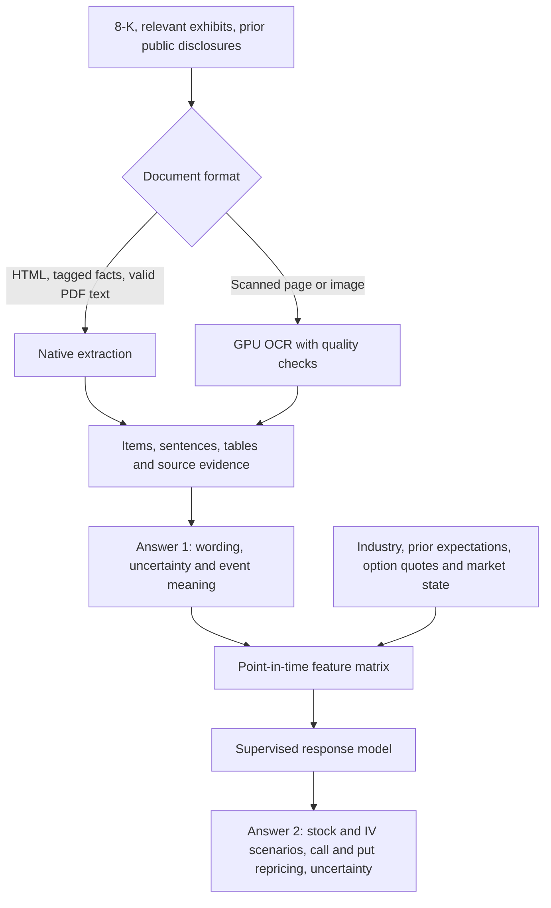

# Reading 8-Ks, measuring wording, and forecasting option repricing

Research date: 2026-10-03. Status: literature and design review. This document records the user's purpose and a provisional recommendation. It does not report an OCR experiment, model training, forecast, or backtest.

## Purpose to preserve

For the companies in the repository's options universe, read Form 8-K and relevant exhibits and answer:

1. How is the document worded: financial sentiment, uncertainty, qualification, and meaningful change from prior public statements?
2. How might the news affect specified call and put prices over a defined horizon, with uncertainty and an inconclusive outcome when evidence is insufficient?

The broader strategy also seeks to anticipate future disclosure content using earlier public documents, then update or hedge the position when new information appears. Keep pre-release anticipation and post-release reading as separate information sets. The actual upcoming document cannot enter a pre-release forecast.

"English to math" is interpreted here as converting evidence into numeric features and probabilistic forecasts: tone scores, signed changes, event categories, surprise, and probabilities of option repricing. Transcribing printed formulas is useful where present, but is not the primary objective. A model's explanation is not an observed price-impact label.

## Recommendation and confidence

Use native document extraction first, a GPU OCR fallback for scans, an independently evaluated financial-language stage, and a supervised market-response stage using actual dated market outcomes. The user-facing system returns two answers; each component retains evidence and a measurable truth standard.

GLM-OCR (0.9B) remains a good candidate for the scanned-document component because of its official LoRA recipe and financial-document evidence. FinBERT and Loughran-McDonald remain relevant for language measurement. A generic Qwen model is an optional structured-extraction challenger, rather than a required replacement for financial sentiment. Forecasting option prices needs market data and independent labels regardless of which language model is used.

Confidence is high that extraction accuracy, semantic accuracy, and forecast performance need separate evaluation. Confidence is moderate in GLM-OCR as the best practical LoRA starting point. No local evidence establishes that it beats the current Tesseract pipeline or PaddleOCR on these filings. Whether text adds profitable option information beyond market expectations is unverified.

This is a prediction research question. The sources below mainly establish associations and pricing mechanisms; they do not identify a causal effect of wording holding all other information fixed.

## Evidence reviewed

Primary academic papers, official author repositories/model cards, SEC documentation, OCC educational material, and University of Florida computing documentation were prioritized. Where only a publisher or university abstract was accessible, the evidence is explicitly narrower than a full methods review. Recent preprints and model benchmarks are useful engineering evidence, not proof of investment performance.

| Source | Verified evidence | Consequence for this project and limit |
| --- | --- | --- |
| [SEC Form 8-K](https://www.sec.gov/files/form8-k.pdf) | The general filing deadline is four business days after an event, with item-specific exceptions. Item 2.02 includes the text of a public announcement as an exhibit. | Retrieve relevant exhibits as well as the cover filing. The first announcement can precede EDGAR filing. SEC item codes provide structure but do not fully describe economic meaning. |
| [SEC timestamp FAQ](https://www.sec.gov/about/webmaster-frequently-asked-questions) and [API documentation](https://www.sec.gov/search-filings/edgar-application-programming-interfaces) | The website FAQ describes an often 1-3 minute, unguaranteed delay after acceptance, without a timestamp for first website availability. The API describes typical update delays below a second for submissions and below a minute for XBRL as filings are disseminated. | These refer to different processes. Do not infer that text was readable one second after acceptance. Record source availability and actual receipt separately. XBRL APIs are useful for tagged facts but do not cover every 8-K exhibit or custom financial measure. |
| [Loughran-McDonald dictionary, Notre Dame](https://sraf.nd.edu/loughranmcdonald-master-dictionary/) | Financial-domain word categories include positive, negative, uncertainty, litigious, and constraining language. The page was updated March 2026. Academic use is free; commercial use requires a license from the authors. | A transparent language baseline. Context, negation, industry meaning, and economic surprise require additional analysis. Freeze the dictionary version; record its licensing conditions. |
| [Araci, FinBERT (2019)](https://arxiv.org/abs/1908.10063), [ProsusAI repository](https://github.com/ProsusAI/finBERT), [checkpoint](https://huggingface.co/ProsusAI/finbert) | Finance-adapted BERT with positive, negative, and neutral supervision from Financial PhraseBank. The paper identifies difficulties with numerical comparisons and context. | A small contextual classifier, approximately 110M parameters. Its probabilities describe its learned sentiment labels, not the chance a call price increases. It needs 8-K-specific semantic evaluation. |
| [Yang/Huang FinBERT repository](https://github.com/yya518/FinBERT) and [tone checkpoint](https://huggingface.co/yiyanghkust/finbert-tone) | A distinct financial BERT family pretrained on filings, calls, and analyst reports; the tone model uses 10,000 annotated analyst-report sentences. | A useful second finance-language baseline. The documented 4.9B figure is training tokens, not model parameters. Analyst sentences differ from issuer filings, legal exhibits, and options labels. |
| [Malo et al., Financial PhraseBank](https://arxiv.org/abs/1307.5336) | Investor-oriented sentence annotations are judgments in isolation, not subsequent returns; the paper reports annotation disagreement and a noncommercial research license. | Rhetorical optimism, favorable economic news, and positive realized market return are different labels. Human annotators should use a stated rubric and remain blind to future returns for semantic tasks. |
| [Borochin et al., conference-call tone and uncertainty (2018)](https://www.sciencedirect.com/science/article/pii/S1386418117301143) | Publisher abstract/introduction: call tone is associated with option-based valuation uncertainty; analyst and management tones have different relationships. | Supports language as a candidate volatility feature. Calls contain interaction absent from 8-Ks. It does not establish an executable 8-K tone-to-option-return rule. |
| [Truong, Corrado and Chen, options and earnings (2012)](https://research.monash.edu/en/publications/the-options-market-response-to-accounting-earnings-announcements/) | University publication record: earnings-news polarity relates to uncertainty resolution in the announcement window, with different responses to profits/losses and positive/negative surprises. | Separate volatility response from stock direction and condition on event timing. This concerns earnings news, not all 8-K items or a generic sentiment score. |
| [Dubinsky et al., Option Pricing of Earnings Announcement Risks (2019)](https://research.vu.nl/ws/files/108247883/Option_Pricing_of_Earnings_Announcement_Risks.pdf) | Full published article: scheduled earnings-jump risk can be distinguished from ordinary volatility, varies across firms and regimes, and includes a risk premium. | The pre-event option surface is an essential benchmark. An option-implied move reflects risk compensation as well as expected uncertainty; predicting a large move alone does not establish an attractive option trade. |
| [Wang, Sarath and Rai, voluntary disclosure and IV (2026)](https://www.researchwithrutgers.org/en/publications/options-market-implied-volatility-and-voluntary-disclosure-manage/) | Official university abstract: in the 1996-2022 sample, roughly one quarter of firms show increased IV after earnings. Greater changes accompany more voluntary 8-K disclosure; matched disclosing firms later show greater IV reductions. | Direct support for examining 8-Ks and option uncertainty, and against a universal rule that IV always falls. Disclosure choice is endogenous; the study does not validate a tone-based trading predictor. |
| [Schmitz et al., When machines trade on corporate disclosures (2023)](https://ucrisportal.univie.ac.at/de/publications/when-machines-trade-on-corporate-disclosures-using-text-analytics/) | Published 8-K stock strategies incorporate post-publication returns, liquidity, clearance delays, costs, prior disclosure information, and a neutral reaction class. | A close precedent for the text-to-market design. The outcome is stocks, not option contracts; reported best-case research returns are not expected deployment returns. |
| [Glasserman and Lin, look-ahead bias (2023)](https://arxiv.org/abs/2309.17322) | Preprint examines future-outcome knowledge and company-specific interference in pretrained-model sentiment strategies; anonymization changes results. | A later train/test split does not erase information already embedded in pretrained weights. Model release/training dates and prospective evaluation matter. Anonymization is a diagnostic, not proof of no leakage. |
| [OCC/OIC, option price behavior](https://www.optionseducation.org/referencelibrary/faq/option-price-behavior) and [bid/ask prices](https://www.optionseducation.org/news/understanding-the-bid-and-ask-prices-for-options) | Option value depends on underlying price, strike, maturity, volatility, rates and dividends. Market buys typically pay the ask and sells receive the bid; midpoint limit fills are not guaranteed. | Forecast calls and puts separately and distinguish mark changes from realized after-cost returns. Favorable news can coincide with a falling call premium. |
| [FinCriticalED, April 2026 revision](https://arxiv.org/abs/2511.14998v3) and [authors' benchmark](https://the-finai.github.io/FinCriticalED/) | Financial OCR evaluation distinguishes numeric, temporal, monetary-unit, entity and concept fidelity from lexical similarity. GLM-OCR reports 96.92% aggregate financial fact accuracy, with 93.24% numeric and 88.89% monetary-unit accuracy in this setup. | Financially decisive errors remain despite high aggregate scores. Includes SEC material, but the corpus is dominated by legal documents and uses a rule-guided LLM judge. It does not establish our 8-K accuracy or compare the newer PaddleOCR-VL-1.6. |
| [OmniDocBench official repository](https://github.com/opendatalab/OmniDocBench) | The currently displayed v1.6 overall scores are PaddleOCR-VL-1.6 96.34, MinerU2.5-Pro 95.75, and GLM-OCR 95.22. The benchmark includes diverse documents and structure metrics. | Use this as a generic parsing comparison, not a price-forecast score. Paddle's paper reports 96.33; the current leaderboard shows 96.34. The small reporting difference does not change the ordering. |

The literature supports investigating incremental information in wording, event meaning and uncertainty. No source reviewed establishes a general, causal, executable rule mapping an 8-K sentiment score to a positive or negative option return.

## Proposed architecture

### 1. Read the original evidence

Prefer original HTML, structured tags, and trustworthy PDF text layers. Use OCR for scanned pages, images, or demonstrably broken text layers. Native extraction still requires layout, reading-order, table and completeness checks; it is not automatically perfect. Many 8-Ks reference an earnings release or agreement in an exhibit, so a clean cover transcript can still omit the news.

Retain CIK, accession, form, item, exhibit identity, source URL/hash, page or character span, extraction method, engine and adapter version, retrieval time and available publication timestamps. Preserve original punctuation and negation. Do not silently rewrite material numbers or words from model memory. Derived facts need currency, scale, period, entity and table-column context, plus a separate quality flag.

### 2. Answer the wording question with several measurements

Produce section/sentence evidence for contextual financial sentiment; dictionary categories; uncertainty and qualification; event subtype; and differences from earlier comparable public material. Report rhetorical wording and economic event polarity separately. For example, positive phrasing about an acquisition can coexist with negative dilution or financing terms. "Loss narrowed" can contain a negative dictionary word while describing improvement.

Use the full 8-K item/exhibit structure. Remove or label repeated signatures, safe-harbor language and unrelated boilerplate using fixed rules learned or reviewed before evaluation. Keep meaningful legal risk disclosures. Report section-level and material-event scores rather than only one length-dominated average across the entire filing.

The preferred initial semantic baselines are frozen Prosus FinBERT, the Yang/Huang tone checkpoint, and a versioned Loughran-McDonald dictionary. Their outputs need comparison with an independently adjudicated 8-K sample. More parameters do not establish more useful sentiment. A small general model can be a challenger for grounded event extraction or explanation, but should not invent unsupported financial facts or use future company knowledge.

Illustrative numeric features include positive/negative sentence proportions, uncertainty counts per fixed token denominator, tone relative to earlier comparable statements, disclosure novelty, guidance direction, debt/refinancing terms, and event-specific financial changes. A tone balance may aggregate `p_positive - p_negative` with predeclared relevance weights. Those classifier outputs require calibration if interpreted probabilistically; the aggregate is not an option-return probability.

Industry features should follow the event: REIT cash flow/debt maturities, bank funding or credit conditions, biotech trial results and runway, or software guidance and recurring revenue. Historical industry membership and source availability are part of the feature provenance.

### 3. Learn option response from independent observations

Combine the language features with event type, information novelty, issuer/industry history, expectations or prior guidance, underlying market state, and dated option data. "Good news" can be worse than what investors already expected. An EPS increase versus last year is not an earnings surprise versus consensus; record which comparison is available and avoid calling the former consensus surprise.

Begin with transparent regularized classification/regression and a tree-model challenger. This is a design recommendation about auditability and data requirements, not a measured claim that either algorithm wins. Text embeddings can be additional features. A shared neural backbone with separate heads is possible, but each head still needs independent labels and evaluation.

Keep three scientifically useful responses beneath the second user-facing answer:

| Response | Label definition | Why retain it |
| --- | --- | --- |
| Stock direction and magnitude | Signed and absolute underlying return from a stated observation time to horizon | Captures directional news without confusing it with volatility pricing |
| Volatility repricing | IV change for the same contract or carefully defined comparable maturity/moneyness | Captures resolution or increase of uncertainty; standardized surface measures are not purchased contracts |
| Specific option outcome | Fixed call/put contract mark change, and a separately measured feasible position return after spreads/fees | Directly answers whether that option increased or decreased in value and whether the proposed position benefited |

Choose contracts using only the entry-time chain; retain contract identity, strike, expiry, multiplier, deliverable adjustments, and call/put type. Do not select the later best-performing strike. Define a horizon, such as next eligible session close, before labeling. Intraday horizons require intraday quote coverage and latency evidence.

Midpoint repricing is a scientific mark outcome. A conservative long-option execution outcome uses entry ask and exit bid with size, fees and slippage assumptions; short positions require their own reversed cash-flow rules and collateral/exercise treatment. Report position P&L separately from the direction of the option premium. Crossed, stale or zero quotes require explicit handling rather than imaginary fills.

An explanatory local approximation is `option change ~= delta * stock change + 0.5 * gamma * stock_change^2 + vega * IV_change + theta * elapsed_time`. Units must match the Greek convention. This is not accurate for arbitrary jumps or a substitute for repricing appropriate contracts; dividends, rates, American exercise and adjustments also matter. The point is that stock direction, volatility, and time can offset one another. [OIC Greeks](https://www.optionseducation.org/advancedconcepts/volatility-the-greeks)

The final output should name the horizon and contract, estimated probability/range of repricing, stock and IV scenarios, supporting text, and missing data. An unknown probability remains unknown until a trained model has been evaluated. Do not generate plausible-looking probabilities from an OCR prompt.

## Pre-release anticipation and post-release reading

| Mode | Eligible information | Proper forecast interval |
| --- | --- | --- |
| Anticipation | Earlier public disclosures, industry data, known schedules and market state at decision time | A subsequent window fixed before the event; include days on which no event occurs |
| Post-release update | Actual new 8-K/exhibit text only after public receipt and extraction/inference | From the first feasible quote after the system can act, to the chosen horizon |
| Event explanation | Released text and observed pre-release-to-post-release move | Useful association analysis; does not demonstrate a feasible forecast or trade that captured that move |

For a filing after the options session closes, a post-read model begins at the next eligible session quote. It cannot claim the overnight jump from a prior close as its obtainable return. A release already published through issuer channels may also precede the SEC filing; label its timing and duplicated content. Availability of prior disclosures and subsequent filing data must be audited independently.

Record at least the first verified public announcement, SEC acceptance, venue availability where known, actual receipt, extraction completion, feature completion, decision/order time, and entry quote. An historical acceptance timestamp alone cannot reconstruct every one of these. Any latency scenario used where records are absent must be identified as an assumption.

## OCR and LoRA choice under the size constraint

| Candidate | Document model size and license | Evidence and adaptation status | Recommended role |
| --- | --- | --- | --- |
| [GLM-OCR](https://huggingface.co/zai-org/GLM-OCR) | 0.9B; model MIT | [Official LLaMA-Factory LoRA recipe](https://github.com/zai-org/GLM-OCR/blob/main/examples/finetune/README.md), including text/table/formula tasks; authors estimate at least 8 GB VRAM for their example | Primary financial-scan LoRA candidate |
| [PaddleOCR-VL-1.6](https://huggingface.co/PaddlePaddle/PaddleOCR-VL-1.6) | 0.9B; Apache-2.0 | Stronger generic v1.6 parsing benchmark. An official LoRA recipe for this exact checkpoint was not verified in this review | Untuned accuracy challenger; adaptation feasibility remains a separate check |
| [MinerU2.5-Pro](https://huggingface.co/opendatalab/MinerU2.5-Pro-2604-1.2B) | 1.2B; model Apache-2.0 | Strong PDF parsing; current Pro-specific LoRA recipe was not verified. Model and [MinerU application licensing](https://github.com/opendatalab/MinerU/blob/master/LICENSE.md) differ | Additional parsing challenger if it improves relevant exhibit fidelity |

These sizes describe document-model checkpoints; full pipelines also use layout processing and runtime memory. FinBERT's approximately 110M parameters also fit the user's preference. A 1.7B general language model is optional and does not need to be loaded alongside OCR to return these two answers. Parameter count and available GPU compute do not by themselves ensure accuracy.

LoRA trains a relatively small adapter while reusing pretrained weights. For OCR, prepare page/region images paired with exact reviewed transcripts, tables or formulas; an SEC URL alone is not supervision. Native text can help construct pairs after checking rendering and correspondence, but synthetic clean pages alone do not represent degraded scans. Include meaningful layout failures, decimal/sign errors, negation and low-resolution exhibits.

Use separate supervision for the language stage: human 8-K tone/event annotations without access to future market returns. Market supervision comes from actual subsequent outcomes. A model's own sentiment or option guesses should not serve as the independent final test labels.

Only keep an OCR adapter if a later evaluation demonstrates improved financially important extraction without unacceptable regressions. Financial-fact accuracy, sentence completeness, negation, digit/sign/unit fidelity, table alignment and downstream tone stability matter more here than attractive Markdown. The reported 8 GB LoRA requirement depends on the authors' batch/resolution/sequence settings and does not guarantee the eventual job memory need.

HiPerGator supports scheduled GPU work through [Slurm GPU allocation](https://docs.rc.ufl.edu/scheduler/gpu_access/) and [job arrays](https://docs.rc.ufl.edu/scheduler/job_arrays/). Allocate a compute GPU and measure VRAM/throughput for the actual pages and model configuration. Corpus reading and adapter training are distinct jobs. No GPU allocation, model installation, or compute run was performed for this research.

## Design ranking and what would change it

The decision is which architecture best serves the two required answers while staying below 3B parameters per neural model. Weights are design assumptions: evidence fidelity 25%, financial-language fit 20%, alignment with option outcome 30%, timing/auditability 15%, and compute simplicity 10%. Scores use 1 (weak) to 5 (strong) and express engineering judgment, not measured predictive performance. LoRA is an adaptation mechanism, not a replacement for labels.

| Rank | Architecture | Fidelity | Language | Option target | Timing/audit | Compute | Weighted score |
| --- | --- | ---: | ---: | ---: | ---: | ---: | ---: |
| 1 | Native extraction + targeted OCR + finance-language baselines + separately supervised market model | 5 | 4 | 5 | 5 | 5 | 4.80 |
| 2 | Same pipeline with a small general language model for grounded extraction and explanations | 4 | 4 | 5 | 4 | 3 | 4.20 |
| 3 | One OCR/VLM prompt or adapter asked to transcribe, score wording and announce option direction | 3 | 3 | 2 | 2 | 4 | 2.65 |

The second route can rank first if it demonstrably improves event/fact extraction enough to justify added latency and review. A single jointly trained model could also become competitive with extensive independent supervision and provenance controls; current OCR model cards do not establish this. If scans are rare, the OCR choice has little influence on the financial hypothesis. If usable historical quotes are absent, no OCR choice resolves the response-label gap.

GLM is the best practical LoRA starting candidate; Paddle is the strongest generic parsing alternative among the reviewed small checkpoints. The ranking would change with an official Paddle adaptation recipe, local financial-fidelity measurements, licensing requirements, or different allocated GPU memory. No score here establishes that a trading edge exists.

## Eventual evaluation needed to substantiate the route

This section specifies future work; none of these experiments has been run.

1. Audit document formats and option quote coverage on the historically eligible company universe. The SEC catalog is a source universe, not proof every issuer has option labels.
2. Build independent transcription and semantic reference samples, stratified by item, industry, exhibit type and scan quality. Keep amendments, exhibits and duplicate announcements together. Use blinded human semantic labels and adjudicate disagreement.
3. Compare native extraction, current Tesseract, untuned GLM, Paddle, and any GLM adapter on material text/facts. Assess whether extraction errors change sentence meaning or tone. Do not claim a single generic benchmark winner is universally accurate.
4. Compare finance-language baselines and any adapted challenger using classwise errors, macro-F1, disagreement, calibration and grounded evidence. Financial sentiment accuracy and rhetorical-tone accuracy need their own reference rubrics.
5. For prediction, use chronological walk-forward splits; purge outcome overlap at boundaries, keep related documents in one fold, and fit normalization/feature selection only inside training folds. Event observations are irregular and clustered: [TimeSeriesSplit](https://scikit-learn.org/stable/modules/generated/sklearn.model_selection.TimeSeriesSplit.html) documents chronological splitting and a gap, but its equally spaced assumptions and row-based gap do not replace an event/time-aware splitter. Company holdouts answer a separate generalization question.
6. Compare market-only; market plus event/industry; market plus dictionary; and market plus contextual language. Use calibration/Brier or log loss for probabilities, return/IV errors and interval coverage, plus execution outcomes where supported. Text must add information beyond known event premiums and market state. Log tried horizons, event families and regime rules before selecting winners.
7. Keep a final untouched later period and a prospective paper-observation period after model release/adaptation. Later model weights can contain information about earlier outcomes; chronology in downstream training alone does not resolve that. Include no-event observations for anticipation and preserve failed/delisted or illiquid cases when data permit; document exclusions.

Regime rules should use observable inputs such as market volatility, liquidity, event type, and option term structure. Define and fit them on training data. A threshold invented after viewing the final period is another fitted decision and must not be presented as independent validation.

## Repository state and boundaries

As inspected for this review, `src/document_ocr.py` provides Tesseract text extraction with source hash, page text, engine/settings and mean word confidence. It does not implement semantic tone, event extraction or option prediction. Its mean OCR confidence is not the probability a financial number or forecast is correct.

The current options study uses daily option bars with close/volume, not synchronized historical executable bid/ask quotes, an IV surface or measured post-read execution timing. The native options bridge work provides study/data plumbing; it does not establish a trained predictor. This limits what the existing data can substantiate about the second answer.

`docs/sec-8k-url-catalog.md` records 285,831 accession rows for 1,630 CIKs. This catalog does not establish historical quote coverage or usable transcripts. The existing 100-name options configuration and broader SEC company list are different populations; use dated intersection/eligibility rules rather than assuming one is the tradable universe.

The enduring strategy statement is in `docs/8k-anticipation-research-concept.md`. This evidence review refines its document/semantic/market boundaries and preserves the original anticipation objective. Model training, collecting additional documents, or trading tests still require their own concrete scope and data readiness.
