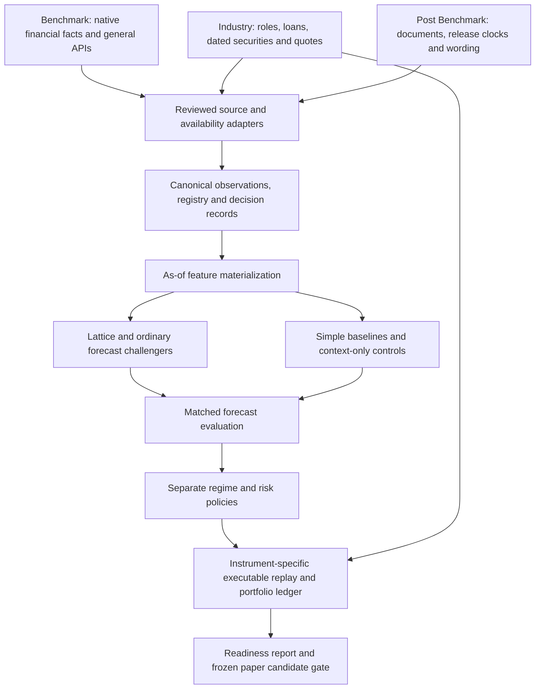

# Unified architecture and chat coordination

Status: coordination active; implementation contracts require producer/consumer acceptance. Date: 2026-10-04 UTC (2026-10-03 America/New_York). Owner: **Track work across project chats**.

## Purpose and existing authority

The user requested active chats communicate, incorporate each other's plans over time and make integration smooth enough to begin backtesting when the required pieces are ready. This contract organizes existing authorized work. It does not establish profitability, approve numerical risk limits, authorize duplicate purchases or open the final holdout.

Use [strategy validation](../superpowers/plans/2026-10-03-strategy-validation.md) as the research/evaluation spine and [parallel execution](../superpowers/plans/2026-10-03-parallel-8k-validation-and-learning.md) as the lane schedule. This document owns coordination and boundary acceptance, not a second pipeline. Current implementation in a managed worktree can be ahead of the root checkout and either can be ahead of merged GitHub state.

The user's2026-10-04 request explicitly assigns this chat as orchestrator, including context-carrying new chats when needed within approved work. Post Benchmark owns integration acceptance; peers discuss their actual handoffs directly. The [continuation policy](continuation-policy.md) preserves ownership, checkpoints and existing execution permissions.

## Ownership and participant directory

| Chat | Thread ID | Owned responsibility | Boundary it must agree |
|---|---|---|---|
| Track work across project chats | 01a1036f-6912-73f2-b9ff-513b7d6c8400 | Shared decision/dependency record, reconciled status and GitHub context | Conflicts, cross-workstream changes and readiness evidence |
| Benchmark | 01a1029e-8008-7d52-8f98-6c55f4aa739e | Financial/native facts, general API context, feature provenance and issuer/security reconciliation | Evidence/availability adapter into canonical observations |
| Benchmark pt. 2 industry spec | 01a102d3-5cc5-7373-9620-523d2a1419a6 | Industry, loans/roles/history, dated REIT universe, market acquisition and quote QA | Reviewed economic context, instrument definitions, source quarantine and paid reservations |
| Post Benchmark | 01a1029b-f907-7bc1-9127-bf22a03633cd | Document/wording processing, canonical records/registry/clocks/runner/evaluator/portfolio boundary | Consumer acceptance and integrated run manifest |
| Assess Lattice repo fit | 01a102c4-489a-7e80-acfe-9e545b25b99d | Numerical/context hypotheses, market-specific targets, comparisons and diagnostic outputs | Registered causal features/targets and matched comparison sample |

Existing worktrees:
- Benchmark: `C:/Users/johnp/.codex/worktrees/point-in-time-feature-matrix/QuantHaxs`.
- Post Benchmark: `C:/Users/johnp/.codex/worktrees/8k-cross-asset-validation/QuantHaxs`.
- Industry and Lattice: current shared QuantHaxs root unless the owner declares a newer checkout.

Each owner retains its source files. Source owners may delegate internal agents, but those agents inherit the lane's interface and ownership. Only the shared-schema owner edits shared definitions after the affected producers/consumers agree. A coordinator message is not permission to revert another owner's changes. Newly active workspace chats join only when their work touches a named dependency; dormant OCR/HiPerGator chats are not routinely awakened.

## Architecture: evidence to decision to backtest

Adapters preserve the source record and producer schema. They add canonical identity and evidence; they do not rename an unavailable clock into a usable clock or promote a descriptive mark into a fill.

Current canonical implementation is Post Benchmark's `src/research_validation/`, routed by `docs/research/8k-data-contracts-v1.md`, `configs/strategy_validation.json` and `docs/8k-validation-execution.md` in its declared worktree. Relevant modules are `records`, `clocks`, `features`, `financial_handoff`, `market_handoff`, `evaluate`, `trials` and `portfolio`. The root planning document's proposed paths are not proof those modules are merged or present in the root checkout.

## Boundary rules

### Identity and grain

- A decision uses the canonical `decision_id`, scope, instrument/security identity, calendar/session, information cutoff, outcome horizon and mode. Preserve the Benchmark matrix's original row key in provenance.
- CIK identifies an issuer. Ticker text is not proof of common stock, historical listing, a particular option deliverable or futures contract.
- Market decisions use the canonical market scope/instrument identity; do not duplicate one ES outcome for every company.
- Event groups identify the underlying economic disclosure. Multiple contracts, strategy variants, text fragments and feature rows remain dependent observations of that event.
- Explicit null/missing/censored/excluded states survive joins. Unknown coverage is not a negative event.

### Information clocks

Keep public, received, retrieved, processed, effective/valid and review times distinct, with their evidence and timezone. SEC acceptance is a proxy unless first-public timing is independently established. Later-filed/restated figures cannot be backdated to the represented fiscal period.

Observed decisions use actual availability. Historical replay uses an explicit named latency policy and assumed availability with provenance. A 2026 retrieval or machine review does not establish actual 2024 receipt; a verified 2026 filing does not become a 2024 predictor. Consumer adapters follow the canonical cutoff comparator; producer differences such as strict `<` versus `<=` must be resolved explicitly.

The existing protocols are distinct:

| Protocol | Existing cutoff and outcome | Integration treatment |
|---|---|---|
| Issuer daily spine | 15:30 America/New_York, calendar-aware early-close adjustment; next reference session | Preserve its registered decision schedule |
| Lattice futures diagnostic | 09:30 ET, features through prior completed session; sampled 09:35–09:36 actual-contract BBO interval | Preserve separate market protocol; do not directly join it to 15:30 issuer decisions |
| Equity close diagnostic | 16:00 ET completed close → next panel-session close; both endpoints within 2024 for the proposed consumer study | Development/descriptive adjusted-close return; not a 15:30 issuer feature clock or an executable fill |
| Event/options diagnostics | Exact registered event/score timestamps and matching contract mark | Retain event grain, quote limits and descriptive label |

The equity close study uses inspected development data. Lattice has already inspected 2024 and 2025 globally; neither becomes an untouched shared test through a new study name.

A harmonized comparison needs a newly registered protocol or a documented causal adapter with matched information sets. Merely converting timezones does not harmonize these experiments. Futures require product-specific sessions, definitions and roll rules; an equity calendar alone is insufficient.

### Definitions, units and qualification

Features are long observations registered by exact name, version, unit, scope and period. Native four-tag instant USD facts, FFO/AFFO, loan balances, commitments, proceeds, sentiment and residual geometry are different definitions. Preserve amount kind, currency/scale, formula operand IDs and exact source spans.

Benchmark's locked exporter is a producer-side readiness smoke; Post Benchmark owns the shared consumer adapter and run capsule. Exact native feature-name/version mapping still needs that consumer's acceptance.

The native financial adapter presently accepts four entity-scope instant USD GAAP facts; broader facts need a reviewed extension/materializer. REIT relationship role/history records are evidence inputs, not immediately model features. Trustee/agent/guarantor is not lender exposure. Signed exposure needs an economically justified, dated role and amount interpretation.

Lattice exports its feature version, window, fit cutoff, availability, sample and target definition. Current dimensionless futures risk units, adjusted-close returns, option quote changes and cash portfolio returns are not interchangeable. Frozen wording scores remain measured text unless feature review and historical-clock gates pass.

Every source version retains original raw bytes/hash, extraction/parser hash and source/record identity. Same URL with different hashes creates separate versions and a conflict entry. Quarantine propagates to facts, relationships, features, labels and any dependent run; consumers return explicit exclusion counts/reasons. Resolving a raw conflict requires a saved comparison/adjudication and recomputation of dependents, not an undocumented normalized-hash deduplication.

## Communication and change protocol

Use direct messages for a specific producer/consumer boundary, a breaking change, a failed acceptance check, a shared resource conflict or a milestone. Share links/IDs and a concise delta. Avoid routine all-to-all messages. At each meaningful handoff:

1. **Producer proposes:** identify change ID, owner, current schema/protocol, exact artifact paths, source/code/input/output hashes, eligibility/exclusions and affected consumers.
2. **Consumer reviews:** validate schema, identity, clocks, units, exclusions and required behavior with a small real or deliberately ineligible fixture. Reply **accepted**, **accepted for diagnostics only**, or **rejected**, with evidence and reasons.
3. **Coordinator records:** update this contract's decision register and the dependency status; resolve semantic disagreements with the source owners. Business choices such as permitted risk/instruments, paid scope beyond the existing limit or final-test access go to the user.
4. **Owner implements/revises:** only the relevant source/schema owner applies the change under its existing execution authority. Publish a new immutable run/version and revalidate affected dependents.
5. **Consumer closes the handoff:** record the exact consumed manifest/version, checks and resulting status. Delivery alone is not acceptance.

Packets should contain: `change_id`, producer, consumer(s), checkout/commit plus dirty-file fingerprints, schema/protocol version, input/output paths and hashes, IDs/grain, clocks/basis, units/target, checks, exclusions, dependencies, status and next action. These are coordination metadata; runtime field names come from the canonical schemas.

Breaking semantics require a new version and acknowledgement by affected consumers. An additive change is compatible only when the consumer actually supports it. A stale hash, dropped quarantine, identifier ambiguity, future availability or target-unit mismatch stops the affected experiment; unrelated lanes continue.

One mutable artifact has one writer. Owner handoff documents remain in the owner's checkout. This chat records messages and pointers here; it does not rewrite peers' source. A source or configuration edit invalidates dependent acceptance/run receipts. Retry deliveries and external jobs by saved IDs; do not create duplicate purchases or repeated coordination prompts.

## Dependency and immediate handoff register

| Handoff | Producer → consumer | Concrete acceptance | Current coordination status |
|---|---|---|---|
| Financial evidence/availability | Benchmark → Post Benchmark | Four-tag native export consumed with exact hashes, independent evidence and explicit nonready clocks | Benchmark accepted coordination for diagnostics only; exact shared feature-name mapping and consumer acceptance pending |
| Dated identity/universe | Benchmark + industry → Post Benchmark/Lattice | Share class/instrument/valid-known interval proof; ambiguous mappings excluded | Contract gap remains |
| Reviewed industry context | Industry → Benchmark/Post Benchmark/Lattice | Role, signed economic interpretation, unit/period and causal availability map to registered observations | Owner packet received; adapter acceptance pending |
| Source quarantine | Industry + financial → all dependent consumers | Conflicting source versions retained; exclusion visible in consumer output and decision cards | Current code has quarantine guard; specific end-to-end receipt pending |
| Qualified market records | Industry → Post Benchmark/Lattice | Definitions, actions/deliverables, sessions, quote freshness/size/conditions, hashes and missing dates | Acquisition/QA ongoing; per-product acceptance pending |
| Lattice features/targets | Lattice → Post Benchmark | Exact registered fields and market clocks/units; history/context/Lattice controls on identical eligible rows | Numerical contract inspected; economic-context adapter acceptance pending |
| Spending reservations | Industry + Lattice → every paid buyer | One atomic reservation/reconciliation gate across all job IDs and stores | Existing separate stores; serialize until verified common gate |
| Regime/risk policies | This research plan + integration → evaluator | Distinct forecast adaptation and risk/sizing trials, asset-specific profiles, no silent forecast rewrite | Research design; numeric mandate unresolved |
| Integrated backtest capsule | Post Benchmark ← all accepted producers | One actual command/config/manifest, boundary checks and class-specific readiness report | Pending integrated accepted handoffs |

The packet status above is deliberately separate from each owner's implementation progress. Previously saved diagnostic results remain valid only for their declared inputs/protocol.

## Backtest readiness and first delivery

An owner prepares a **run capsule** containing the exact runnable command, working checkout/source fingerprint, environment, input manifests, protocol/registry/adapter versions, output directory, costs/risk assumptions, acceptance results, exclusions and report paths. It must execute without manually editing another owner's paths or silently discovering changing files.

Current research entrypoint is `scripts/run_8k_validation.py` in Post Benchmark's worktree, with explicit SEC/source/calendar/registry/output inputs. The integration owner must supply an exact verified invocation for the accepted snapshot; this document does not invent a command that combines incompatible products.

Three gates:

1. **Diagnostic replay:** reproducible pipeline and joins, clock/source/universe/quote coverage report, explicit exclusions. It can correctly produce zero eligible trades and does not claim economic performance.
2. **Eligible forecast comparison:** historically usable features and dated outcomes; common eligible opportunity set; ordinary history/factors, simple mean/zero, context-only, Lattice-only and combined challengers; event/calendar-aware uncertainty and a frozen development protocol. No usable rows means no fit.
3. **Executable portfolio backtest:** class-specific quote/fill assumptions, multipliers, spread/slippage/fees, quantity/capacity, synchronized legs, cash/collateral/margin, corporate actions, exercise/assignment/expiry/delivery/roll/borrow/financing as applicable, and a portfolio ledger. A hedge study requires the funded exposure and portfolio-plus-hedge comparator.

Equities, options, futures, strict arbitrage and predicted repricing pass their gates independently. The existing equity-oriented market handoff and portfolio helper are not proof of implemented options/futures lifecycle. Financially qualified alternatives cannot inherit eligibility from another asset.

Risk profiles are research scenarios until the user approves numerical limits/instrument permissions. Correct forecasts and successful tests do not establish net growth. Stops do not bound overnight gaps or execution losses. Regime gating/sizing and forecast adaptation remain separately registered comparisons, with exposure-matched controls.

The completion target is an accepted first run capsule and class-by-class readiness table, delivered incrementally as boundaries pass. There is no reason to wait for unrelated lanes; there is also no reason to trade through failed gates. The final holdout remains protected; current inspected 2024–2025 studies are development/exploratory evidence.

## Shared compute and acquisition

Heavy runs use the user's `home-pc` SSH alias, detached tmux, unique owner/run directories, logs and hash-verified results; Tailscale failure is reported. Initially use two CPU threads and the existing global heavy-job flock, with bounded memory/chunking. GPU work uses the separately authorized cluster path and actual authentication/runtime evidence. Do not overwrite another remote checkout or migrate an active job without a safe checkpoint.

Paid buyers use one authoritative atomic reservation gate, stable provider job IDs, reserve-before-submit, reconciliation and idempotent retries. Existing SQLite/JSON stores must be reconciled once without double counting prior charges/reservations. Industry owns the gate implementation; Lattice confirms its integration. Until verified, serialize all submissions and include every outstanding commitment. The existing spending cap remains in force. No purchase is authorized by this coordination contract alone.

## Iteration and persistent context

At each accepted boundary or changed assumption, peers exchange the delta and this chat records the decision. The existing 30-minute heartbeat can inspect for changes, request a missing handoff once, verify evidence and update GitHub when a material milestone occurs. It must not interrupt unchanged work or produce duplicate comments.

Living status: GitHub Discussion 2. Overall solution and design: Discussion 3, **the solution**. Publish planned/accepted/implemented/validated/merged states distinctly; do not turn a chat assertion into independent verification.

[Grill interview](../grill-sessions/2026-10-03-cross-chat-coordination.md) records user decisions. [Task plan](task_plan.md), [findings](findings.md) and [progress](progress.md) support resumption. Runtime contracts stay with their implementation owner.

## Decision log

- C01 — Human authorized scoped cross-chat architecture communication and continued coordination.
- C02 — Explicitly confirmed by the human2026-10-04: this chat acts as orchestrator; Post Benchmark owns integrated acceptance; peers discuss actual boundaries.
- C03 — Existing canonical spine retained; producer adapters bridge their schemas. No competing runtime registry/pipeline.
- C04 — Existing 15:30 issuer and 09:30 futures protocols remain distinct until a registered causal harmonization is accepted.
- C05 — A source conflict/quarantine and failed availability gate must propagate end-to-end.
- C06 — Diagnostic replay, forecast eligibility and executable economic replay are separate completion predicates.
- C07 — Shared spending gate remains an explicit cross-chat dependency; serialize until verified.

## Accepted sequencing and negative-result rule — 2026-10-04 UTC

C08 — User explicitly chose a small validated slice with realistic costs, then expansion. Diagnostic fixtures are intermediate handoffs.

C09 — A valid eligible after-cost comparison may complete with explicit no trade and targeted follow-up research. Missing clocks, quotes or eligible observations remain insufficient; they do not establish a failed strategy. Numeric risk limits and live capital remain separate decisions.

ICM navigation and change impacts: [CONTEXT.md](CONTEXT.md). Actual Graphify source snapshot: `.planning/graphs/graph.json` with `SOURCE_MAP.json` and `BUILD_RECEIPT.json`. Source drift does not invalidate an archived run; affected current-code boundaries require refresh and acceptance.

C10 — Human authorizes context-carrying new chats when a ready approved work unit or verified checkpoint needs one. A focused Markdown handoff, existing owner/state check and persisted continuation ledger precede creation. Current active owners continue; no new chat is created merely by this policy.

C11 — Source-inspected feature matrix remains upstream of forecasts, through a reviewed mapping into Post Benchmark's existing FeaturePanel. [Detailed placement and grill checks](feature-matrix-integration.md) distinguish the wide producer from the native long-observation readiness route; mapping/availability acceptance remains explicit.
