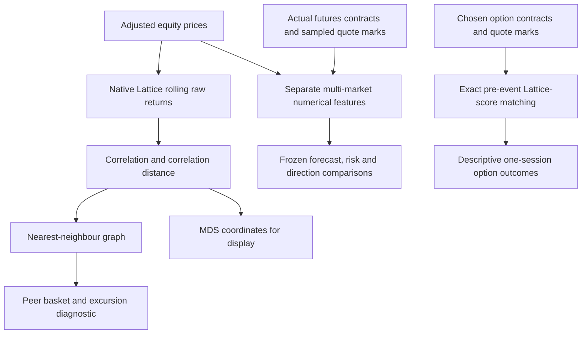
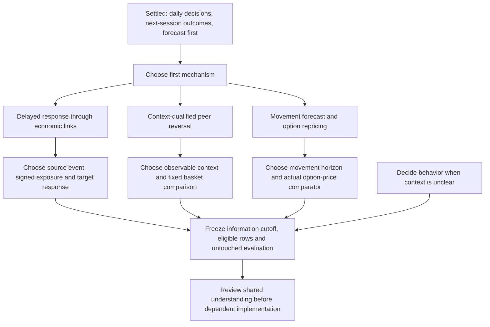

# Giving Lattice numbers a specific economic job

Date: 2026-10-03. Status: investigated proposals and active grill session, not new backtest results or an approved contextual model.

## Plain-language conclusion

The useful next question is: **given a particular event and a known economic relationship, has an asset reacted as much as we would expect?** Lattice can help measure the relationship and the unusual reaction. Dated company facts can explain the channel. A forecast needs both to be available before the decision.

This may still fail. Our first generic relationship forecasts lost to simple controls. Adding context is a new hypothesis, not an explanation already established for those failures.

## 1. What was actually traced

Three independent read-only explorations covered native Lattice, the multi-market prediction contracts, and the broader company/event/options data. A fourth review challenges the proposed mechanisms. Source paths below identify the relevant dependency graph; they do not imply an automated whole-repository Graphify build. Graphify's configuration is absent, and structural MCP reads were unavailable or unhelpful, so local structural inspection was used.

### Existing code paths

The new multi-market feature experiments recompute small numerical measures from market data. They are related to Lattice's approach; they are not an existing news-and-business-context model connected to every native graph export. Native MDS coordinates did not select H1's peers.

| Source / symbol | Extracted role | Consequence |
|---|---|---|
| `stat-arb/apps/gm-geometry/main.cpp`, `build_return_panel`, `run_gm_geometry` | Common-date adjusted-close returns, rolling correlation estimates, graph and embedding exports | Raw geometry still contains market and sector effects |
| `stat-arb/libs/gm-geometry/src/distance.cpp`, `mantegna_distance` | Correlation-derived distance | Close nodes indicate past same-direction co-movement, not a business contract or causal link |
| `stat-arb/libs/gm-geometry/src/graph.cpp`, `knn_and_mst_edges` | Nearest neighbours and spanning tree | Mechanical graph connectivity does not prove every edge is economically meaningful |
| `stat-arb/apps/gm-signals/main.cpp`, `compute_spread_row`; `libs/gm-signals/src/peer_basket.cpp` | Prior fitted nonnegative peer basket, excursion score | A signed economic channel or opposite exposure needs separate representation |
| `src/multi_market/features.py`, `build_features` | Six ordinary inputs, residual peer shock/concentration and graph turnover; peer weights use absolute contemporaneous residual correlation | Current fits have no dated event variable or event-specific interaction; those weights do not establish directed transmission or economic sign |
| `src/multi_market/futures_study.py`, `build_contract_panel`, `build_futures_features` | Same-contract outcomes and strictly prior 63-session features | Preserve actual contracts and clocks when adding context |
| `src/multi_market/evaluation.py`, `evaluate_forecasts` | Frozen additive ridge fits, paired rows, simple controls, label availability and purge | Reuse evaluation safeguards; add a separately registered conditional specification |
| `scripts/multi_market/run_options_matched_study.py` | Exact `(ticker,t_pre)` score join and collapsed event-strategy outcomes | Existing association diagnostic is not a fitted news-arrival forecast |
| `src/options_learning.py` | Timestamp/lineage and exact-contract import gates | Schema support does not imply populated eligible training observations |

### Information and outcome clocks

- **Current equity diagnostic:** information through session close, followed by the next available panel session's close return. These are adjusted-close statistical marks; historical vintage and executable-close assumptions remain unproved.
- **Current futures diagnostic:** decision at 09:30 ET; features end at the preceding eligible session's 09:36 mark; entry sample is 09:35–09:36, then the same actual contract at the next common session's interval. A release after 09:30 cannot be an input for that decision. A peer move later that morning cannot be smuggled into the existing prior-session packet.
- **Current options diagnostic:** contracts/pre-score selected at `t_pre`, then a post-event one-session outcome. Exact date matching does not prove first-public or processing timestamps. This remains descriptive, with 18 qualifying events.

These clocks differ. A new cross-market contextual experiment must explicitly harmonize information availability or maintain separate clocks; joining only on calendar date is insufficient.

## 2. Three different graphs must remain distinct

1. **Code graph:** which module produces a field and which evaluator consumes it.
2. **Statistical graph:** which assets recently moved together, after stated factor controls.
3. **Economic graph:** who supplies whom, whose borrowing resets with which rate, or which firm produces/uses a commodity, with dated supporting evidence.

An economic edge can be signed: an oil-price increase may affect a producer and a user differently. Lattice's standard correlation distance and nonnegative peer basket do not automatically capture that relationship. Economic edges must have a source, public availability, effective interval, direction/channel and confidence; an undocumented edge remains a hypothesis.

## 3. One hypothetical example

Suppose company A is an important customer of company B. A publicly reports weaker demand and falls 5%; B has barely moved.

1. Verify that the demand report was public before our decision.
2. Verify from an earlier public filing that B actually depended on A at that time.
3. Remove broad market and industry moves from the observed returns.
4. Use prior data to measure how strongly B usually responds to comparable shocks and how stable that relationship is.
5. Form a testable forecast: B's next-session residual return may reflect some delayed negative response.

The same price gap has a different interpretation if A fell because of its own lawsuit, B recently lost the customer relationship, or B already released offsetting information. The relationship number alone cannot settle those cases. This is an invented illustration, not a finding in our data.

## 4. Iteration through the candidate ideas

| Initial idea | Main objection | More precise version | Reject or block if |
|---|---|---|---|
| Nearby assets should revert together | Similar price history does not explain whether a change in value is permanent | Test a fixed peer-basket gap conditional on information known at the decision, stable peers and comparable liquidity/volatility | It loses to same-day sector/factor/momentum/volatility controls, or needs future event exclusions |
| Related assets should catch up | Undirected simultaneous correlation supplies no lead/lag direction | Use a dated, signed economic exposure and a source shock already known before the decision; predict the target's subsequent residual response | The response already occurred before entry, or exposure/context-only controls explain the result |
| A changing graph tells us to cut risk | Graph changes can be sampling noise; holding more cash mechanically reduces risk | Ask whether instability predicts a specific covariance/hedge error, against ordinary covariance models and equivalent exposure | A simple model or uniform exposure reduction reproduces the benefit |
| More predicted movement means an option profit | Option prices already incorporate expected movement and risk; underlying direction, time and quotes affect premium | First test movement/volatility forecasts against implied and historical measures; separately test exact-contract repricing after ordinary option-risk controls | There is no forecast increment or bid/ask costs/common option exposures consume it |
| Put every futures market in one graph | Index, rate and commodity prices represent different economics and delivery structures | Use ES for broad equity context; documented rate exposure for ZN; delivery-month curves and commodity channels for CL/GC | A market lacks a stated channel, correct contract timestamps or a useful simple-baseline increment |

**Native H5 audit:** [H5](../../stat-arb/HYPOTHESES.md) reports 54.1% versus 33.5% five-day reversion in its named no-earnings/8-K versus event buckets, without matched controls. Source inspection found that `stat-arb/apps/gm-report/main.cpp:227` classifies filings from excursion start through its observed end (`:265`), with that end determined by reversion or censoring in `stat-arb/libs/gm-signals/src/excursion.cpp:43`. Membership therefore uses information after the starting decision and a span partly determined by the outcome. SEC `filingDate` supplies date-only timing; the requested form is 8-K, without an independent earnings calendar (`gm-report/main.cpp:243`; `libs/gm-signals/src/earnings.cpp:19`). Missing CIKs/fetch errors leave the initialized event flag at zero. This is retrospective, incomplete-coverage stratification, not an eligible news-free-at-entry rule. Five-day/twenty-day rates also cannot establish the one-session target. Do not treat the split as positive evidence for a usable conditional signal.

"No news" must mean sufficiently complete monitored information available at the cutoff. Missing coverage means unknown. Later news cannot retroactively remove an otherwise eligible decision. Unscheduled releases during the holding period remain part of the outcome.

## 5. Research priority and sensitivity

Decision: choose which contextual mechanism to specify first, subject to data eligibility. Scores below are subjective research priorities on a 1–5 scale, not probabilities of success.

- Economic specificity, **35%**: can we state the channel and expected conditional response?
- Data tractability, **30%**: can current files support it after bounded qualification?
- Falsifiability, **25%**: can simple controls meaningfully reject it?
- Timing feasibility, **10%**: could the response plausibly remain after a daily decision?

| Proposal | Specificity / data / falsifiability / timing | Weighted priority | Binding uncertainty |
|---|---|---:|---|
| Dated economic-link catch-up | 5 / 2 / 5 / 2 | 3.80 | Qualified historical links, surprise and publication clocks are missing |
| Context-qualified peer reversal | 3 / 3 / 5 / 3 | 3.50 | Complete at-decision event coverage and controlled evidence |
| Contextual movement then option repricing | 4 / 1 / 4 / 2 | 2.90 | Underlying/surface/quotes and sufficient independent events |

A missing data gate blocks fitting regardless of score. Catch-up is the recommended economic hypothesis. Reversal is the alternative if price/event timing can be qualified sooner. If data tractability receives 50% weight and economic specificity 15% (other weights unchanged), reversal ranks 3.50 versus catch-up 3.20. A qualified historical option surface could materially improve the option proposal's tractability. No choice is treated as settled until the user answers the grill frontier.

## 6. What we can and cannot currently assemble

| Input | Current evidence | Next qualification |
|---|---|---|
| Equity/futures prices and numerical diagnostics | Completed datasets and reports | Keep exact clocks, historic eligibility, common-factor controls and quote limitations |
| Native graph/peer scores | Native implementation and dated exports; 20 exact pre-scores in existing options match | Preserve estimator/window identity and access dates; avoid interchangeable coordinates |
| Company financial/disclosure context | Cached source documents, parsing/lineage adapters and candidate money/debt facts | Reconcile original values, units, periods and earliest public/processing times |
| Dated business exposures | Candidate counterparty/debt/property/loan evidence | Qualify historical effective links and the relevant economic channel |
| Event surprise | Potentially derivable from prior facts | Freeze expectation before release; wording tone alone is not surprise |
| Options | Full purchased quote processing completed; 18 qualifying diagnostic events | Actual underlying/rates/dividends/terms, sufficient distinct events and a synchronized surface for a surface hypothesis |
| Futures curves | Actual contract marks and definitions; volume-ranked contract panels | Volume rank 0/1 is not delivery-month order. Identify maturities, synchronize quotes, and validate a curve before deriving slope |
| Hedge economics | Some accounting/clock scaffolding | Fixed holdings/exposures, mandate, costs, margin and feasible hedge comparator |

The separate cross-asset document integration grid currently has 2,008 document-only decisions, with zero eligible financial feature cells and zero market targets. This is a statement about that integration artifact; it does not erase the separate completed market-only diagnostics. Collected documents and functioning adapters are not yet a joined contextual training dataset. See root [task plan](../../task_plan.md), [feature readiness](../feature-matrix-readiness.md) and [collection integrity](../reit-collection-integrity-2026-10-03.md).

## 7. The smallest meaningful eventual comparison

After mechanism, clocks, context fields and eligible universe are settled:

1. Freeze one context family and one next-session target. A source-company event can motivate a target-company residual-return forecast; it cannot automatically motivate every futures or options outcome.
2. Fit/compare **simple history/factors**, **context only**, **Lattice only**, and **context plus Lattice** on identical eligible decisions. In catch-up, context only includes a signed historical economic-link/source-surprise rule without a Lattice reliability statistic, plus ordinary sector-peer/source-shock substitutes. The final comparison must beat these context-only controls; otherwise the context/link helped and Lattice did not earn its complexity.
3. Use at most a small preregistered interaction such as source shock × known exposure × prior relationship reliability. Do not cross every feature with every regime and select the best result.
4. Record every daily opportunity, including unclear/no-trade decisions. Assess coverage and opportunity cost; abstention must not hide losing dates. For a target's own simultaneous public news, predeclare exclusion or stratification using only information known by the decision cutoff; later target news remains in the outcome.
5. Choose genuinely untouched later observations or a prospective frozen study. Our inspected 2024/2025 results remain development evidence for these new hypotheses. Document earlier trials and dependence between names/events.
6. Keep return, movement, option repricing, standalone profit and hedge protection as distinct targets. A target change is a registered new question, not proof that an earlier failed one worked.

As a concrete proposed field contract, a future contextual row needs: decision/feature availability times, source identity, event type and first-public time, prior expectation, measured surprise or explicitly labelled price-shock proxy, exposure source/effective interval/sign, prior graph window/estimator, own reaction already observed, fixed target times, quality/missingness and dependency IDs. Undefined fields prevent that mechanism's eligibility; they are not filled with an assumed neutral value.

At the research checkpoint, no contextual fit, new backtest, purchase or execution policy had been created. The subsequent authorized implementation and 15 fixed comparisons are now complete: see [results and tracking](2026-10-03-contextual-lattice-results.md). Timing/exposure/coverage failures still make the actual-news and economic variants presently untestable; statistically negative conclusions require adequate eligible observations and precision. The independent review corrected the weighted option score and added the simple signed-link comparator and cutoff-known own-news rule.

## 8. Primary research and its limits

- [Cohen and Frazzini, Economic Links and Predictable Returns](https://pages.stern.nyu.edu/~afrazzin/pdf/Economic%20Links%20and%20Predictable%20Returns%20-%20Cohen%20and%20Frazzini.pdf) motivates investigating delayed adjustment along documented customer/supplier links. Its historical monthly strategy does not validate our daily horizon or contemporary universe.
- [Kelly, Pruitt and Su, Characteristics Are Covariances](https://www.nber.org/papers/w24540) motivates connecting observable characteristics to changing exposures. Such characteristics may identify risk compensation rather than a separate mispricing signal.
- [Andersen et al., Real-time price discovery in global stock, bond and foreign exchange markets](https://public.econ.duke.edu/~boller/Published_Papers/jie_07.pdf) documents announcement-surprise and state-dependent cross-market responses. High-frequency responses may already be complete by our daily entry; this supports timestamp scrutiny, not a promised next-session edge.
- [CME explanation of contango/backwardation](https://www.cmegroup.com/education/courses/introduction-to-precious-metals/what-is-contango-and-backwardation) supports interpreting delivery curves through financing/storage/convenience economics. Curve shape alone does not determine the next-session price move.
- [Cboe volatility overview](https://www.cboe.com/tradable-products/volatility-trading) defines VIX as a 30-day expected-volatility measure. That horizon and instrument differ from our issuer-option next-session target; a movement forecast still requires an appropriate maturity and pricing comparison.

## 9. Grill decision tree

### Round 1: current answerable frontier

**Q1 — First economic situation.** User answered: test all mechanisms, delegate ordering. Available price proxies were tested separately from the qualified actual-news hypotheses.

**Q2 — Conflicting or missing context.** User answered: allow unclear/no-trade and track every opportunity, including skipped outcomes.

These answers authorized implementation under the requested [grilling process](https://github.com/mattpocock/skills/blob/main/skills/productivity/grilling/SKILL.md). The fixed price/context experiments are complete; missing qualified business links, expectations and availability evidence continue to block the full economic-news branches.
