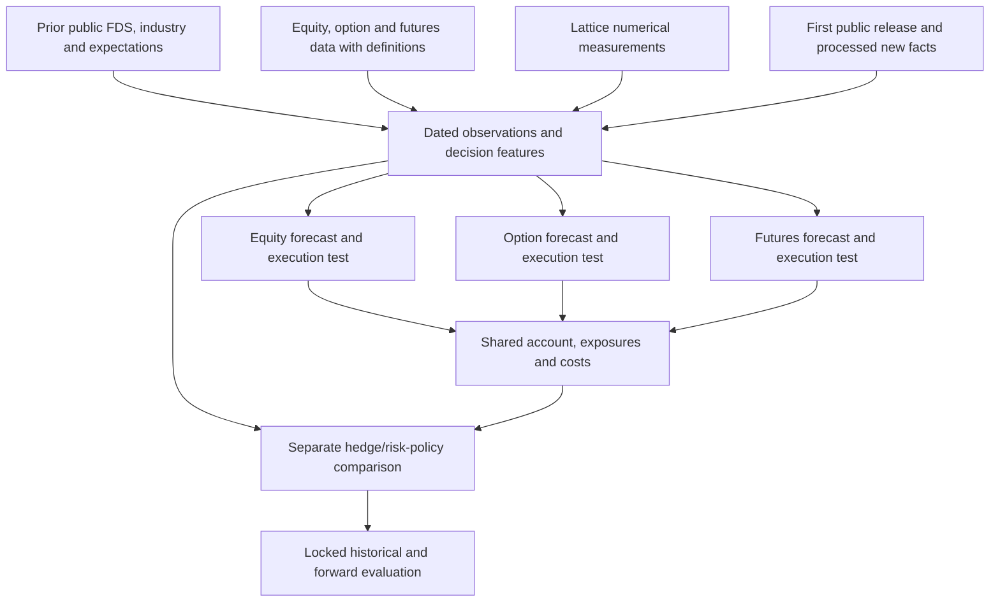

# Lattice numerical context across equities, options and futures

Date: 2026-10-03. Status: research design; no new acquisition, feature run, model fit or trading result. This extends option A using numerical inputs and outputs. The figure is a diagnostic, not the primary deliverable.

## Accepted intent and unresolved decisions

The user selected Lattice market-context features as the first role, expanded the scope to equities, options and futures, and confirmed:

- One daily decision with next-session outcomes.
- Futures may generate standalone returns and hedge equity/options exposure; measure these separately.
- Establish incremental value in historical research, then run a frozen forward paper test.
- Existing data is a starting point. Additional data may be sourced; availability, timing and acquisition cost still constrain the experiment.

The later user instruction selects all proposed futures families and all three numerical roles, with recommendations first: ES/MES, then rates, then energy/metals; forecast, then risk/filter, then direct signal. It also authorizes valuable extensions of Lattice's underlying approach. The [grill session](../grill-sessions/2026-10-03-multi-market-lattice.md) records this direction. The versioned research config `configs/experiments/multi-market-v1.json` freezes bounded diagnostic defaults. Economic account/position assumptions and genuinely reserved final dates require the corresponding data/execution gates; absent inputs are explicit blocked tests, not guessed profitable fills.

## Current evidence

| Component | Observed local state | Consequence |
|---|---|---|
| CFO development sample | 34 events, 89 event/expiry groups, 712 leg assignments/654 unique contracts, 31,510 Massive daily option bars, 4,527 outcome rows | Useful plumbing data. Rows share events/exposure; they are not 4,527 independent observations. Static current top-100 membership and filing-date clocks need replacement for a historical strategy. |
| Databento daily options | 29 verified compressed CSV files; 375,337 venue bars; 651/654 requested contracts; 2023-12-26 through 2026-04-17 | Raw coverage/liquidity diagnostics. Not yet imported as a new Lattice pricing input. Multiple publisher rows and UTC days prevent blindly substituting one row's close for Massive's close. |
| Exact-contract CBBO batch | Purchased job OPRA-20261003-4APD3MDYPJ still processing; saved status showed 66% at 23:31 UTC | Reuse the existing order. The sampled quote schema has its own clock/freshness limitations. |
| Native options pilot | 34 events/89 groups imported; GD-only quote pilot has 2 ATM quote groups; no equity score input attached | Data plumbing works; geometry-plus-options value has not been measured. Zero score matches is absence of supplied scores in this pilot, not proof that all issuers are unavailable. |
| Lattice equity numerics | Returns/beta/residual volatility, correlation distances, coordinates, scores, spreads, baskets and regime outputs exist | Reuse the exporters and provenance. The current correlation geometry uses raw adjusted-close returns; a market-factor residual series is not its existing signal input. |
| Predictive evidence | H1 peer-basket reversion failed matched controls; H3 embedding comparison is untestable in the current signal path | Do not inherit an equity trading edge. H1 is negative evidence for a specific correlation-distance peer rule, not a test of every numeric output. |
| FDS / release interpretation | Dated-data and document-learning plans exist; bounded OCR/FinBERT runtime verified; no accepted fitted payoff model | Native facts and release/wording work supply separate features. Their measurements are not future market outcomes. |
| Futures | No acquired, audited futures research panel or futures lifecycle adapter established in this workstream | Add a separate data/label adapter; do not feed continuous symbols into the equity price pipeline unchanged. |

Evidence: `data/processed/cfo-2024-2025-massive/manifest.json`; `data/raw/databento/OPRA-20261003-3QFKGVKXNA/validation_report.json`; `data/raw/databento/finalize_status.json`; `data/processed/lattice-databento-gd-pilot/gm-options-study/coverage.json`; `stat-arb/HYPOTHESES.md`; `stat-arb/ADR.md`; `docs/options-model-training.md`.

## Economic roles and shared architecture

One information store supports several hypotheses, not one pooled payoff definition. A filing describes an issuer; an index future represents aggregate exposure, and a commodity future needs its own supply/demand/carry mechanism. Industry exposures may connect them, but a favorable company disclosure cannot automatically determine a broad futures trade.

The existing pre-release and post-release information boundaries remain. Generate ordinary no-event decision rows for anticipation. Post-release labels begin after verified or explicitly assumed usable processing time. Futures market-state research can proceed without waiting for OCR; a separate macro/event lane can later add release-time surprises and vintage macro inputs.

Do not mix raw equity prices, thousands of option contracts and rolled futures as interchangeable geometry vertices. Begin with underlying market features; keep option and futures overlays. Risk-normalized, synchronized factor inputs are a later explicit experiment, with one representation per intended economic exposure. ES and MES are closely related implementations of one index exposure, not extra independent signals.

## Candidate numbers and what each claim would mean

| Family | Actual availability | Candidate use and first comparison |
|---|---|---|
| Trailing return, beta, idiosyncratic volatility | Exported in `gm-features/features.parquet` | Baseline controls. These are ordinary market features rather than evidence that geometry adds value. |
| Correlation-distance edges / peer weights | Exported edges and baskets | Peer/context features. Compare with sector peers and simple trailing correlation on identical decisions. |
| Boundary depth, p-value, inside flag | Exported `scores.parquet` | Unusualness relative to fitted history. A distributional p-value is not probability of profit. Retain estimator/view and decision-time fit window. |
| Peer spread z-score and OU half-life | Exported `spreads.parquet` | A falsifiable mean-reversion or risk feature. Preserve failed H1; do not keep changing variants until the same test wins. |
| Structural change / tear flag | Exported `regime.parquet` | Candidate state change or forecast-reliability feature. Compare with realized-volatility/correlation changes. High change does not imply a direction. |
| Persistence and diagram distance | Exported regime quantities | Later challenger after simpler state measures. Their descriptive meaning is not a demonstrated payoff advantage. |
| Correlation spectrum concentration | Computed internally; scalar export needed | Candidate invariant such as largest eigenvalue / trace. Separate exporter and formula version; compare with ordinary average correlation/PCA controls. |
| MDS x/y/z and extra dimensions | Exported coordinates; absent from H1 peer selection | Later experiment. Rotations, reflections and reference drift require causal alignment; invariant distances avoid arbitrary coordinate signs. |
| Valuation yields / View D | Optional equity-only path | FDS challenger when dated accounting, units and availability pass. Do not use issuer valuation ratios for futures. |
| Option spread, DTE, moneyness, implied move, volume/mark age | Existing options study fields | Pricing/liquidity baseline; IV/skew/term structure need correctly matched chains and pricing inputs. |
| Futures curve, roll state, settlement/OI, basis | New adapter needed | Contract-specific context. Carry/basis needs comparable underlying, rates/dividends, expiry and product conventions. |

Audit paths: `stat-arb/apps/gm-features/main.cpp:238`, `stat-arb/apps/gm-geometry/main.cpp:338`, `stat-arb/apps/gm-boundaries/main.cpp:783`, `stat-arb/apps/gm-signals/main.cpp:482`, `stat-arb/tools/options_native.py:315`. Raw market-model residual return export is proposed work, not an existing artifact.

First test a small predeclared family: simple market controls, then one invariant Lattice state scalar, then per-name boundary depth. Add spread and topology families as logged challengers rather than feeding every available column into a complex model. All windows, normalizers, feature selection, geometry reference fits and thresholds use training/past data only. No full-history embedding or future-aligned coordinate reference is eligible.

## Data expansion: coverage before buying

| Market | Context / lifecycle data | Execution evidence | Limits and external inputs |
|---|---|---|---|
| Equities / ETFs | Existing FDS plus dated issuer/security eligibility, corporate actions, consolidated daily or session bars. Databento `EQUS.SUMMARY` offers daily consolidated OHLCV, statistics and definitions. | Historical eligible bid/ask quotes, or explicitly named sampled/venue-limited pricing proxies. | Databento direct feeds / synthetic BBO are not official CTA/UTP SIP NBBO. Audit venue coverage or use a suitable SIP provider. Borrow/locates and financing are separate if shorting. |
| Listed equity options | Reuse OPRA caches; add definitions, start-of-day OI statistics, actual underlying data, and entry-time candidate chains as needed. | Existing `cbbo-1m` for a sampled pricing study; `cmbp-1` for consolidated update history where strict quote-time evidence is required. | Daily bars do not supply bid/ask. Minute records are interval samples, not a synchronized full-chain snapshot. IV/Greeks require matched inputs and a versioned pricing model, rates/dividends and exercise conventions. |
| CME futures | `GLBX.MDP3` definitions, actual contract bars and statistics for settlement/OI. Acquire front and subsequent maturities when curve/roll features require them. | `mbp-1` or `bbo-1m`; merged real-plus-implied `cmbp-1`/`cbbo-1m` is a different book choice, not cross-exchange NBBO. | Raw contract P&L, roll executions, multipliers, delivery/expiry and price limits; CME/broker historical margin and fees separately. Commodity fundamentals and macro vintages come from additional sources. |

`EQUS.SUMMARY` full-day summary includes extended trading and is published after regular trading; it must not silently replace a regular-session close. Query dataset-range metadata for the required history rather than inferring coverage from product launch date. Use finer data/calendar aggregation when a specific session bar is required. [Databento equity summary](https://databento.com/docs/venues-and-datasets/equs-summary), [equity SIP conventions](https://databento.com/microstructure/sip).

Databento daily OHLCV uses UTC dates. Futures official settlement/OI are separate statistics keyed to trading reference date and can arrive later or be corrected; use only the version available by the decision. [OHLCV specification](https://databento.com/docs/schemas-and-data-formats/ohlcv), [CME feed specifications](https://databento.com/docs/venues-and-datasets/glbx-mdp3), [statistics specification](https://databento.com/docs/schemas-and-data-formats/statistics).

Continuous futures symbology can select calendar or prior-day-volume/OI rolls, but its prices are unadjusted across the switch. Record resolved contracts and causal roll choices; never count a change of contract price as a traded return. [Databento symbology](https://databento.com/docs/standards-and-conventions/symbology), [CME expiration/roll guidance](https://www.cmegroup.com/education/courses/introduction-to-futures/understanding-futures-expiration-contract-roll).

Maintain dated equity reference/adjustment records, including inactive names. Stable economic/security keys are separate from vendor instrument IDs, with validity intervals. [Corporate actions](https://databento.com/docs/venues-and-datasets/corporate-actions), [security master](https://databento.com/docs/venues-and-datasets/security-master), [adjustment-factor timing](https://databento.com/docs/venues-and-datasets/adjustment-factors).

The existing Databento ledger is $23.13917 actual plus quoted against the user's $250 total cap. New universe/date/schema choices need free range/schema/cost metadata before commitment; the remaining cap is not an estimate that a full option chain panel will fit. Reuse purchased files, request definitions/context first, and expand quote scope only for frozen eligible decisions. No new order is part of this design.

## Shared observation and label contracts

Suggested keys are `(market, instrument_key, decision_id, horizon_id, feature_version)`. Issuer CIK exists only where applicable. Every observation preserves dataset/publisher, vendor instrument ID, contract/security mapping version, source session and UTC timestamps, original receipt/publication and any historical replay assumption, unit/currency, definition version, quality and missing reason. Source bars, quotes and corrections remain immutable.

Each lane has an audited session calendar. A daily decision still needs an exact information cutoff and feasible later execution. Candidate pilot: previous complete available session features, a fixed US-equity-calendar decision, then entries from a defined eligible quote after that decision. Exact time remains an interview parameter. Futures have different overnight sessions; label by product calendar and preserve a common account marking clock. Never use a later futures/underlying observation to repair an earlier options feature.

| Lane | Scientific target | Economic target |
|---|---|---|
| Equity | Next-session underlying return/residual return, plus uncertainty | Cash P&L after bid/ask, fees, dividends/actions and any borrow/financing; fixed position/exposure rule |
| Option | Same-contract call/put midpoint change and optional IV change | Cash P&L after ask-entry/bid-exit and fees/slippage assumptions; exact preselected contract and deliverable |
| Futures alpha | Next-session actual-contract point/cash change, risk-scaled using past observations | Quantity × multiplier × actual execution change, less fees/slippage, including actual roll trades; reconcile settlement cash flows to that same gain |
| Futures hedge | Portfolio residual risk / tail loss at a stated horizon | Portfolio-plus-hedge net cash/account returns compared with no hedge and a simple frozen rolling-beta hedge |

Option premium depends on stock movement, volatility, time and other inputs. Premium-percent gain cannot fairly be compared with share-percent or futures-margin-percent gain. Report cash/account returns and exposures at comparable risk; futures margin is collateral, not invested capital or a universal return denominator. [OIC option price behavior](https://www.optionseducation.org/referencelibrary/faq/option-price-behavior), [CME margin guidance](https://www.cmegroup.com/education/courses/introduction-to-futures/margin-know-what-is-needed).

The equity code computes positive-price log returns. Futures and spreads may have zero/negative prices; their adapter must use explicit point/cash changes and an ex-ante risk scale where needed. Keep adjusted continuous features separate from raw-contract execution. A shared account ledger includes overlapping exposure, cash/premium, variation margin, collateral, financing and limits. Shares, option delta and equity futures can express the same beta; adding them does not diversify it automatically. Separate gross notional, beta/delta, gamma/vega and concentration attribution.

Executable-label rules preserve original quote timestamps, side-specific prices and displayed sizes. Reject crossed/invalid quotes and quotes lacking the capacity required by the frozen position policy. Define conservative participation, partial fills and nonfills; sampled bid/ask prices remain pricing proxies unless the execution contract can be met. Missing execution evidence cannot cause a retrospectively favorable substitute contract to replace the selected one.

Futures accounting must reconcile cumulative variation margin, residual mark-to-market and entry/exit cash adjustments to quantity × multiplier × execution-price change, less costs. Settlement cash flows are not added again to total execution P&L. Collateral transfers are separate from profit; every actual contract leg of a roll appears once. Verify equality of lifecycle profit under cash-flow and execution-price representations with a position held across settlement and a roll.

## Experiments and rejection rules

1. Freeze eligibility, decision/contract/roll rules, primary horizon, model capacity, costs, feature families and trial IDs on development data. Current CFO/cache data has been inspected and is not an untouched holdout.
2. Build market-specific simple price/volatility/liquidity baselines. Add dated FDS/context where applicable; macro/curve context is a separate futures lane.
3. Add one numerical family to exactly the same decisions, instruments, costs and missing-data cohort. Compare against its simple substitute (volatility/correlation/PCA/sector-peer feature), not only no trade.
4. Distinguish forecast improvement, net trading value, risk-policy benefit and hedge benefit. Fit policy thresholds inside training/validation; a later filter change is another logged trial.
5. Use chronological, grouped, overlap-purged evaluation. Keep one economic release, its options, its equity and related futures exposure together for dependence accounting. Preregister dependence-preserving permutation tests of the paired increment before interpreting significance; preserve event bundles and shared calendar-time dependence across issuers and markets. A permutation requires a defensible exchangeability/null assumption; if unavailable, report that limitation rather than a fabricated p-value. Report net daily account-return Sharpe with dependence-aware bootstrap confidence intervals, its capital denominator and annualization convention, trial count and effective independent support. Never pool trade returns as independent daily account returns. Insufficient support remains inconclusive. Track all tried variants and market decisions.
6. Reject a candidate whose gain depends on future timing, roll jumps, revisions, arbitrary coordinates, incomparable exposure, unusable quotes or simple-feature redundancy. Wide uncertainty remains inconclusive; do not promote it as a signal.
7. Promote only after a predeclared practically useful incremental outcome and informative uncertainty. Numerical minimum benefit/drawdown/precision thresholds need the mandate/risk answers; no universal event count or p-value alone proves tradability.
8. Freeze the surviving candidates for a forward paper period with actual source receipts, feature completion, quotes, decisions, exclusions and account exposures. No live capital follows from this planning document.

## Coordination with the other workstreams

- **Benchmark:** dated FDS, historical issuer eligibility, observations and as-of joins. Its issuer keys feed the equity/options lanes; generic market keys accommodate futures.
- **Benchmark pt. 2 industry spec:** economic exposure mappings and industry facts. Futures connections require explicit portfolio/index/rate/commodity channels, not merely a sector label.
- **Post Benchmark:** release timing, calibrated facts/wording and existing options-label integrity. This expansion consumes its artifacts; `src/options_learning.py` remains under that workstream's integration ownership.
- **Assess Lattice repo fit:** market/contract adapters, numerical exports, quote interpretation, paired feature experiments and shared-account evidence.
- **Track work across project chats:** evidence/status reconciliation and the living discussion. Draft plans, local implementations and verified runtime outcomes remain distinct.

Read together with [the existing parallel 8-K plan](../superpowers/plans/2026-10-03-parallel-8k-validation-and-learning.md) and [the skeptical strategy review](../strategy-research-review-2026-10-03.md). Large eventual panel processing/backtests run on `home-pc` in detached tmux with logs; OCR/GPU work uses the existing HiPerGator lane.
