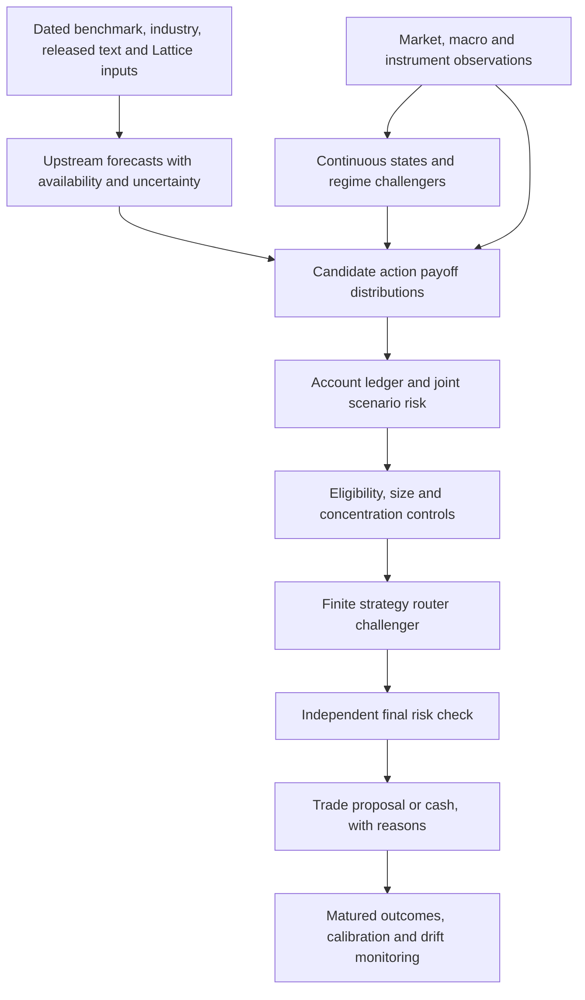

# Regime detection, risk and signal optimization for QuantHaxs

Date: 2026-10-03. Status: researched proposal and research work plan; interview in progress. No new model fitting, backtest, acquisition, remote job or trading was performed for this document. These are local documents, not merged implementation or measured strategy performance.

## 1. Agreed purpose and upstream assumptions

The user asks us to assume **Benchmark**, **Benchmark pt. 2 industry spec**, **Post Benchmark** and **Assess Lattice repo fit** supply their intended outputs. This research designs the downstream layer against those contracts. It does not reopen upstream completion as a reason to delay research or certify upstream forecasting performance.

New decisions from this chat:

- Optimize **net portfolio growth within hard risk limits**.
- Research both **rejecting/sizing/capping trades** and **automatic strategy switching**.
- **Compare risk profiles across asset universes**; no numeric capital limits, leverage or short-option permissions have been chosen.

Previously recovered decisions are daily decisions/next-session outcomes, January 2024 onward with earlier lookbacks where needed, historical validation followed by frozen forward paper, options/equities/futures, ES/MES as the first futures recommendation, and forecast-first numerical Lattice experiments. Futures profit and hedge benefit, and strict arbitrage versus predicted repricing, remain separate studies. See [cross-chat context](2026-10-03-cross-chat-scope-and-cross-asset-integration.md).

The existing [strategy-validation plan](../superpowers/plans/2026-10-03-strategy-validation.md) remains the proposed evaluation spine. The [parallel plan](../superpowers/plans/2026-10-03-parallel-8k-validation-and-learning.md) remains the cross-asset schedule. This document extends their downstream research rather than defining another ingestion or evaluation pipeline.

**Initial assessment:** regimes are a plausible conditioning variable and risk tool. Their usefulness must be demonstrated in the decisions they change. The most promising first comparison is pricing-aware eligibility and shared exposure control versus the same system with probabilistic regimes and switching. This is an inference from the research below, not an established QuantHaxs edge.

## 2. What similar research supports, and where it disagrees

| Primary evidence and access | Finding | Consequence for this project |
| --- | --- | --- |
| Guidolin & Timmermann, [Asset Allocation under Multivariate Regime Switching](https://files.stlouisfed.org/files/htdocs/wp/2005/2005-002.pdf), author working paper underlying the 2007 article; full text | Recursive stock/bond allocation tests favor a four-state model at some horizons and a continuous VAR at another. Table 4 separates 1980–1999 pseudo out-of-sample from 2000–2003 genuine out-of-sample evidence. | Test continuous and discrete representations. Monthly asset allocation is not evidence for next-session event-options profits. Do not copy its four-state count or treat its whole history as untouched. |
| Ang & Bekaert, [International Asset Allocation with Regime Shifts](https://business.columbia.edu/faculty/research/international-asset-allocation-regime-shifts), 2002; university abstract | Ignoring regimes has relatively small costs for all-equity portfolios, larger costs when a conditionally risk-free asset is available. | Value depends on available actions, including cash. A detectable state need not have substantial trading value. Full empirical methods were not verified here. |
| Moreira & Muir, [Volatility-Managed Portfolios](https://www.nber.org/system/files/working_papers/w22208/w22208.pdf), 2016 working paper underlying the 2017 article; indexed primary text | Scaling risk down when volatility rises improves factor performance in their analysis. | Volatility management is a candidate risk overlay. Equity factors and currency carry are different from nonlinear single-name event options. |
| Cederburg et al., [On the Performance of Volatility-Managed Portfolios](https://www.lehigh.edu/~xuy219/research/COWY.pdf), 2020; full published paper | Direct comparisons across 103 equity strategies do not show systematic superiority. Their base real-time combination test lowers certainty-equivalent returns in 72 cases; unstable historical relationships matter. | Separate attractive regression results from implementable policy value. Estimate normalization and allocation weights using past data, not full-sample realized volatility. |
| Adams & MacKay, [Bayesian Online Changepoint Detection](https://arxiv.org/pdf/0710.3742), 2007; full paper | Causal run-length inference detects changes using observed data; the original model assumes independent observations within segments and a specified change hazard. | Test change alarms on forecast errors or suitable market innovations. Serial dependence and hazard choice need explicit treatment. Change detection is not foresight about the next corporate announcement. |
| Tsaknaki, Lillo & Mazzarisi, [Online Learning of Order Flow and Market Impact](https://usiena-air.unisi.it/bitstream/11365/1275957/1/QF_2024.pdf), author manuscript for the 2025 article; full text | Change-point extensions improve order-flow forecasting in selected minute-scale TSLA/MSFT samples. | Evidence of a workable method, with a narrow sample and different target. Do not transfer its microstructure result to daily options alpha. |
| Alexiou et al., [Pricing Event Risk](https://academic.oup.com/rof/article/29/4/963/8079062), 2025; full article | Concave short-term IV curves precede larger earnings moves but lower long straddle/strangle returns; costs preserve the group difference. | Forecast event-specific payoff relative to the price paid. Large expected moves do not automatically favor buying volatility, and negative long-vol results do not automatically validate selling it. |
| Dubinsky et al., [Option Pricing of Earnings Announcement Risks](https://research.vu.nl/ws/files/108247883/Option_Pricing_of_Earnings_Announcement_Risks.pdf), 2019; full published paper | Implied event uncertainty adds information about realized volatility, while event risk commands a premium. | Separate event jump variance, ordinary volatility and expected net payoff. The market surface belongs in the baseline. |
| Gao, Xing & Zhang, [Anticipating Uncertainty](https://www.cambridge.org/core/journals/journal-of-financial-and-quantitative-finance/article/abs/anticipating-uncertainty-straddles-around-earnings-announcements/7B34877AD5E06304BA3C55FBA3219FDD), 2018; publisher abstract | Contrary earnings evidence reports positive straddle returns for a three-days-before-through-event window, strongest in smaller/less-traded names. | Entry window and liquidity can reverse conclusions. Abstract evidence does not establish executable profits or endorse extending holding periods after looking at results. |
| Mitchell & Pulvino, [Characteristics of Risk and Return in Risk Arbitrage](https://onlinelibrary.wiley.com/doi/10.1111/0022-1082.00401), 2001; publisher abstract | Merger-arbitrage returns become related to the market during severe declines; a nonlinear contingent-claims model describes downside better than constant beta. | Deal exposure needs joint close/break and market stress. Apparent diversification in ordinary periods need not survive a selloff. This is merger-stock evidence, not a company-event options forecast. |
| Daniel & Moskowitz, [Momentum Crashes](https://kentdaniel.net/papers/published/jfe_16.pdf), 2016; full author-hosted article | Momentum losses cluster after market falls, during high volatility and sharp rebounds; their dynamic rule uses changing mean and variance. | Include rebound as well as selloff scenarios. A successful stock-factor strategy does not validate a daily event/options router or justify switching on volatility alone. |
| Barroso & Santa-Clara, [Momentum Has Its Moments](https://doi.org/10.1016/j.jfineco.2014.11.010), 2015; publisher abstract | Their volatility-managed momentum strategy reduces historical crashes and improves Sharpe ratios. | A reason to test risk scaling, with the contrasting real-time volatility evidence above. Historical momentum protection is not proven event-options growth. |
| Ledoit & Wolf, [Honey, I Shrunk the Sample Covariance Matrix](https://econ-papers.upf.edu/papers/691.pdf), 2003; full author paper | Shrinking stock covariance estimates reduces optimization error in their application. | Use conservative covariance estimates and exposure caps rather than optimizing an unstable event covariance matrix. Covariance alone misses option jumps and joint tail losses. |
| Brunnermeier & Pedersen, [Market Liquidity and Funding Liquidity](https://www.newyorkfed.org/medialibrary/media/newsevents/events/research/2006/0518-Mkt_Fun_Liquiditybrunnermeierandpedersen.pdf), 2006 working paper; full text | Their model links trading liquidity, funding constraints and destabilizing liquidity spirals. | Stress both liquidation cost and cash needed to maintain positions; distinguish issuer liquidity from our account liquidity. This is a theoretical mechanism, not a calibrated broker-margin forecast. |
| Busseti, Ryu & Boyd, [Risk-Constrained Kelly Gambling](https://web.stanford.edu/~boyd/papers/pdf/kelly.pdf), 2016; full paper | Optimizes growth with a drawdown-probability bound under a repeated IID payoff model. Its drawdown definition concerns initial wealth rather than a rolling high-water mark. | Useful objective formulation; not a license to apply full Kelly to uncertain, overlapping events or promise a peak-to-trough drawdown ceiling. |
| Sun & Boyd, [Distributional Robust Kelly Gambling](https://web.stanford.edu/~boyd/papers/pdf/robust_kelly.pdf), 2018 manuscript; full text | Optimizes worst-case growth over a specified probability uncertainty set. | Compare uncertainty-aware sizing with simple capped sizing. Results depend on whether the uncertainty set covers relevant outcomes; the model cannot guarantee real-world survival. |
| Gibbs & Candès, [Adaptive Conformal Inference Under Distribution Shift](https://arxiv.org/pdf/2106.00170), 2021; full paper | An online wrapper adapts prediction-set coverage; its distribution-free guarantee concerns long-run coverage frequency. It illustrates volatility forecasting with GARCH. | A calibration challenger, not a per-event conditional probability or portfolio-loss guarantee. Update only when outcomes are known; assess interval width and local/family coverage as well as average coverage. |

The closest earlier project precedent remains post-disclosure stock prediction from filing text, with economically modest per-trade returns and cost/drawdown limitations. That research is summarized in [the whole-strategy review](../strategy-research-review-2026-10-03.md). None of the studies above validates the combined FDS → pre/post surprise → geometry → cross-asset strategy.

## 3. Use several dated state dimensions

Avoid one label such as “bullish regime” standing in for all risk. Start with a small predeclared set; add a dimension only through a logged comparison.

| State dimension | Inputs available by decision | Economic use |
| --- | --- | --- |
| Market and macro | Lagged market/sector returns, realized volatility, rate/credit changes and released macro vintages | Conditioning risk, discount-rate and demand scenarios; shared exposures |
| Issuer financial state | Dated FDS, margins/cash generation, cash runway, debt resets/maturities, business exposure and evidenced relationships | Which surprise changes value, refinancing or dilution risk; issuer-specific stress |
| Event state | Scheduled/unscheduled, event family, time to known event, prior guidance, announcement/closing/review stage | Arrival versus surprise; jump/timing distribution and no-event decay |
| Instrument and execution state | Contract horizon, IV/skew/term structure, bid/ask/size, quote age, session, financing/borrow/margin | Price of exposure, liquidity and feasible action |
| Model and data state | Forecast uncertainty, matured forecast errors, source coverage/age, calibration and out-of-distribution indicators | Abstention, smaller exposure, fallback, recalibration review |

For revised macro series, use dated vintages. [ALFRED real-time periods](https://fred.stlouisfed.org/docs/api/fred/realtime_period.html) preserve information known on historical dates; date-level vintages do not establish intraday public or local receipt timestamps. Join release-time evidence separately. Never use later recession classifications as real-time features without a dated publication basis.

**Candidate methods:**

1. **Observable continuous state:** a small set of lagged variables with regularized interactions. This is the first interpretable comparator, not a claim that all macro variables predict returns.
2. **Filtered Markov/HMM state:** probabilities conditioned only on available observations. Fit parameters, scaling and state count inside past development folds. Prohibit full-series smoothing and retrospectively decoded paths as trading inputs. State numbers are not stable economic identities across refits; align interpretations using training information only.
3. **Online change detector:** probability of a recent change/run-length distribution. Start as a warning or shrinkage input; automatic retraining needs a separately frozen policy. Measure false alarms and adaptation delay using controlled changes and prospective diagnostics; ex-post market labels are not an unquestionable ground truth.

Regime detectors may use longer pre-2024 market lookbacks for initialization, consistent with the accepted context. This does not add corporate-event training observations or create more independent crises. Sparse event/state/family cells should pool information and show wide uncertainty rather than receive separate unconstrained strategies.

## 4. Proposed decision architecture

The router consumes admissible candidate actions, including cash, and cannot bypass a final independent risk check. Expected outcomes must include no event, delay, adverse surprise, favorable surprise already priced, volatility repricing and unavailable/failed execution. Forecast changes and risk-policy changes remain separately identifiable.

Do not map a favorable company forecast directly to a call, a high-volatility state directly to a short straddle, or a rate cut directly to a profitable REIT trade. Convert each economic scenario into an uncertain **instrument payoff after costs**. Prediction-market observations remain optional permitted-input experiments; do not count odds and prices as independent corroboration by assumption.

The existing 90–180-day, near-120-day option selection with next-session exit is a baseline candidate. Short-expiry earnings research cannot certify it. Maturity/structure/holding-period alternatives are finite registered challengers, not a retrospective search for a profitable window.

## 5. Risk analysis across different asset universes

### Risk measures have distinct roles

- **Enforceable pre-trade limits:** allowed instruments, quantities, premium/collateral committed, exposure concentrations, available cash and executable size. Check again after routing and proposed netting.
- **Modeled loss limits:** joint stress loss, expected shortfall and probability of severe loss under declared assumptions. Expected shortfall needs adequate tail information; with sparse events, report scenario losses and uncertainty rather than precision unsupported by data.
- **Drawdown response:** account-level loss/drawdown thresholds trigger reduced or stopped new risk and a specified liquidation/review policy. Gaps, unavailable quotes and fills can overshoot thresholds. A stop order or modeled stress budget is not a guaranteed realized loss ceiling.

Use full option revaluation for large moves, with delta/gamma/vega as local diagnostics. Stress underlying jump, skew/term-structure repricing, elapsed time, spread widening, missing exits, assignment/exercise/deliverables and correlated events. For expiry/exercise, include resulting holdings and cash obligations. [OCC standardized-options risks](https://www.theocc.com/company-information/documents-and-archives/options-disclosure-document).

| Universe or structure | Capital and risk accounting | Distinct failure to test |
| --- | --- | --- |
| Fully paid equities | Actual shares, cash/distributions/actions; market/sector and issuer-gap exposures | Price gaps or delisting; a proposed stop may fill below its trigger |
| Purchased options | Premium plus fees; possible full-premium loss; nonlinear payoff and exercise-created exposure | Correct direction but overpriced premium, IV repricing, illiquid exit |
| Multi-leg/short options, research challengers | Simultaneous leg feasibility, collateral, exercise/assignment, residual shares and liquidation path | “Defined risk” at expiry does not eliminate interim leg/assignment/cash problems; uncovered calls have unbounded theoretical upside loss |
| ES/MES first futures study | Actual multiplier/contracts, cash variation, changing margin, sessions/expiry and basis | Index exposure is not issuer exposure; margin is not maximum loss; gap/variation obligations can exceed deposited collateral |
| Portfolio hedge | Combine hedge with a named protected holdings book and costs | Profitable hedge during stress can still have excessive long-run insurance cost; hedge-alone return is not total portfolio benefit |

[CME margin documentation](https://www.cmegroup.com/education/courses/introduction-to-futures/margin-know-what-is-needed.html) distinguishes performance bonds from the exposure they support. Study changes and cash calls rather than treating margin as money spent or a loss cap. Securities borrow for a short stock is separate from a company's disclosed corporate loans.

**Shared exposures:** aggregate underlying/sector/market/rate sensitivity, option volatility/jump exposure, event timing and evidenced counterparty relationships. Revalue all books under the same shocks. An option and equity on the same issuer are not two independent bets. Repeated ES labels joined to many companies produce one market outcome and one net position. Stale graph edges or missing disclosures are uncertainty, not proof of diversification or a causal transmission path.

### Compare profiles on two axes

Keep instrument eligibility separate from budget aggressiveness so a result is interpretable:

| Research profile | Risk budget relative to a future agreed base B | Treatment of uncertainty and cash | Main question |
| --- | --- | --- | --- |
| Defensive | 0.5 × B | Stronger shrinkage/abstention; larger settlement and liquidation buffer | Does capital protection preserve enough net growth? |
| Balanced | 1 × B | Conservative estimates with diversified exposure caps and normal stress buffer | Does this provide the best useful growth/risk trade-off? |
| Active | 1.5 × B, subject to unchanged instrument and concentration restrictions | Accept more modeled exposure only where uncertainty/quotes remain admissible | Does added exposure improve growth after tails and cash demands? |

These relative multipliers are **illustrative sensitivity candidates**, not calibrated optima or approved live limits. B is unresolved. All profiles retain their own declared hard ceilings; “active” does not relax a ceiling after a loss. Compare each within an identical instrument set first, then compare equity-only, equity plus purchased options, and equity/options plus futures. More complex or short-option sets are separate conditional research branches. Avoid an exhaustive cross-product of profiles, states, horizons and structures.

Report one shared-NAV growth series, cash usage, binding limits, tail/scenario loss, peak-to-trough drawdown, time under water, margin demand and usable/closed-market coverage. Show opportunity cost versus cash and a simple admissible benchmark. Run risk-matched sensitivity comparisons so increased leverage is not mistaken for better information. A modeled global risk budget is not a guarantee across unmodeled scenarios.

## 6. Research work plan and experiments

### Phase A — freeze the research question and contracts

Deliver an extension to existing typed records: `decision_id`, asset/policy/family/version, decision/public/receipt/process clocks, upstream forecast version, uncertainty basis, state-observation IDs/model-fit cutoff, eligible actions, cost and scenario versions, existing positions/cash, proposed quantity and rejection/limit reasons. Reuse the same schema owner; names here are proposed fields, not implemented APIs.

Freeze exact daily decision/reference-session time, pre/post branches, baseline action rule, outcome availability and matched universe. Preserve all eligible decisions, including no event and no trade. Separate missing source coverage, source outage and an economic no-event outcome. Keep January 2024 onward evaluation and initial lookbacks distinct.

**Output:** experiment registry, input contract, coverage ledger and [interview decisions](../grill-sessions/2026-10-03-regime-risk-layer.md). Numeric risk preferences, exact daily time and promotion thresholds require user decisions before an executable experiment is frozen.

### Phase B — construct a common economic comparison

Assuming upstream artifacts exist, reconstruct representative decision/quote/position examples for earnings/guidance, FDA/deals and REIT/rates plus ES/MES. Use each family's economic scenarios rather than pooling “good 8-K” labels. Earnings compares to dated expectations; FDA includes scope/delay/runway; deals include close/break and terms; REITs distinguish floating debt, maturity/refinancing, loan assets and property demand. Include already-priced news.

Define full-revaluation stress cases, synchronized feasible entry/exit, corporate actions, exercise, borrow/financing, settlement and margin. Buying at ask and selling at bid already charges the spread; do not charge it twice as extra slippage. Model extra slippage/impact only with a declared basis and sensitivity. Quotes and available size are fill assumptions, not proof of execution.

**Output:** one reconstructable action/risk card per covered family, shared cash ledger examples and asset-specific scenario contracts.

### Phase C — test forecast conditioning separately

Compare the frozen upstream forecast with continuous state variables, filtered-state probabilities, and change/uncertainty signals as registered challengers. Keep the trading/risk policy unchanged in this phase. Each forecast may choose different actions under that same policy; do not force identical realized positions.

Use proper scores/calibration for probabilities and appropriate amount/return losses for continuous targets. Separate event arrival, conditional surprise, stock return and option net payoff. Score all decisions as well as selected trades. Sparse regime cells require pooling and interval reporting. Adaptive calibration updates only from matured labels; next-session labels cannot alter earlier decisions.

**Output:** paired forecast loss, local/family coverage, interval width, incremental value over prices/options/macro and failure cases. These do not by themselves establish portfolio profitability.

### Phase D — test risk control and routing separately

Hold a selected forecast version fixed and compare:

1. **P0:** basic admissible sizing and universal hard controls, without additional regime conditioning.
2. **P1:** continuous-state risk gating/sizing/concentration controls.
3. **P2:** P1 with a probabilistic-state or change-detector challenger, replacing the state representation in a controlled comparison.
4. **P3:** the chosen gating baseline plus a finite strategy router. Router alternatives include cash and only eligible structures. Use trained expected net payoff/uncertainty, prices and joint portfolio risk; account for switch costs, state errors, unnecessary churn and delayed transitions.

Do not select P3 using P2's final-test outcomes. P1/P2 selection and router tuning occur in development; one frozen challenger faces the final comparison. Predeclare minimum switching benefit, hysteresis/cooldown candidates and reevaluation rules. Monitoring a break does not authorize an unlogged new model.

First compare profiles within each book; then aggregate them using one cash/exposure ledger. Profit strategies and portfolio insurance remain separately scored. A strict-arbitrage branch requires enforceable matched cashflows and feasible legs; a forecast of convergence belongs to the risk-bearing repricing branch.

**Output:** growth/risk frontier, net benefit versus the admissible baseline, turnover, limit breaches, cash/margin paths, rejected opportunities and explainable routing decisions.

### Phase E — chronological validation and falsification

Use walk-forward development with all fitting, scaling, imputation, state identity alignment, feature selection, thresholds and profile/router selection confined to past data. Purge overlapping label intervals and require label availability. The 34-event CFO study's thousands of dependent rows remain a development case, not thousands of independent trials.

For paired uncertainty, retain shared calendar shocks across issuers/books; resample blocks jointly, keeping economic-event variants together. Assess issuer dependence, regime transitions and block assumptions. Do not bootstrap each asset's coincident crisis independently. Log all candidate models, windows, policies and failures. [Backtest-overfitting research](https://www.davidhbailey.com/dhbpapers/backtest-prob.pdf) motivates accounting for selection; its framework is not a substitute for chronological deployment evaluation.

Evaluate per-family/asset/regime stability, coverage and selection effects alongside the common calendar portfolio. Estimate necessary precision using development-only variance, tail availability and an economically meaningful minimum increment; there is no universal adequate event count. Model deterioration and data failures receive explicit fallback/review policies.

After a frozen historical comparison, forward paper records actual processing clocks, proposals, quotes, no fills, state changes and matured outcomes. Retire a challenger if benefit disappears after costs, depends on future regime labels, misses cash/risk obligations, or fails the predeclared comparison. Report inconclusive evidence when uncertainty is too wide. Hard-control breaches fail the policy even if its average return is attractive.

**Output:** promote/retain as research/retire decision with uncertainty and a frozen forward-paper protocol. No result from this plan is reported as already obtained.

## 7. Cross-chat integration and next decisions

Proposed interfaces, not accepted work assignments or messages to those chats:

| Exact chat title | Downstream contribution |
| --- | --- |
| Benchmark | Company/FDS observations, decision-ready feature versions, clock/quality and uncertainty evidence; no future facts selecting historical regimes |
| Benchmark pt. 2 industry spec | Dated debt/reset/maturity, cash/runway, industry and relationship exposures with units/signs/roles, coverage and review flags |
| Post Benchmark | Separate pre/post forecasts, released surprise/text, calibrated payoff candidates and matured-label availability; no sentiment-to-position shortcut |
| Assess Lattice repo fit | Numerical geometry as a forecast challenger, ordinary factor/price/vol controls, asset-specific market/quote/session interfaces and unique ES/MES aggregation |
| Track work across project chats | Shared evidence/decision log and living GitHub discussion; distinguish hypotheses, local implementation, merged code and verified runtime |

The existing parallel plan's **lane F (protocol/regime/risk)** should specify profiles, policies and comparisons; **lane G (numerical context)** should supply dated state/geometry features. Integration retains shared schema/configuration/ledger ownership; asset lanes supply prices, contract definitions and cash obligations. These are proposed handoffs through the existing plan, not additional assignments.

All owners should extend the canonical validation contract before creating overlapping regime/risk schemas. Existing `src/risk_management.py` provides per-event sizing and IID bootstrap scoreboards; `src/capital_liquidity.py` limits a single trade by capital/risk/volume. Neither is a shared portfolio-risk/router contract. The Lattice trailing-volume rank is not a fill/capacity model. Their outputs need account/decision/scenario semantics before reuse as this layer. File ownership remains with the active workstreams.

The grilling interview has settled objective, authority and profile comparison. Remaining branches include falsification/zero allocation, exact daily clock, which instrument permissions to include in each prospective profile, numeric risk limits and the minimum useful economic increment. Research can continue without inventing answers. A finalized design and implementation plan follow the interview and written-design review; this document is the current research proposal.
