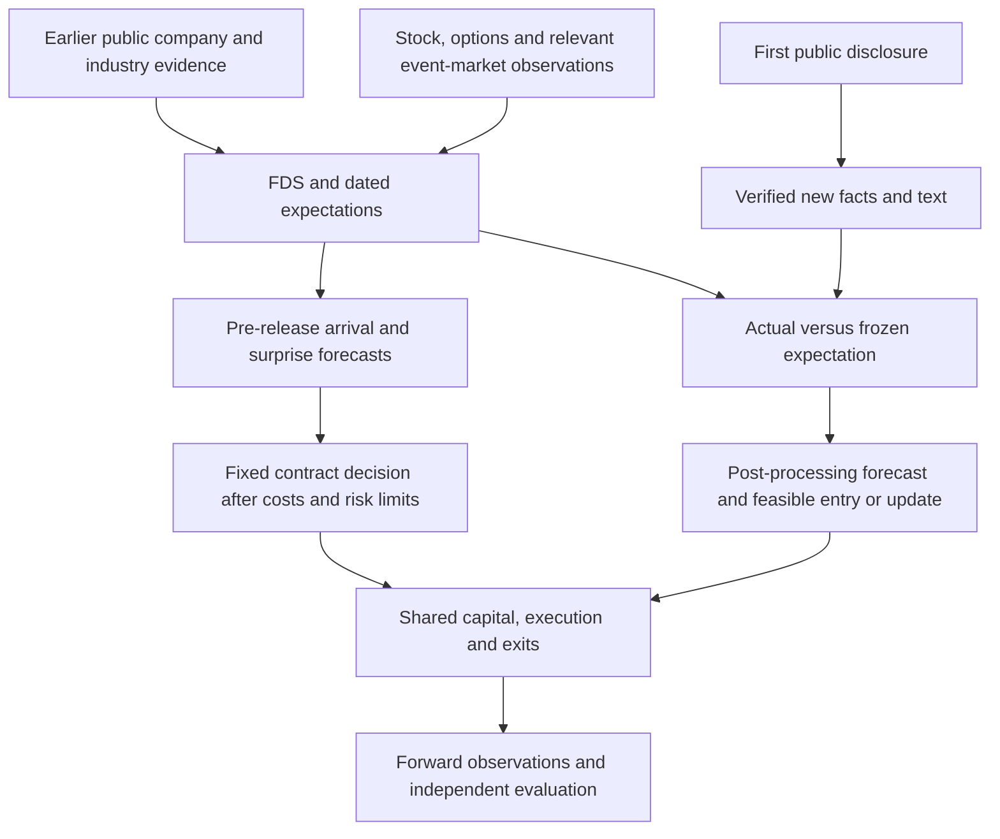

# QuantHaxs: skeptical review of the whole trading strategy

**Evidence date: October 3, 2026; local status refreshed at 22:53 UTC.** Research and local-artifact review; no new backtest, purchase, model fit or trade was performed. Local state is a dated snapshot of concurrent work.

**Detailed follow-up:** [Research into all five validation gaps](strategy-validation-research-2026-10-03.md) and [the shared implementation plan](superpowers/plans/2026-10-03-strategy-validation.md) now connect sample expansion, information timing, quotes/capital, option premiums and source ablations to all three event tracks and the existing chats. Use that plan for the next validation work; this review remains the earlier strategy assessment.

## Verdict

**There is a defensible research idea here. A profitable, deployable trading strategy has not been demonstrated.** I would approve a bounded validation program. I would not approve capital allocation on the evidence inspected.

For a research goal of establishing incremental trading value, the leading candidate to test is an event-specific comparison of **new economic facts versus what was already expected**, conditioned on the issuer's financial exposure and current stock/options prices. The least defensible shortcut is converting favorable filing tone, an expected event, or a high prediction-market YES price directly into a call/put decision.

This is not a finding that the strategy necessarily loses. There is no adequate project test to support either profitability or general failure. Certain existing measurements cannot answer the live-trading question: an event-only retrospective sample cannot validate advance event selection, and last-trade marks cannot establish achievable option execution.

Personal suitability remains unresolved: the user has been asked about the intended research/paper/live stage, capital, loss limits, overnight exposure and permission to sell options. Those choices will affect implementation and instrument selection.

## 1. The strategy reconstructed

The user's intended pipeline is:

1. Build company financial data sheets (FDS) from earlier EDGAR filings, collected general APIs and industry-specific sources.
2. Represent financial condition, prior guidance, industry exposures, expectations and observable regimes using information available at the decision.
3. Forecast a precise forthcoming event and its economic surprise; for unscheduled events, forecast arrival within a fixed window as well.
4. Compare that forecast with expectations already embedded in stock/options prices and, where relevant and permitted, prediction markets.
5. Select a specified position only when predicted executable value clears its costs and risk constraints.
6. After the first public release, extract new facts and wording, compare them with frozen expectations, and update a separately evaluated response model.
7. Apply predeclared position, exit, capital and liquidity rules; record realized outcomes and errors.

The pre-release and post-release branches need separate labels, clocks and evidence. If issuer news precedes the 8-K, that news is already part of the available information at later decisions.

## 2. What exists today

| Component | Inspected evidence | What it establishes |
| --- | --- | --- |
| Strategy concept | docs/8k-anticipation-research-concept.md, especially lines 20–65 | Proposed two-stage research architecture; not a fitted trading system. |
| Current CFO study | src/config.py; src/data.py; src/implementation.py; data/processed/cfo-2024-2025-massive/manifest.json | 34 CFO-appointment events in 2024–2025, expanded into 89 priced event/expiry groups and 4,527 result rows. |
| Current study economics | Daily option last-trade closes, marks allowed up to 3 sessions stale, synthetic stock from put/call parity | Descriptive mark calculations. No verified fills, underlying hedge, net portfolio equity curve or options alpha. |
| Trade families | Synthetic stock, long call, covered call, protective put, collar, cash-secured put | Different economic objectives and risks; a single pooled scoreboard does not select a live mandate. |
| Capital calculations | Per-event capital/risk/volume assumptions and premium haircuts | Separate capacity assumptions; not a shared overlapping-position or financing ledger. These haircuts do not make the mark-return formulas actual net returns. |
| Independent quotes | docs/databento-options-backfill.md and retained quote-coverage artifacts | Real bid/ask acquisition and plumbing. Only bounded group coverage was complete at review; the exact-contract CBBO quote batch was pending. Completed trade-derived OHLCV bars are a separate dataset and do not establish executable quotes. |
| Document processing | Collected integrated pilot 44620388, pilot-run.json and local-processor-v1-verification.json | The bounded pipeline completed with batch exit 0 and OCR acceptance passing for one prose image alongside four native HTML inputs. Its OCR matches the checked 251-word body. Options remain not_ready with null forecasts; no fitted predictor or LoRA improvement established. |
| REIT extraction | Realty Income selected-fact score; four-issuer collection/analysis manifests | 14 selected native-text facts classified correctly on two pages;35 documents collected across four issuers, with broader money analysis explicitly partial. |
| Prediction markets | docs/prediction-market-evidence-review.md and its implementation plan | Researched optional expectations input. No project incremental forecast or trading result. |
| Lattice geometry | Retained pilot coverage and native bridge work | Experimental data/feature infrastructure. No independent evidence that geometry improves the strategy. |

Specific implementation concerns from the read-only audit:

- The universe is a current September 2026 top-100 list applied to earlier years. Without a dated eligibility rule, this creates survivorship/selection risk.
- Event tags identify CFO appointments, not every CFO departure, succession or economically equivalent change. Classification completeness has not been established.
- “Pre” is the prior session before the filing date; “post” is the first session strictly after that date. Neither identifies the earliest public announcement or an intraday feasible decision.
- Despite an ENTRY=post default, evaluation expands both pre/post entries across variants. The saved summary pools strategies/horizons without a locked entry/bucket/OTM selection.
- A 2026 out-of-sample window exists in configuration; the inspected 2024–2025 export is not evidence that the window was run as a locked independent test.
- Returns normalized by entry spot are not automatically returns on premium, collateral or account equity.
- The headline study bucket is 3–6 months to expiry, with about 5% OTM alternatives and horizons up to 63 sessions. This differs from the short-expiry earnings literature; over longer holds, unrelated news and ordinary stock/volatility exposure can dominate the original event.
- A GD quote pilot had a 42.1% median relative spread across 15 quoted pre-date contracts. This is a warning about that small, mixed-contract sample, not an estimate for every issuer or selected future position. Its costs must be measured contract by contract.

These gaps invalidate a strong profitability interpretation of current outputs. They do not invalidate the underlying research hypothesis.

## 3. What primary research supports—and what it does not

### Disclosure text can contain useful information

Schmitz, Lutz, Wolff and Neumann examine 354,992 U.S. 8-Ks and 10,204 German announcements. The publisher's indexed results report that their best U.S. stock strategy has 7.81% annualized out-of-sample return, 0.02% return per trade and 51.66% maximum drawdown. They also show how favorable entry assumptions and missing liquidity filters inflate results. This is a useful precedent for **post-disclosure stock prediction**, with substantial limitations; it is not an options test or a forecast of an unannounced event. The publisher's indexed methods/results were accessible; a fresh direct publisher open returned 403, and the author abstract was checked. [Published study](https://doi.org/10.1016/j.dss.2022.113892), [author working-paper record](https://papers.ssrn.com/sol3/papers.cfm?abstract_id=3910451).

**Inference for this project:** better interpretation can be valuable, but any residual forecast must survive executable timing and costs. The paper's returns are not an expected return for QuantHaxs.

### Anticipated movement can be expensive to own

Alexiou et al.'s 2025 open-access study of 2013–2020 short-expiry options finds that concave pre-earnings IV curves identify greater event movement, while several long event-risk positions have lower, negative returns when those curves appear. This directly challenges “we expect a large move, therefore buying options is attractive.” It concerns scheduled earnings and does not settle every unscheduled 8-K or directional position. [Pricing event risk](https://academic.oup.com/rof/article/29/4/963/8079062).

Leung and Santoli model scheduled earnings jumps and their effect on the option surface, including a distinction between risk-neutral and historical jump distributions. This is a pricing framework, not a demonstrated trading edge. [Accounting for earnings announcements](https://arxiv.org/abs/1412.8414).

**Inference:** the relevant forecast is the return distribution of the exact exposure at its current price. Negative average long-event returns also do not make selling event risk a safe substitute: tail losses and capital requirements remain.

### Pre-event market activity is a candidate signal, not proof of public-data foresight

Weinbaum et al. report different predictive relationships for option purchases and sales around scheduled and unscheduled news. The accessible abstract supports testing observable option activity. Detailed execution results were not independently recovered from full text in this review. It does not validate FDS-based event-arrival forecasting. [Option trading activity, news releases, and stock return predictability](https://pubsonline.informs.org/doi/10.1287/mnsc.2022.4543).

Leakage/insider studies should not be used as proof that an outside public-data model can obtain the same information. The proposed strategy needs its own strictly public-information test.

### Prediction-market evidence is mixed

The accessible March 2026 Gómez-Cram et al. working-paper version reports incremental earnings-expectation information and a lead over analyst revisions. SSRN lists an August 30 revision whose complete updated text was not independently retrieved. Keep version-specific findings separate. [March paper](https://www.hhs.se/contentassets/fa9e2f0927584e4c8ba7b098a98ccf2a/financial_prediction_markets.pdf), [updated paper record](https://papers.ssrn.com/sol3/papers.cfm?abstract_id=5933475).

Li and Luan's September 1 abstract, covering 599 earnings events, reports stock returns leading subsequent Polymarket changes, without the reverse stock-return predictability. Full-text details remain unverified. These results can coexist: leading analysts is different from leading equity prices. [What moves prediction markets?](https://papers.ssrn.com/sol3/papers.cfm?abstract_id=7324239).

A Federal Reserve staff working paper finds competitive macro forecasts from Kalshi, with benefits varying by variable and benchmark. That supports a macro expectations reference, not an issuer-specific “good 8-K” probability or net options result. The paper also discusses the distinction between market-implied and physical distributions. [Kalshi and the rise of macro markets](https://www.federalreserve.gov/econres/feds/files/2026010pap.pdf).

**Decision:** retain the bounded experiment already planned. Do not count correlated market observations as independent confirmation of company health.

### Costs require measurement, not an optimistic or pessimistic constant

Muravyev and Pearson document that measured options trading costs depend on execution timing and can be lower than conventional spread estimates. This makes bid/ask a conservative diagnostic, rather than a universal estimate of every actual fill. Any better fill assumption must be supported for this strategy; timing an order can introduce nonfills or miss the move. Publisher/author records were reviewed; detailed estimates are not transplanted here. [Options trading costs are lower than you think](https://doi.org/10.1093/rfs/hhaa010).

### Positive returns can be compensation for common risks

Goyal and Saretto's 2025 journal study finds that an option factor model explains much of the return from 46 previously documented delta-hedged option strategies; average risk-adjusted alpha is close to zero even before costs. Its monthly, delta-hedged setting differs from this project's event trades and cannot reject them directly. It does require a stronger explanation than a positive average return: separate information value from systematic stock, volatility and jump-risk exposure. The open-access full text was inspected. [Can equity option returns be explained by a factor model?](https://academic.oup.com/rfs/article/38/6/1783/8010873).

## 4. Eight questions the economics must answer

### A. What is the source of superior information?

“More company data” is not a mechanism by itself. Candidate mechanisms include neglected financing terms, an exposure mapping that changes the importance of a disclosure, or persistent underreaction to economically material new facts. Each needs a baseline showing that stock prices, options, existing guidance and other public signals do not already contain the contribution.

A CFO appointment alone has ambiguous economic meaning: planned succession, distress, replacement quality and simultaneous news differ. No universal bullish/bearish sign follows from the tag.

### B. When is the information first public and usable?

The SEC's default filing deadline is generally four business days, subject to exceptions. Item 2.02 explicitly relates to a public announcement/release. EDGAR acceptance is also not website availability: the SEC describes a common 1–3 minute lag with no guarantee. [Form 8-K](https://www.sec.gov/files/form8-k.pdf), [SEC availability FAQ](https://www.sec.gov/about/webmaster-frequently-asked-questions).

Record earliest verified public source, receipt, extraction completion, feature completion and feasible quote/order time. Missing historical receipt/latency evidence must remain an assumption. A post-read trade cannot claim a price move completed before it could act.

### C. Can the system know to trade before an unscheduled event?

A retrospective list of companies that filed tomorrow cannot be the live selection rule. Evaluate a full eligible issuer-time risk set, including false alarms and periods with no event. Separate:
- probability of event arrival within the window;
- economic content conditional on arrival;
- position outcome, including when the event never arrives.

Scheduled earnings simplify the first question. They do not establish forecasting ability for unscheduled appointments, transactions or financing.

### D. What does “good” mean relative to expectations?

Improvement versus last year, beat versus dated guidance, beat versus consensus, favorable wording, positive stock return and profitable option outcome are different labels.

Define material event-specific amounts and surprise. For financing, retain issuer, subsidiary, currency, unit, maturity, proceeds versus principal, cash versus noncash, and refinancing versus new borrowing. A favorable sentence can describe economically unfavorable dilution or terms.

### E. What distribution is the option position buying?

For one long contract:
**Net P&L = multiplier × (exit bid − entry ask) − fees − additional slippage/impact.**

Spread is already included in these quote-side cash flows. Do not subtract it twice. Exercise, assignment, deliverable changes and stock/financing legs require their own cash-flow treatment.

A simple hypothetical: if a profitable outcome earns 40 and an unprofitable outcome loses 60, both already net of costs, break-even is a 60% probability of a profitable trade. A 60% chance of beating EPS is not the same probability. Real option outcomes need a full stock/IV/time/liquidity distribution; a hit rate alone is inadequate. Option value responds to multiple inputs. [OIC option price behavior](https://www.optionseducation.org/referencelibrary/faq/option-price-behavior).

Compare an options overlay with the same information applied to the underlying as a diagnostic. That identifies whether forecast value is lost through premium, leverage or trading costs; it does not replace the user's options objective.

### F. Does industry context change cash flows, or merely add features?

For example, Realty Income reports primarily fixed-rate borrowing and a maturity ladder. AGNC describes mortgage assets, financing, hedges, duration/convexity and prepayment sensitivities. A common “rate cut is good for REITs” label misses those different channels. [Realty Income 2025 annual report](https://www.realtyincome.com/sites/realty-income/files/realty-income/investors/quartely-and-annual-result/2025-annual-report.pdf), [AGNC 2025 Form 10-K](https://www.sec.gov/Archives/edgar/data/1423689/000142368926000043/agnc-20251231.htm).

These are issuer-reported exposures dated December 2025, not timeless sensitivities or independently verified forecasts. Use the version available at each decision. Pharma/FDA/deal scenarios likewise need exact product/transaction exposure, economics and event definition; those examples are not user-selected priority industries.

### G. Can exits and capital survive the event?

Stops cannot ensure their trigger price is the execution price. A stop-limit can remain unfilled. FINRA's explanation concerns stocks; actual option triggers and execution must be checked with the relevant venue/broker policy. [Order types](https://www.finra.org/investors/investing/investment-products/stocks/order-types).

Evaluate gaps, halts, widening spreads, unavailable depth, expiry/assignment and correlated simultaneous positions. A 1% risk fraction applied separately to many events does not cap total drawdown. Separate premium at risk, collateral, financing and stress loss; test one shared account ledger.

### H. Is apparent success just trial selection or data contamination?

34 events are not 4,527 independent observations. Keep economic episodes, issuers and shared market dates in dependence-aware evaluation. Report the concentration of results and uncertainty.

Freeze features, event families, contracts, horizons, regimes and exits before the final test. Fit normalization and selection inside training folds; purge overlapping outcomes and ensure labels were already available at training cutoffs. Track discarded trials. Later model weights, revised financial data, current membership and corrected transcripts can contaminate historical tests; chronological response-model splits alone do not settle every upstream vintage issue.

Bailey et al. show how repeated strategy selection can generate misleading backtests and propose PBO/CSCV diagnostics. These diagnostics do not repair bad clocks or fictional fills, and a random CSCV split is not a substitute for a realistic chronological deployment test. [Author paper](https://www.davidhbailey.com/dhbpapers/backtest-prob.pdf).

## 5. Where to spend the next research effort

**Objective:** obtain a credible accept/reject decision for an incremental trading mechanism. Data timing and executable quotes are hard prerequisites for every candidate.

Criteria are relevant primary evidence, bounded testability, compatibility with the stated pre/post public-information workflow, and added complexity. These are conditional research priorities, not expected-return estimates. A numerical ranking would imply unjustified precision while the mandate is unresolved.

| Proposed sequence if net trading value is the goal | Evidence | Potential | What prevents promotion |
| --- | --- | --- | --- |
| Post-release structured surprise, with tone as an ablation | Direct neighboring stock-text literature; options extension untested | Observable new facts and issuer exposure can identify economic surprise | The useful move may finish before processing and executable entry |
| Scheduled pre-release forecast versus dated expectations and option prices | Adjacent earnings forecasting and event-pricing literature | Known calendar removes much arrival uncertainty | Better forecasts may not pay the event premium |
| Prediction-market expectations check on an exactly covered event | Mixed earnings evidence and useful macro evidence | Additional expectations reference | Rights, coverage, redundancy, liquidity and calibration |
| Unscheduled arrival plus conditional surprise from prior public FDS | Public-market-flow evidence; FDS arrival mechanism unproven | Closest to the full anticipation ambition | Risk-set construction, false alarms and genuine information lead |
| Lattice geometry as a separate challenger | No direct project value established | Possible additional descriptive state | Must beat simpler liquidity, IV and price features |

Confidence is moderate in this proposed test sequence and low in profitability. It changes if the mandate is portfolio insurance rather than information-driven profit, if unscheduled public signals genuinely lead prices, or if post-release latency eliminates the residual move. All original strategy branches remain in scope; none is selected for implementation here.

**Extraction/OCR is an enabling tool**, not a separate alpha claim. Prefer native structured evidence where sound; use OCR on pages that need it. A financial-fidelity comparison should decide whether adaptation is worthwhile. The current prose check and selected fact sample do not justify a full training campaign by themselves.

## 6. A program that can actually reject the strategy

Leakage and non-executable cash flows can be rejected now. Numerical thresholds for a useful return improvement, tolerable loss, drawdown and evaluation precision require the user's mandate and risk-envelope answers, followed by registration before holdout inspection.

### Gate 1: reconstructability

Deliver an eligibility ledger for every event/decision: first-public-time evidence, source/mapping vintages, processing assumptions, exact contracts, entry/exit quote ages/sides/sizes, exclusions and missingness. Use the existing quote acquisition rather than purchasing or collecting more by default.

**Stop/redesign:** if apparent returns depend on future event knowledge, earlier-than-usable entries, stale marks or unreconstructable contracts. This rejects that result, not every possible future variant.

### Gate 2: incremental prediction

Freeze a baseline containing event family/calendar, dated FDS and guidance, issuer/sector context, stock return/volatility/liquidity and available option price/IV structure. On the same eligible decisions, add structured new facts, then tone, then a permitted prediction-market feature in separate comparisons. Geometry is a separate challenger.

For anticipation, use the full risk set and score event arrival as well as conditional surprise. For post-release, begin after actual/assumed usable processing. Separate calibration and forecast errors from trade outcomes.

**Advance:** a chronological evaluation shows a practically useful incremental signal with uncertainty that resolves the chosen forecast decision.
**Reject/inconclusive:** redundant information, unstable signs, or uncertainty too wide. Do not promote an inconclusive result.

### Gate 3: economics and portfolio

Keep one predeclared contract/exit policy for the primary comparison. Evaluate executable quote sides, nonfills, fees, realistic size, simultaneous positions, financing and gap losses. Report net P&L/account returns, drawdown, tail outcomes, turnover, capital usage and issuer/event concentration. Explain whether gains come from information or systematic beta/volatility-risk exposure. Compare with baseline strategy and no trade.

**Advance:** net benefit is economically material relative to added costs and the user's mandate, survives reasonable execution/risk stress, and has informative uncertainty.
**Reject/redesign:** benefit disappears at usable prices, requires unrealistic fills/leverage, or relies on a few favorable episodes. A quoted bid/ask failure does not prohibit investigating a separately validated better execution policy; it prohibits assuming one.

### Gate 4: prospective evidence

Run a frozen forward paper protocol with recorded receipts, forecasts, decisions, quotes, misses and changes. Do not retrofit winners. Determine needed duration/event coverage from achievable precision and effective independent observations—not a universal arbitrary event-count threshold.

Funding is a separate decision after these results and the user's constraints. This review authorizes no new trades, compute jobs or implementation.

## 7. Current reviewer decision

- **Company evidence and extraction architecture:** useful foundations, with incomplete fidelity/coverage.
- **Post-release economic-surprise signal:** plausible and worth a bounded test.
- **Pre-release scheduled forecasts:** plausible but must clear a priced expectations/event-risk hurdle.
- **Pre-release unscheduled event timing/content:** unproven and currently not tested by the event-only study.
- **Prediction markets:** potential expectations context; incremental option value unproven.
- **Stops/capital and options monetization:** material unfinished evidence, not a cure for absent alpha.
- **Current profitability interpretation:** unsupported by the inspected study.

The next best result is a trustworthy, bounded answer about whether one defined signal adds net value. Broader API coverage, GPU throughput and more features should follow the evidence of that experiment.

## 8. Grilling session

The decision tree and pending first-round questions are in **docs/strategy-grilling-2026-10-03.md**. The user, rather than this review, determines the mandate, acceptable risk and prioritization among the proposed tests.

Methods applied: quant-research, evidence-backed ranking, read-only independent reviews and Matt Pocock's [current grilling skill](https://github.com/mattpocock/skills/blob/main/skills/productivity/grilling/SKILL.md). It was read from its source; no skill installation or global configuration change was made.
