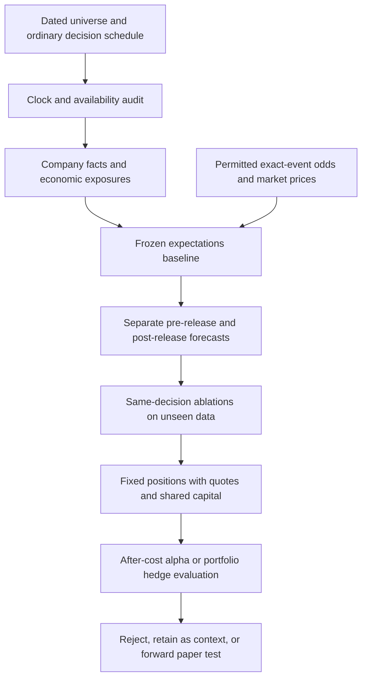

# QuantHaxs: research into the strategy's five validation gaps

**Research date:** October 3, 2026. **Status:** literature review and proposed experiments. This work did not run a backtest, fit a model, buy data or place a trade. Research clarifies how to test the weaknesses; it does not remove them.

**Shared implementation plan:** [Strategy validation](superpowers/plans/2026-10-03-strategy-validation.md). **Earlier context:** [Whole-strategy review](strategy-research-review-2026-10-03.md) and [prediction-market evidence review](prediction-market-evidence-review.md).

**Published shared context:** [GitHub Discussion 2: research-backed validation program](https://github.com/jrile018/QuantHacks/discussions/2#discussioncomment-18737094).

**Downstream extension:** [Regime, risk and signal optimization](research/2026-10-03-regime-risk-and-signal-optimization.md), with an [active grilling decision tree](grill-sessions/2026-10-03-regime-risk-layer.md). The user now selects net portfolio growth within hard risk limits, both exposure controls and strategy-switching research, and comparison of profiles across asset universes. Numeric limits and live permissions remain open. Extend the existing validation spine rather than building another evaluator.

## Judgment

The idea remains worth a bounded experiment: compare dated company facts with existing expectations, then test whether the difference improves a feasible financial decision. The literature supports some useful information in earnings and macro markets. It also supports serious competing explanations: base rates, prices already reflecting the news, compensation for event risk, and execution effects.

The next deliverable should be an auditable decision dataset and a frozen evaluation protocol. Additional feature engineering should proceed against that protocol. A completed OCR job, accurate event forecast or attractive mark return is insufficient evidence of an options edge.

Two objectives require separate experiments. **Standalone alpha** needs incremental after-cost account returns versus the same strategy without the new information and a no-trade alternative. **Hedging** needs improvement in the specified underlying portfolio's losses or risk-adjusted utility after hedge cost, compared with that same unhedged portfolio and simple hedges. A hedge can rationally have negative standalone expected return. Net growth within hard risk limits is now selected for the downstream layer; numerical risk limits and any specific protected holdings remain open.

## 1. Small sample, dependent variants and selection

### What is weak now

The inspected CFO study contains 34 events, 89 priced event/expiry groups and 4,527 result rows. Strike, expiry, entry and holding-period variants share the same announcements and underlying prices. They are repeated measurements and candidate experiments, not thousands of independent catalysts. The contemporary top-100 universe applied to earlier years adds selection risk. A sample of eventual events alone cannot evaluate choosing companies before unscheduled news.

For scale only: a hypothetical 17 successes from 34 **independent** binary forecasts gives a 95% Wilson interval of approximately 34.1%–65.9%. This is not measured project accuracy; dependence and financial return tails make the real inference different. An automatic requirement such as “100 trades” would not resolve the problem.

[Cameron and Miller's cluster-inference guide](https://cameron.econ.ucdavis.edu/research/Cameron_Miller_JHR_2015.pdf) explains how within-group correlation and few clusters can undermine conventional uncertainty estimates. [Bailey et al.'s backtest-overfitting paper](https://www.davidhbailey.com/dhbpapers/backtest-prob.pdf) shows why strategy selection and repeated trials require separate accounting; its CSCV method also has limitations for dependent financial series. Neither supplies a universal sample-size or automatic approval rule for this project.

### Proposed repair

- Preserve the CFO cohort as exploratory. Expand prespecified event families and periods based on source and tradability coverage. Report each family separately; earnings, FDA, deals and macro exposures do not become interchangeable observations.
- Build the universe from dated eligibility evidence. Include ordinary eligible company-days, missing-data cases, delistings and no-event windows. Scheduled events use calendars known at the decision. Unscheduled arrival models use a predefined risk set and horizon.
- Assign one economic event ID across amendments, releases, thresholds, strikes and related filings; link repeated issuers and common macro shocks.
- Select a small candidate set in development, keep a trial ledger, and preserve a later chronological holdout. Fit calibration and feature selection only within development folds. Purge overlapping label intervals; keep related economic events out of opposing folds.
- Use paired event-level improvements, issuer/calendar dependence diagnostics and justified block/cluster inference. Few independent shocks or wide intervals produce **inconclusive**, not “passed.” Do not shuffle dependent rows independently. Any resampling must preserve relevant blocks and rerun the development selection procedure.
- Determine additional collection needs from the observed variance, dependence, coverage and a preregistered minimum useful improvement. Increasing option variants cannot substitute for new independent events. A short final holdout cannot certify stability across unseen regimes.

## 2. Descriptive marks versus executable portfolio outcomes

Daily last trades can be old, asymmetric and unrelated to the price available when the system finishes processing. Synthetic stock reconstructed from parity is not evidence of an underlying trade. Spot-normalized returns are not account-equity returns. Combining several per-event results without a cash ledger ignores overlapping positions and repeated collateral.

The [OCC's execution guidance](https://www.optionseducation.org/referencelibrary/faq/trade-entry-execution) explains that displayed size, order type and rapidly changing markets affect execution. A quote-based replay is a simulation with explicit assumptions; it is not a record of actual fills.

**Proposed repair:** use dated underlying prices and actual contract terms with synchronized option bid/ask observations. Preserve source times, receipt basis, size, conditions, trading session, corporate actions and missing reasons. Enter no earlier than completed signal processing plus declared latency. Long options start with ask entry and bid exit; shorts reverse the sides. Charge fees and additional slippage once, without double-counting the quoted spread. Model partial/no fills and depth constraints. Do not interpolate a tradable quote from a daily bar.

Maintain one chronological portfolio ledger: cash, premium, underlying holdings, collateral/margin, fees, financing, dividends, assignments, expirations and all simultaneous positions. Report account equity, turnover, drawdown, tail losses, concentration and participation limits. Include rejected decisions and liquidity failures. Stop-trigger prices do not guarantee exits at those prices; model gaps, halts and unavailable quotes.

**Current handoff:** the verified exact-contract OHLCV download has 375,337 venue-level bars across 29 data files. It covers 651 of 654 requested contracts. Multiple venues can produce multiple bars per contract/day. The separate exact-contract CBBO request was still processing when inspected. Daily quote tables and retrospective exchange timestamps do not automatically meet the learner's synchronized intraday receipt contract. The acquired 654 contracts were selected by the old study; they do not establish coverage of a newly selected strategy or whole chain.

## 3. Repair the information clock

The [SEC Form 8-K instructions](https://www.sec.gov/files/form8-k.pdf) generally permit four business days for many disclosures, with item-specific requirements and exceptions. The [SEC timestamp FAQ](https://www.sec.gov/about/webmaster-frequently-asked-questions) distinguishes acceptance from website availability and says the latter often follows by 1–3 minutes, with an unpredictable lag. A press release, regulator or transaction announcement may precede both.

**Proposed repair:** keep separate event-occurrence, first-public-disclosure, EDGAR-acceptance, source-receipt, parsing/model-completion and decision/entry clocks. The first public channel matters for whether an event was already public; the system's receipt and processing clocks matter for whether it could act. Do not use an internal occurrence date as a public time.

Preserve source timestamp precision and an uncertainty interval. Date-only publication cannot be made intraday by assigning midnight. A candidate pre-event entry must precede the earliest plausible public release; otherwise mark anticipation unverified/ineligible. Post-release entry must follow actual availability and completed processing, with a feasible options session.

Historical downloads received today cannot be relabeled as receipts in 2024. Maintain two explicit modes: **retrospective replay with documented availability assumptions** and **forward observation with measured receipt/processing times**. Record source revisions, calendar versions, model/checkpoint versions and known release/training vintages. Modern weights and retrospectively chosen features do not demonstrate historical deployability; potential outcome contamination requires examination and forward validation.

An event-only dataset may require a target accession for audit. A prospective decision must not use a future accession as a predictor or to select its risk set. Link realized filings to frozen decisions only during later labeling.

## 4. Correct predictions can still lose in options

[Alexiou et al. (2025)](https://academic.oup.com/rof/article/29/4/963/8079062) study scheduled earnings in 2013–2020, emphasizing liquid option markets. Concave short-expiry IV curves anticipate larger announcement moves, yet associated long straddle/strangle returns are lower. This is evidence that forecasting event risk and profiting from owning it differ. It does not settle returns for unscheduled CFO events or this project's 90–180-day contracts.

Illustration, not a forecast: at expiry a call with strike 100 pays 30 if the stock finishes at 130 and zero if it finishes at 70. An 80% probability of the first outcome implies expected payoff 24. Paying 26 loses 2 per share in expectation before other costs, despite usually predicting the favorable event correctly. Paying 20 gives expected gain 4 before costs and risk constraints. Probability, outcome magnitude and purchase price all matter.

For a sale before expiry, intrinsic value is insufficient. Estimate the **joint** exit scenarios for underlying price, remaining time, implied volatility, spread, dividends and deliverable. A simple long-option cash calculation is:

`expected_net_cash = multiplier * (sum(probability_s * exit_bid_s) - entry_ask) - fees - additional_slippage - financing`

Scenario bids are model outputs requiring validation; the realized label comes from eligible historical or forward observations. Apply analogous leg-specific formulas to other positions. Do not turn this example into a universal probability threshold or derive fair probability directly from IV.

Test whether the information improves results beyond ordinary delta/beta, volatility, skew, carry and event exposure. Separate signal value from premium earned for accepting tail risk. Hold the contract-selection rule, entry/exit rules, sizing function and risk budget fixed when testing a new source. Each frozen forecast may produce different allowed actions and quantities under that same policy; forcing identical realized positions would hide economic decision value. Test short-expiry variants, if desired, as a separately registered experiment rather than borrowing the earnings paper's result for existing long-expiry rules.

## 5. What prediction markets add—and the contrary case

### Evidence audit

| Primary evidence | Finding and limitation | Consequence |
| --- | --- | --- |
| [Gómez-Cram et al., March 7, 2026 version](https://www.hhs.se/contentassets/fa9e2f0927584e4c8ba7b098a98ccf2a/financial_prediction_markets.pdf); [SSRN version record](https://papers.ssrn.com/sol3/papers.cfm?abstract_id=5933475) | Indexed March tables cover 299 earnings markets in September–November 2025. One-day classification accuracy is 77%, while the full sample's actual-beat rate is about 74%; these use different denominators. A matched base-rate comparison is needed. Reported increments over analyst revisions and announcement-return associations do not prove odds lead equities or yield executable options returns. The direct March URL now returns 404; the August revision's full text was not verified. | Compare proper probability scores on identical decisions against base rates and dated consensus. Preserve version/access limits; do not quote March estimates as latest results. |
| [Li and Luan, September 1, 2026 revision](https://papers.ssrn.com/sol3/papers.cfm?abstract_id=7324239) | The abstract reports 599 earnings events, stocks predicting later Polymarket price changes over one hour to one day, and no reverse stock-return predictability. Full methods/numerical tests were not independently accessible. | Serious redundancy hypothesis to test, not a definitive rejection. Leading analysts can coexist with following stocks. |
| [Diercks, Katz and Wright, February 12, 2026](https://www.federalreserve.gov/econres/feds/files/2026010pap.pdf) | Full working paper: macro forecasts are competitive, with performance varying by variable, summary statistic and horizon. Table 3 finds some headline-CPI improvements, not uniform superiority. Kalshi mean Fed-rate RMSE is worse than futures in that table while median/mode are better. The paper discusses risk-neutral versus physical probabilities and calibration limitations. | Test rates as exposure context against conventional expectations. This is not issuer-level REIT or options-alpha evidence. |
| [Van Tassel, Merger Options and Risk Arbitrage, January 2016](https://www.newyorkfed.org/medialibrary/media/research/staff_reports/sr761.pdf?la=en) | Full working paper finds joint target stock/option information predicts merger outcomes and models priced deal risk. It studies securities-implied estimates, not Polymarket/Kalshi contracts. | The deal baseline must include security-market information. A high close probability alone is not an unpriced opportunity. |

Price-derived probabilities reflect preferences, risk premia, trading frictions and settlement definitions as well as information. Never multiply FDS and market odds as independent confirmations. Preserve bid, ask, midpoint, last-trade age and quality; an 80% display is not an audited probability or probability the entire 8-K is good.

### Track-specific design

**Earnings/guidance:** match issuer, fiscal period, GAAP/non-GAAP, diluted/basic EPS, threshold and deadline. Store the consensus used to set the market strike separately from current consensus. EPS beat, revenue, margins, cash flow and guidance raise/maintain/lower are different targets. An earnings-call keyword contract is a wording event. Freeze the earnings calendar and compare forecasts at identical feasible horizons.

**FDA:** match molecule, indication, sponsor/economic ownership, application and review cycle, public goal-date revisions, exact action and contract deadline. Approval, approval after deadline, complete response, extension and withdrawal are separate outcomes. Pending observations remain censored for eventual approval; a known failure to approve by a passed deadline can still be a resolved deadline label. The [FDA's accelerated-approval guidance](https://www.fda.gov/drugs/nda-and-bla-approvals/accelerated-approval-program) establishes why confirmatory obligations and withdrawal matter. Model indication scope, launch time, royalties, required investment, runway/dilution and competition before assigning company-value scenarios. No independent empirical evidence was found here that these venues add FDA-related issuer trading alpha.

**Deals:** distinguish announcement, clearance, completion and termination; preserve consideration, financing, votes, competing bids, contractual extensions and revisions. The [FTC's merger-review process](https://www.ftc.gov/advice-guidance/competition-guidance/guide-antitrust-laws/mergers/premerger-notification-merger-review-process) explains why signing does not establish regulatory completion. Map target and acquirer economics separately. Cash, stock and contingent consideration have different risk and timing. Use actual adjusted option deliverables. A contract resolving on announcement cannot check the probability of closing.

**REIT/rates:** match the FOMC meeting, rate definition and deadline. Map scenarios through the issuer's dated floating debt, reset dates, fixed debt refinancing, hedges/caps, maturity ladder, property cash flows, loan assets and liquidity. Lower rates can ease financing while accompanying weaker tenant demand. Equity and mortgage REITs require distinct exposures. [Nareit's Q2 2026 balance-sheet commentary](https://www.reit.com/news/blog/market-commentary/reits-ready-growth-disciplined-well-structured-balance-sheets) reports roughly 90% fixed-rate debt on average; sector averages cannot replace issuer terms or historical vintages. Compare odds with dated yield curves, futures/SOFR and available macro forecasts. One Fed meeting remains one common shock across many exposed issuers. Marginal rate, inflation and growth probabilities cannot simply be multiplied into a joint scenario.

### Access and useful collection

The current [Kalshi Developer Agreement](https://kalshi-public-docs.s3.amazonaws.com/Kalshi-Developer-Agreement.pdf), sections 3–3.1, restricts API uses and collection/storage; permission for this project's forecasting/ML workflow has not been established. [Polymarket's institutional notice](https://institutional.polymarket.com/) requires consultation for capital-markets entities, with applicability depending on the user's/entity's use. Resolve and record applicable rights before ingestion. Reachable endpoints do not grant the intended use. The existing adapter plan remains the technical reference; no new market collector was launched here.

Once permitted, collect a bounded mapped watchlist forward. Preserve raw hashes, versioned rules, source/receipt/processing times, gaps and coverage. Keep direct issuer events distinct from peer and macro context. Reject ambiguous mappings and mark unmatched issuers missing. Historical candles without historical rules/quote depth cannot manufacture a live history.

## 6. Incremental-value experiments for every new layer

Use a strong common baseline: dated FDS, known calendar, guidance/consensus where accessible, public news, stock returns, options prices/IV/skew/spreads and conventional macro inputs. On the **same decisions**, add one layer at a time: structured industry facts, released-document text, direct odds, contextual odds and geometry. New filing text is permitted only in the post-release arm. Fit and calibrate simple models first; choose complex models only on development evidence.

For event probabilities use Brier/log loss and calibration; [Gneiting and Raftery's proper-score framework](https://sites.stat.washington.edu/people/raftery/Research/PDF/Gneiting2007jasa.pdf) supports evaluating probability quality separately from classification accuracy. Amount/return forecasts need their own errors and interval diagnostics. Arrival, content, stock reaction, option outcome and portfolio utility are different targets.

Report the identical covered subset **and** the full eligible universe with uncovered cases and a defined baseline fallback. Compare odds-only, core-only and combined models. Test odds-to-stock and stock-to-odds prediction with synchronized information; predictive lead/lag is not causal identification. Use delayed/stale-source sensitivity, release-time perturbations and block-preserving placebos. A feature that loses its contribution after ordinary market/news controls should not be credited as independent information.

Keep all preprocessing, model selection and strategy choices inside development. Register model/checkpoint hashes, features, trials, horizons, primary metrics and promotion criteria before final evaluation. A touched holdout becomes development; another final test needs new unseen data. Report concentration by issuer, family, liquidity and observable regime, including losses and missing coverage. Geometry must beat conventional price, factor and volatility controls; visual structure or software integration is not evidence.

## 7. Advance, retain as context, or stop

| Result | Decision |
| --- | --- |
| Rights, precise mapping or feasible timing fail | Provider/track unavailable for the proposed use; document the reason |
| Coverage or independent event count cannot support useful precision | Continue bounded forward collection or stop for cost; label inconclusive |
| Better held-out forecasts, no useful economic improvement | Retain as an expectations/research card if worthwhile; exclude from position decisions |
| Useful incremental after-cost benefit on frozen data, within preregistered risk/liquidity limits | Candidate for bounded forward paper evaluation; not automatic capital deployment |
| Benefit disappears with corrected clocks, matched baselines or realistic execution | Reject that trading claim; preserve the negative result |

Set minimum useful improvements and numerical risk limits after the coverage/precision audit and mandate choice, before examining holdout results. Evaluate each track/provider separately. The master plan assigns proposed interfaces to the existing chats and places clocks, independent observations and execution ahead of expanding feature searches.
