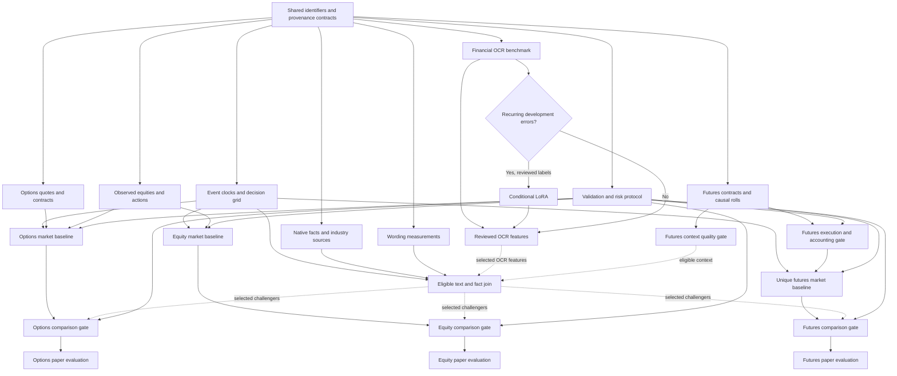

# Parallel 8-K and cross-asset research, validation and learning plan

Date: 2026-10-03. Status: research-backed draft; the grill interview has unanswered decisions. This request produced research and planning documents only. It did not initiate acquisition, GPU jobs, model fitting or trading.

## Goal and current evidence

Use earlier public financial documents, issuer/loan/relationship history, industry information and contemporaneous equities, options and futures to forecast disclosure occurrence/content and asset outcomes; update after the first public disclosure. Measure wording and economic facts separately. Evaluate standalone profits separately from portfolio protection, using the portfolio plus hedge rather than hedge premium in isolation.

## Scope incorporated from the other chats

The user explicitly requested this expansion and use of other chat context. [Cross-chat scope and integration](../../research/2026-10-03-cross-chat-scope-and-cross-asset-integration.md) records source chat titles/turns, accepted user answers and evidence limits. Carry these decisions forward:

- **Daily decisions and next-session outcomes.** Exact daily time and reference-session mapping remain to be specified.
- **Futures profits and hedge benefits, evaluated separately.** Historical added value comes before a frozen forward paper test.
- **January 2024 onward with OOS**, plus earlier documents/market lookbacks needed to form initial features.
- **All validated US-listed REITs in dated batches**, with loan/company relationships extending outside REITs. The existing 100-company universe, 1,630-CIK source catalog and REIT discovery screen remain distinct cohorts.
- **Numerical Lattice features as optional experiments**, consistent with the requested Option A context extension. Forecast improvement is the delegated first comparison; a figure's appearance is not a signal validation.
- **Latest delegated defaults:** the Lattice chat now authorizes recommended choices first. Start with ES/MES and numerical forecast improvement; test alternative futures families, risk filters and direct-signal policies as separate registered challengers. Expand the mathematical idea beyond the repository where economically justified.
- **Strict arbitrage and predicted repricing are both in scope, evaluated separately.** The industry chat permits financially justified alternative horizons and research-derived parameter optimization. Daily/next-session remains the anchor experiment; alternatives do not tune its final test.
- **Paid-dataset planning is requested**, with a monthly spending limit to be supplied. Estimate and rank gaps; do not infer an unlimited acquisition budget.

ES/MES-first and forecast-first are selected through the user's delegation to the prior recommendations, not attributed as user-named tickers. Both opportunity hypotheses are accepted; exact clocks, exposure/capital constraints and priced-data limits remain to be specified. Commodity/rate expansion requires exposure evidence. A current single-stock-futures offering does not prove issuer liquidity or January 2024 history. See [futures research](../../research/2026-10-03-futures-market-data-and-validation.md).

The [strategy-validation plan](2026-10-03-strategy-validation.md) is the canonical proposed typed-record/evaluation spine; this document is the parallel schedule and cross-asset extension. Reconcile records there instead of implementing a second competing pipeline. Other chats' source collectors, feature checkout and pending OCR jobs retain their owners.

The checked HiPerGator foundation ran successfully: job44620388, NVIDIA L4, Slurm0:0, 80 seconds, five inputs and 25 hash-verified collected artifacts. Four inputs were native SEC HTML. The annual-report image was one prose page: 251 heading/body words agreed with native text after whitespace normalization, with a footer omitted. FinBERT processed 408 fragments without provider errors. This proves bounded pipeline operation; financial-table accuracy, LoRA and option prediction remain unvalidated. See [verification artifact](../../../data/processed/hipergator/local-processor-v1-verification.json) and [current status](../../hipergator-and-training-status.md).

There are two different universes: 100 static September2026 tickers in `src/config.py`, and 1,630 CIKs/285,831 filing rows in the SEC catalog manifest. Neither is a dated holdings portfolio. The broader CFO study and Databento caches are reusable candidates with different clock/quote contracts, not a fitted anticipation model. See [event/data audit](../../research/2026-10-03-event-timing-and-options-data.md).

## Decisions and boundaries

The [grill session](../../grill-sessions/2026-10-03-8k-parallel-plan.md) records the frontier and recommendations. Before freezing an experiment, resolve:

1. Futures profit and hedge experiments are accepted as separate studies; equity/options primary policies and the named exposure for a hedge still require definition.
2. First disclosure family. Earnings/guidance is proposed; FDA/deals and REIT/rates remain in broader research scope.
3. Daily decisions/next-session outcomes are accepted from the Lattice chat. Freeze the exact daily time, reference calendar and pre-/post-release boundaries; scheduled-event information may be an eligible feature, not an outcome-selected decision trigger.
4. Conditional decisions: exposure, hedge budget and loss horizon for protection; mechanism, contract policy and primary loss for standalone trading. Existing mandate/risk questions remain pending in [strategy grilling](../../strategy-grilling-2026-10-03.md).

January 2024 onward is the requested history. Existing 2024–2025 caches are development candidates, not the complete range or approved split cutoffs. Existing config dates and 30/10/10 group minimums are software defaults, not proof of sample adequacy. Data already inspected cannot be called untouched. No branch is implemented from an unanswered decision.

Read the supporting research:

- [OCR, calibration and conditional LoRA](../../research/2026-10-03-ocr-calibration-and-lora.md).
- [Event timing, controls and options data](../../research/2026-10-03-event-timing-and-options-data.md).
- [Experiments, uncertainty and regimes](../../research/2026-10-03-experiment-and-regime-design.md).
- [Financial features and source provenance](../../research/2026-10-03-feature-provenance-and-source-design.md).
- [Equities market data and validation](../../research/2026-10-03-equities-market-data-and-validation.md).
- [Futures market data and validation](../../research/2026-10-03-futures-market-data-and-validation.md).
- [Recovered chat decisions and integration](../../research/2026-10-03-cross-chat-scope-and-cross-asset-integration.md).

## Architecture and dependencies

An OCR engine transcribes images. Native HTML/XBRL/PDF extraction handles machine-readable documents. A measurement layer converts verified text into traceable numeric features: tone, uncertainty, novelty, signed financial values, periods, units and industry measures. Occurrence/content and payoff learners consume only information eligible at their own decision clocks. The payoff learner has observed market labels; sentiment classes are not payoff labels.

Native-document features can enter J before D finishes. OCR-dependent features wait for D's quality gate. Each asset baseline/comparison/paper gate waits only for its own selected dependencies and F; there is no global barrier requiring futures execution before stock or option evaluation. Futures context H can join company rows before execution U passes. Dashed joins are optional registered challengers: an unselected/unready block does not block a core baseline. Geometry/odds joins likewise depend only on sources used. No baseline waits for OCR or LoRA. Asset and hedge results remain separately scored rather than pooled into one success number.

## Shared contracts: integration owner

Write versioned contracts before workers mutate shared modules. The integration owner alone owns `docs/research/8k-data-contracts-v1.md`, `configs/experiments/8k-v1.json`, the eventual decision-grid adapter and `src/options_learning.py`, coordinating extensions to the strategy-validation plan's `src/research_validation/records.py`. Other workers supply artifacts through that canonical contract; no parallel schema redefinition or uncoordinated edits to another chat's checkout.

| Artifact | Required contract |
|---|---|
| Universe inventory | `cohort_id`, CIK, stable security ID, dated ticker/industry/listing/option eligibility, source/version and exclusion reason |
| Decision grid | Immutable `decision_id`, scope issuer/market/portfolio, nullable CIK where appropriate, security/instrument, UTC decision, reference session, mode, horizon/rule version; row exists independently of outcome |
| Release inventory | Economic `event_group_id`, document/accession/exhibit roles, occurrence if known, earliest verified public release, SEC acceptance/dissemination, evidence/hash and uncertainty |
| Outcome links | `decision_id`, nullable accessions/event groups, window, event/no-event/censored status, label availability; separate from features |
| Observations | Long-form values, definition/version, currency/scale/unit/scope/period, source span/cell/hash, publication/retrieval/receipt/processing, timestamp basis and quality/missing reason |
| Quote snapshots | Contract terms/mapping validity, bid/ask/size, underlying and quote timestamps, provider schema, original versus interval clock, corrections, same-contract entry/exit and coverage flags |
| Cross-asset extension | Asset class, venue/feed consolidation basis, raw price/currency/units, actions/deliverables/multiplier, futures reference/expiry/notice/delivery/roll calendars, settlement publication, synchronized-anchor ID and per-leg quality |
| Exposure/relationship edges | Dated borrower/lender/guarantor/ownership/peer link, amount kind and unit, entity/security mapping, source evidence, public/known and valid times, confidence and coverage status |
| Asset labels and ledger | Unique instrument-decision-policy outcome; common futures labels not duplicated by CIK; raw fills, cash/shares/premiums, distributions, securities borrow, collateral/margin, variation, financing and rejected-leg reasons |
| Feature matrix | `(decision_id, feature_version)` plus eligibility audit and upstream revisions; no future accession/item/text as predictors |
| Run manifest | Dataset/config/code/model hashes, split assignments, trial ledger, costs/latency assumptions, execution mode, input/output checksums and holdout access |

Observed receipt and processing differ from historical replay assumptions. Null historical local timestamps stay null. Replay adds explicitly named assumed availability/latency fields and sensitivity scenarios; it never overwrites observed lineage. Label retrospective results honestly. Live shadow logging will measure actual latency later.

The current anticipation learner requires `target_accession`; an adapter must support genuine controls without fake accessions. Track all future related releases/amendments in the forbidden document family during joins. Existing exporter and training code should be extended at defined seams, not replaced wholesale.

## Parallel lane A — event timing and the denominator

Owner: event/data worker. Proposed files: `src/event_timeline.py`, `scripts/build_decision_grid.py`, `tests/test_event_timeline.py`; outputs under `data/processed/8k_research/event_inventory/`.

1. Inventory the 100-name cohort and broader catalog separately. Record historical membership limitations; audit mappings and exclusions before choosing eligible cohorts. Discovery can inventory broadly while a bounded pilot is selected without looking at payoffs.
2. Preserve submissions plus historical indexes and release bytes. Resolve press release, issuer IR, newswire, call and filing clocks with timezone evidence; group duplicates and amendments. Acceptance is not automatically first public news. [SEC Form 8-K](https://www.sec.gov/files/form8-k.pdf).
3. Generate decisions independently of outcomes. Link future labels afterward. No event is distinct from source outage, incomplete monitoring or right censoring. Announced-event mode requires a schedule version known before decision.
4. Audit ordinary/no-event, after-hours, rescheduled, amended, duplicate and ambiguous-time cases. Produce a coverage waterfall by issuer/year/family and immutable manifests.

Gate A: reviewed clock examples, complete decision denominator, no invented controls, documented exclusions. Initial interface work is independent of B–E; final grid parameters depend on interview answers.

## Parallel lane B1 — options contracts and market labels

Owner: market-data worker. Proposed files: `src/options_quote_adapters.py`, `src/historical_instruments.py`, `scripts/audit_options_coverage.py`, focused tests; outputs under `data/processed/8k_research/market/`.

1. Inventory existing Massive tick probes, CFO study, CBBO and OHLCV caches with hashes and schema versions. Reuse only compatible data; maintain a shared committed/pending acquisition ledger and deduplicate queries.
2. Audit option roots, dated mappings, deliverables, multipliers, adjustments, underlying synchronization and historical product calendars. Select contracts using only decision-time information. Exit the identical selected contracts.
3. Choose strict tick evidence or a separately versioned sampled-CBBO pricing study. Databento's minute `ts_recv` marks interval end and `ts_event` last trade; renaming them cannot establish original quote freshness. [Provider BBO specification](https://databento.com/docs/schemas-and-data-formats/bbo).
4. Produce bounded matched decision/entry/exit examples and exclusions: stale, zero size, wide/crossed market, missing exit, mapping uncertainty. A missing quote is not zero return. Quotes imply fill assumptions rather than guaranteed fills.
5. Estimate capped pilot/expansion cost from current provider metadata and measured records. Resolve entitlement/budget through existing authorization before any new purchase; this plan purchases nothing.

Gate B: correct schema/time semantics, historical mappings/calendar, coverage and cost audit, frozen spread/fees/additional slippage and latency scenarios. A quote proxy can support its own pricing study but cannot silently pass an execution gate.

## Parallel lane B2 — observed equities

Owner: equities worker. Proposed files: `src/equities_quote_adapters.py`, `scripts/audit_equities_coverage.py` and focused tests; outputs under `data/processed/8k_research/equities/`. Shared identity/action records and ledger stay integration-owned.

1. Audit historical stock trades/quotes/bars and rights for the dated REIT/other-company cohorts, plus sector/market references. Classify SIP NBBO, component-venue BBO and single-venue data correctly; identical column names do not make feeds equivalent.
2. Preserve dated issuer/security/share-class links, delistings, raw quotes, condition/correction/size conventions and sessions. Keep corporate-action revisions, dividend announcements/entitlements/payments and raw versus adjusted series separate. Final same-day bars cannot be earlier-decision features.
3. Supply observed underlying prices for options, lagged stock/sector features and separate next-session stock benchmarks. Replace reliance on parity-derived synthetic stock for observed stock labels. Short policies require historical securities borrow; issuer corporate loan records do not provide a locate.
4. Deliver a bounded coverage/synchronization/action-boundary audit, then deterministic batches across the requested universe. Eligible equities are not globally discarded because options or futures are missing; paired cross-asset comparisons publish their intersection and exclusions.

Gate B2: security/action reconciliation, publication/quote clocks, raw-price accounting and usable entry/exit evidence. Reuse existing providers and shared acquisition ledger. [Equities source research](../../research/2026-10-03-equities-market-data-and-validation.md) documents feed/adjustment differences and unverified account coverage.

## Parallel lane B3 — futures context and conditional executable legs

Owner: futures worker. Proposed files: `src/futures_quote_adapters.py`, `src/futures_instruments.py`, `scripts/audit_futures_coverage.py` and focused tests; outputs under `data/processed/8k_research/futures/`. Shared snapshots/ledger remain integration-owned.

1. Audit available dated product/contract definitions, provider schemas/rights/ranges and small queries. Start the delegated pilot with ES/MES; a justified rate product is an additional context candidate. Add commodities/growth factors only with exposure rationale and registered tests.
2. Preserve exchange trade dates, maintenance/holiday/expiry/reference/notice/delivery calendars, price units/multipliers and settlement publication. Daily futures trade dates and next equity session are not interchangeable; freeze an explicit reference-session horizon and feasible exit anchors.
3. Freeze causal roll rules using known calendars or already published lagged liquidity. Raw selected contracts determine P&L; explicit roll fills/costs enter the ledger. Future volume/OI or later back-adjustments cannot revise earlier features.
4. Produce lagged returns/volatility/liquidity and eligible curve/basis context. Estimate company beta or duration/rate interactions in development only. A REIT versus ES/ZN relation is a risk-bearing exposure, not a same-underlying identity.
5. Label each unique market-instrument decision once. Aggregate issuer signals into a capital-constrained futures position under a frozen policy; do not replicate an ES return into independent company profits. Separate net futures profit from reduction in portfolio losses.
6. Before executable promotion, reconcile initial/maintenance margin, variation cashflows plus residual marks, roll/settlement/delivery, costs, funding and cash buffers in the shared portfolio ledger. Initial margin is collateral, not invested account wealth.

Gate B3-context: dated mappings, clocks, coverage and causal features. Gate B3-execution additionally requires selected family, exposure/policy, raw-contract fills and capital/cash reconciliation. Context is usable before executable promotion; neither waits for OCR. [Futures source research](../../research/2026-10-03-futures-market-data-and-validation.md) supplies official specifications and unresolved coverage.

## Parallel lane C — financial facts and industry features

Owner: financial-feature worker. Proposed files: `configs/feature_sources.json`, `src/feature_observations.py`, `scripts/build_asof_features.py`, focused join tests; outputs under `data/processed/8k_research/features/`. Coordinate reuse with owners of the existing REIT modules; do not edit their files independently.

1. Rank the 30 candidate APIs by a specific economic mechanism, historical coverage, issuer join and publication/revision evidence. Start with accession-dated EDGAR facts, identifiers and vintage rates; each sector gets a small registry rather than every available feed. Reuse the other chat's loan-history/source validation deliverables rather than a second collector.
2. Reuse `reit_inline_facts.py`, `reit_money_records.py`, `reit_pdf_money.py` and the established source map. Parse native documents first; obtain OCR facts through D's reviewed interface.
3. Preserve as-filed values and amendments, exact fiscal periods, duration/instant, entity/segment scope, sign/currency/scale. Ratios require compatible quantities; retain conflicts and missing reasons rather than forcing cross-industry comparability.
4. Apply release vintage and decision-time availability. Test that later restatements, future classifications, current revised macro values and mismatched periods cannot enter earlier rows.
5. Add an as-of exposure/relationship graph: borrowers, lenders, guarantors, ownership and reported collateral; include non-REIT/private counterparties where evidenced. Preserve amount kind, commitment versus drawn/funded cash, repayment versus planned use, public/known versus valid dates and uncertainty. Missing disclosures do not prove no relationship. Graph aggregations use only eligible edges, never today's reconstructed full graph.

Gate C: each candidate feature has reproducible formula, evidence and eligibility. Compare baseline and industry additions on identical rows. Missing historical availability prevents PIT promotion, not necessarily descriptive source exploration. See [feature provenance research](../../research/2026-10-03-feature-provenance-and-source-design.md).

## Parallel lane D — OCR benchmark, then conditional LoRA

Owner: OCR worker. Own `src/glm_document_ocr.py`, crop runner, `scripts/evaluate_financial_ocr.py`, OCR-focused tests and benchmark outputs. The same owner controls exporter/LoRA preparer changes after review.

1. Proposed benchmark: 60 pages/12 issuers, 48 tables plus 12 prose pages, with scans and native-rendered images scored separately. Development 40 earlier pages/eight issuers; sealed test 20 later pages/four unseen issuers. Expand acquisition if this cannot satisfy issuer/time constraints. Reviewers and availability are required inputs, not assumed completed labels. Coordinate with the Benchmark checkout's existing OCR evaluator/native/Tesseract/Paddle work; harmonize rubric/provenance and extend it instead of building a duplicate framework. Its pending job 44629090 and 16-cell result do not settle this benchmark.
2. Independently annotate signs, values, units, periods, cell associations, missing regions and order. Native text is useful comparison evidence, not independent human truth. Proposed 1,000 numeric cells/300 test cells are coverage budgets, not statistical adequacy.
3. On development, compare whole-page text, manually cropped task-specific recognition and detector crops. Measure exact signed-value/cell attachment, table structure, order, truncation, omissions, latency and CUDA memory. Use the existing true page66 as development, not test.
4. Retain the pinned GLM-OCR0.9B verified inference environment. Training stays isolated. Audit an immutable Factory checkout and dependency resolution, task template, image tokens and trainable modules before fitting. Mutable guides and metadata differ; a disabled version guard is not validation. [Official GLM training guide](https://github.com/zai-org/GLM-OCR/tree/main/examples/finetune), [Factory metadata](https://github.com/hiyouga/LLaMA-Factory/blob/main/pyproject.toml).
5. LoRA proceeds only for recurring development errors after prompt/layout fixes and with reviewed train/validation pairs satisfying issuer/document/hash/time separation. The exporter needs task-aware prompts for table labels. A proposed 120/30 pair budget is conditional; enough independent documents must exist.
6. Select crop/prompt and LoRA go/no-go on development. Freeze base and candidate, then run one paired sealed evaluation. If prior test access influenced redesign, reserve new test data. No sequential tuning on the same sealed labels.

Gate D: critical numeric errors trigger review/abstention. The research note's proposed accuracy thresholds authorize only broader validation. A successful prose page or loss decrease cannot certify financial tables. OCR/LoRA can finish after M; they are off its critical path.

## Parallel lane E — wording and content measurements

Owner: language worker. Own `src/document_language.py`, `src/document_evidence.py`, `scripts/evaluate_8k_wording.py` and focused tests; outputs under `data/processed/8k_research/language/`. Coordinate transcript/report changes with integration instead of concurrent edits.

1. Start immediately on native HTML with a section rubric: material statements, figures, boilerplate, headers, forward-looking disclaimers and mixed event content. Keep evidence spans and distinguish rhetorical tone from economic polarity and uncertainty.
2. Define transparent counts and issuer-relative novelty/change. Audit official LM version and rights before use; academic permission differs from commercial licensing. Record category membership vintage. [Official LM dictionary](https://sraf.nd.edu/loughranmcdonald-master-dictionary/).
3. Calibrate frozen FinBERT on independently reviewed 8-K sentences/sections by industry/event family; preserve disagreements, aggregation and truncation rules. PhraseBank positive/negative/neutral outputs are text classes, not option-price probabilities. [Official model card](https://huggingface.co/ProsusAI/finbert).
4. Earlier documents supply anticipation features. Future released wording can supply content labels and later post-release features only after eligible publication/receipt/processing. If predicted future tone is a stacked feature, use chronological out-of-fold predictions in development.

Gate E: versioned evidence-backed measurements, eligible timestamps, representative reviewed references, declared model-corpus uncertainty. Public filings may occur in pretraining; modern frozen checkpoints support retrospective research until prospective validation demonstrates actual operation.

## Parallel lane F — experiment, regime and risk protocol

Owner: canonical research/protocol worker, coordinated with the strategy-validation owner. Own the extension note `docs/research/8k-experiment-protocol-v1.md`; extend/reference the single proposed `configs/strategy_validation.json`, `src/research_validation/evaluate.py`, `docs/strategy-validation-ledger.md` and evaluator tests from that plan. No second evaluator/config/trial registry is created. Shared learning-module changes remain integration-owned.

1. Draft leakage/coverage controls alongside the other lanes. Carry forward accepted daily/next-session pace, separate futures profit/hedge studies and historical-then-paper stage. Finalize exact clocks, policies and primary losses after the remaining interview branches. For protection require dated holdings, quantities, risk horizon and hedge budget; compare portfolio-plus-hedge losses against no hedge and a fixed-budget hedge. For standalone outcomes retain prespecified asset policies including abstention; do not pool stock/option/futures percentage returns with different capital denominators.
2. Separate occurrence, conditional content and option-outcome targets. Include no-event payoffs in any probability-weighted event forecast; do not multiply an already unconditional forecast by event probability again.
3. Predeclare comparisons: historical frequency/training mean; market/calendar; earlier-text counts; industry facts; frozen FinBERT; limited regime interactions. Fit transformations, regime thresholds and selection only on training. Report stock/IV/time/cost decomposition as diagnostics.
4. Group economic events and overlapping label windows; use forward validation and purge overlap. Register every tried feature/target/prompt/horizon/threshold. For paired uncertainty, resample common calendar blocks jointly across issuers while preserving economic-event groups under a development-selected block construction. This retains simultaneous cross-company shocks; issuer-sensitivity checks address dependence within issuers. Independent issuer resampling cannot substitute for the joint calendar procedure.
5. Use development-only frequency/coverage/dependence/tail estimates to set evaluation precision and sample budget. Freeze one primary loss and meaningful improvement before final access. Expected-shortfall or tail protection cannot be inferred from a handful of events.
6. Inspect holdout access history. Lock a genuinely unseen period or prospective stream; existing date cutoffs are not automatic seals. Sharpe/DSR requires a valid shared-capital return series, not pooled option observations.
7. Maintain separate strict-arbitrage and predicted-repricing contracts. Strict claims require matching enforceable cashflows, synchronized actionable legs, exercise/dividend/borrow/financing/delivery and all costs. American option parity residuals or stock-index cross-hedges alone do not pass that gate. Model legging/no-fill/halts and residual risk; forecast convergence remains risk-bearing.
8. Reuse the canonical shared portfolio ledger for stock distributions/borrow, option exercise/assignment and futures variation/margin. Net overlapping market exposures across issuers and guard shared macro outcomes from duplicated inference or profits. The paper stage records actual arrival/processing/order timing under the same frozen policy.
9. Keep next-session as the anchor and register a finite financially motivated challenger set: intraday only where tick/legging evidence permits, then five- and twenty-reference-session repricing windows where mature labels/coverage permit. Each has its own target, costs, overlap purge, capital denominator and trial ID. Broad exploration happens within nested chronological development; final holdouts are not repeatedly optimized. Estimate precision and reduce trials when independent shocks are insufficient.
10. Derive hedge candidates from economic exposures: development-fitted dollar beta/covariance for index futures, dated duration/DV01 for rate legs, integer contract values and financing constraints. Compare minimum-variance and cost-constrained tail-loss policies against simple fixed hedges, with premiums, collateral/margin and cash buffers. Use a development-only efficient frontier of benefit/cost/risk, not a historical maximum-profit leverage setting. Financial reasoning can define candidates; it cannot infer the user's acceptable drawdown or capital. Report normalized research scenarios until those constraints are explicit. No literally bias-free optimization is claimed.

Gate F: agreed target/horizon/metric, protected evaluation, registered baselines/trials and useful precision. No positive-result requirement is imposed; inconclusive or negative evidence is an acceptable scientific outcome.

## Parallel lane G — numerical market context and expectations challengers

Owner: context-feature worker. Reuse `stat-arb/` export/bridge interfaces and the existing prediction-market adapter plan. Proposed export: `scripts/export_cross_asset_context.py` plus versioned artifacts; its owner edits no Lattice or odds collector without coordination.

1. Start with numerical forecast improvement, the delegated recommendation. Extract rolling geometry/regime measures from eligible observed equities; add futures where audited exposure/history permit. Register economically interpretable alternatives beyond Lattice: shrinkage covariance/market-factor residuals, eigenvalue concentration or peer distance, synchronized option-volatility context, futures basis/rate exposures and source-dated network aggregates. Freeze windows/universe/missing handling and fit on development only. Compare ordinary return/beta/volatility controls so a geometric reexpression of existing information cannot masquerade as incremental value. Retain empty states and the original matched-control failure.
2. Join exact-date/time outputs to the canonical decision record. Correlation/dislocation features are descriptive challengers; they do not prove mispricing or causality. Do not fit geometry on an entire future panel or use future graph edges/industry membership.
3. If permitted, consume existing exact-event odds adapters and expectation cards; no duplicate collector or inferred issuer-wide probability. Compare equity/options/futures conventional expectations first, then with/without geometry and with/without odds on matched rows. Register joint combinations rather than selecting the best full-history figure.

Gate G: usable timed outputs, mapping/rights, no future fit, registered comparison and incremental held-out evidence. Forecast is first; risk/filter and direct trading policies are separate later challengers requiring ledger/risk gates. Geometry cannot silently change sizing. G is optional and off core data/OCR paths.

## Execution waves and scarce resources

| Wave | Work that overlaps | Hard handoff |
|---|---|---|
| 0: contracts/interview | Event/universe inventory, options/equity/futures feed audits, feature/edge registry, OCR/wording rubrics and protocol draft | Reuse accepted pace/stage; integration freezes canonical interfaces and unresolved policies |
| 1: independent artifacts | A clocks/grid; B1 options; B2 stocks/actions; B3 futures/rolls; C facts/network; D evaluator/labels; E wording; F protocol; G optional context contracts | Equity baseline:A+B2+F; options:A+B1+B2+F; futures:A+B3+F with unique market labels; native join:A+C+E |
| 2: bounded development | Asset baselines, futures-context/loan-network ablations, native joins; OCR calibration; conditional LoRA; optional numerical geometry/odds | Eligible development evidence selects candidates; a missing optional market does not block unrelated baselines |
| 3: integration | Eligible features and frozen comparisons; conditional hedge simulator after exposure contract | Review leakage, executable assumptions, trial history and holdout before unlocking |
| 4: final evidence | Frozen asset-specific paired evaluations, separate hedge evidence, then forward paper collection | Preserve common shocks/unique futures outcomes; report uncertainty/failures; redesign uses new final evidence |

The expanded lanes are logical responsibilities, not a request for nine simultaneous agents. With four current slots, use a coordinator plus three workers: prioritize A and B2/B3 audits while the coordinator consolidates F/B1's existing interfaces; then rotate C/D/E/G packages as prerequisite artifacts become available. Existing options/loan/OCR owners keep their jobs. Remote CPU/data work can continue detached while workers move to the next artifact; GPU work and human review remain capacity gates. Assign adapter/file ownership before each handoff; preserve concurrent edits and use shared rate/cost limits across markets.

Initial GPU ceiling: one L4 on HiPerGator under `ai-workshop`, `/blue/ai-workshop/kkatiyar`, with measured memory/time and Slurm limits. The observed five-GPU group quota is not five GPUs reserved for this project. Serialize initial OCR and LoRA; increase only after reviewed need and allocation availability. CPU labeling/scoring/native extraction can overlap GPU work. Use Slurm dependencies only for true artifact prerequisites.

Route large CPU backfills/fits to `home-pc` through detached tmux with logs, checksums and result collection; report Tailscale unavailability rather than substituting a LAN address. HiPerGator GPU work uses Slurm, never login-node computation. Short schema checks stay local. All SEC workers share one existing five-request/second budget and the configured contact identity; do not multiply limits per process. Vendor workers share cost/deduplication ledgers. This planning turn initiates none of these jobs.

No wall-time or success estimate is invented. Measure a small sample's eligible coverage, review throughput and GPU/CPU seconds before forecasting the next wave.

## Definition of readiness and next handoff

The next execution handoff is canonical shared contracts plus A/B2/B3 and existing B1 audit packages, while facts/network, OCR/wording and optional-context schemas proceed independently. Asset baselines require only their listed market dependencies. No full-corpus training starts before bounded coverage and quality evidence. Reuse the other chats' source/feature/validation interfaces, not their unverified success claims.

For every promoted dataset: immutable source lineage; documented dated universe/exclusions; correct first-public chronology; observed versus assumed availability; native/OCR quality; raw/adjusted equities and distributions; dated futures contracts/causal rolls/publication clocks; ordinary-day controls; target availability; grouped temporal splits/common shocks; train-only transforms; registered trials; legitimate sealed evaluation. For hedge claims add dated exposure/shared capital. For strict arbitrage add the matched-cashflow/all-leg execution gate; no forecast score substitutes for it.

Self-review and bounded cross-asset review: corrected the graph's global evaluation barrier into independent asset gates, added a futures-context path before execution, reused one canonical evaluator/config/trial registry, and broadened hedge accounting beyond premium to collateral/margin/cash buffers. The earlier uncertainty fix preserves joint calendar shocks. Baselines bypass OCR, LoRA is conditional, controls support no-event decisions, raw/interval quote clocks differ, unique futures outcomes prevent duplication, causal actions/rolls retain historical information, and no tuning follows final-test access. Local links were checked. Latest user replies settle/delegate the pace, stage, opportunity families and initial ES/MES/forecast choices; remaining clocks/budget/risk and measured evidence stay explicit.
