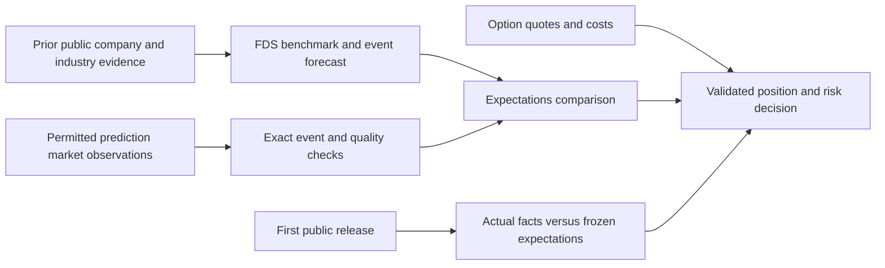

# Prediction markets as a check on the company benchmark

Date: October 3, 2026. Status: researched design and implementation plan; collectors, trained models, and performance results have not been built by this plan.

**Shared validation follow-up:** [Whole-strategy validation plan](2026-10-03-strategy-validation.md) now defines the common clock, cohort, execution, ablation and portfolio gates. [The detailed research](../../strategy-validation-research-2026-10-03.md) covers the five strategy weaknesses and all event tracks. This document remains the provider-adapter and market-data contract reference; implementation and profitability are unverified.

User scope: cover earnings/guidance, FDA decisions/deals, and REIT financing/rates. Use Polymarket and Kalshi information to check the financial data sheets (FDS), anticipate the economic content of a disclosure, and improve the pre-release/post-release options decision. All three tracks remain in scope; coverage determines what can actually be measured.

**Evidence verdict:** worth a bounded experiment as an expectations reference. Direct earnings and macro research supports information value, while other earnings evidence finds stocks lead prediction-market updates. No reviewed evidence establishes incremental after-cost value for this project's FDS/8-K/options pipeline. Start with coverage and shadow reporting; every track must earn its influence on forecasts and trading. See [the evidence review](../../prediction-market-evidence-review.md) for supporting and contrary studies and falsification gates.

## 1. The economic question

FDS answers: what is the company's financial condition, and what outcomes does the available evidence support? Prediction markets add an outside view: what specific future outcomes are market participants pricing? Options answer a third question: what does exposure to the resulting price move cost now?

The proposed addition is an **expectations check** between the FDS benchmark and the options decision. It should improve a forecast or explain a disagreement before it influences position selection.

Prediction-market prices can be useful probability proxies under assumptions about preferences and beliefs; they are not an objective probability oracle. The economic literature also cautions that a price does not reveal the full distribution of participants' beliefs. [Wolfers and Zitzewitz](https://www.nber.org/papers/w12200), [Manski](https://www.nber.org/papers/w10359).

Design inference: participants can react to the same news that our FDS and options features already contain. Therefore, market odds are another potentially informative observation, with correlated errors and market frictions. We will learn whether they add information rather than count them as independent confirmation.

Define three separate outcomes:

1. **Event:** will a precise event occur by a specified time? For unscheduled disclosures, separately model whether any relevant event arrives on the decision horizon. A scheduled earnings contract is not evidence about all unscheduled 8-Ks.
2. **Economic surprise:** what changes relative to the pre-release expectation? Preserve amount, timing, certainty, and issuer exposure. “Good” must be defined for an event family, not assigned from positive words.
3. **Option outcome:** what happens to a frozen option position after executable costs? Correct direction can still lose because of premium paid, volatility changes, and time decay. [Options Industry Council: option price behavior](https://www.optionseducation.org/referencelibrary/faq/option-price-behavior).

The operative boundary is the **first public disclosure**, which may be a company release, regulator announcement, or deal announcement before EDGAR. Information released before the 8-K belongs in the benchmark once it is available. The 8-K may then provide detail rather than a fresh surprise.

## 2. Cover all three tracks with explicit mappings

| Track | Market question to look for | FDS evidence and economic channel | What the comparison can establish |
| --- | --- | --- | --- |
| Earnings and guidance | Exact quarter, EPS/revenue threshold, or specified guidance action | Prior financial trends, margins, cash conversion, debt, segment mix, earlier guidance, already published peer results | Probability of the same financial event, then surprise relative to that expectation. Match GAAP/non-GAAP and diluted/basic definitions. A keyword mention on an earnings call is only a speech event. |
| FDA decisions and commercial milestones | Named product, indication, decision type, and deadline | Product ownership, trial/regulatory evidence from public sources, approval scope, remaining costs, expected market size, royalties, cash runway | Regulatory-event probability. Approval scope and commercial value need separate scenarios; approval alone does not supply a stock-return forecast. |
| Deals and corporate actions | Named transaction announced/completed/terminated by a date, with explicit conditions | Acquirer/target identity, consideration, dilution, financing, contingencies, operating value and break scenario | Probability of the precise deal event. “Announcement” and “completion” are different labels. For targets, deal consideration, standalone value and timing determine value; for acquirers, funding and integration matter. |
| REIT financing and rates | Specific Fed/rate outcome; direct financing event if a comparable market exists | Fixed/floating debt, maturity ladder, refinancing needs, liquidity, covenants, property type, occupancy, loan assets and hedges | Macro scenario weights mapped to an issuer's dated exposure. A rate-cut price is not the probability that a REIT's next 8-K is positive. Equity REITs and mortgage REITs need different channels. |

For each candidate, classify relevance as **direct issuer event**, **industry/peer context**, or **macro context**. These are separate feature groups. Do not translate a peer approval probability or Fed contract into a company-specific probability without a fitted, validated relationship.

Economic scenario design for REITs must separate financing relief from the economic weakness that may accompany a rate cut. Use debt amount and reset/maturity dates to estimate which cash flows change; do not apply the same sensitivity to every REIT. For pharma, model the cash-flow effect of the approved indication and economic ownership. For deals, compute discounted value under completion and failure scenarios instead of assuming a positive filing means a profitable call.

Coverage evidence found in official pages: Polymarket has listed [Apple iPhone revenue thresholds](https://polymarket.com/event/will-apple-aapl-q3-iphone-revenue-be-above-20260717035214899) and [Tesla non-GAAP EPS thresholds](https://polymarket.com/event/tsla-quarterly-earnings-nongaap-eps-07-22-2026-0pt5); these examples are closed markets. Kalshi lists [Tesla company-report markets](https://kalshi.com/company-reports/tsla), [earnings-call mentions](https://kalshi.com/markets/kxearningsmentiontsla/kxearningsmentiontsla-26oct28), and [Fed decisions](https://kalshi.com/markets/kxfeddecision/on-oct-28-2026/kxfeddecision-26oct-c25). These examples establish possible question types, not current usable odds or broad coverage of our issuers. No direct FDA/deal/REIT-financing coverage has been established for our cohort. Audit it explicitly.

Our existing CFO-event study is especially likely to lack direct contracts. Preserve its baseline and report `no_comparable_market`; select a separate covered-event pilot for this extension. Never select a historical sample only because its settled markets are easy to find.

## 3. What the user should see

Produce a compact company expectations card at each decision, with drill-through evidence:

| Field | Hypothetical illustration |
| --- | --- |
| Exact event | Issuer reports quarterly diluted non-GAAP EPS above a named threshold |
| Decision and horizon | UTC decision; specified quarter/report and resolution deadline |
| FDS forecast for that exact event | 65%, only if a calibrated forecast exists |
| Market view | YES bid 78%, ask 82%, midpoint 80%; collection and book times displayed |
| Difference | Company model minus market midpoint = -15 percentage points |
| Interpretation | Both favor the threshold being exceeded; the company model is less optimistic than this market price |
| Reliability | Direct mapping; rule version; quote freshness; spread; depth; last trade age |
| Options context | Frozen contracts, current spreads, volatility/move context, predicted after-cost return if a fitted model exists |
| Action status | Review disagreement / agreement / low-quality market / no comparable market; position decision evaluated separately |

Numbers above are invented to explain the design. The bid/ask bracket is a quote range, **not a statistical confidence interval**. If FDS currently has only financial measurements, show those measurements and `forecast_unavailable`; never convert a financial score or FinBERT tone into an invented probability.

When the result becomes public, show actual metric versus pre-release expected metric, and the realized binary event versus its pre-release odds. For a binary result `y`, `y - q_pre` is one event-surprise measure. It does not determine the stock response: magnitude, guidance, other disclosures, and the priced option premium also matter.

The intuitive dashboard asks: **What does the company evidence say? What is already expected? Where do they disagree? Is the disagreement reliable? Is the available exposure worth its cost?**

## 4. Access and API design

### Provider rights before ingestion

Kalshi's Developer Agreement restricts API use and storage to facilitating a member's own Kalshi trading. Inference from that scope: our separate company/options forecasting use needs written permission or an appropriate license before collection, caching, model use or redistribution. Its separate website Data Terms restrict systematic extraction and AI/ML use; website scraping is not a fallback. [Developer Agreement, sections 3 and 3.1](https://kalshi-public-docs.s3.amazonaws.com/Kalshi-Developer-Agreement.pdf), [website Data Terms, sections I–II](https://kalshi-public-docs.s3.amazonaws.com/kalshi-data-terms-of-service.pdf).

Polymarket states that capital-markets entities must consult Polymarket and ICE for consuming data, including derived/on-chain forms. Establish whether this project's research and intended downstream use fall within that category, and document applicable rights before ingestion or model use. Unauthenticated technical access does not settle these permissions. [Institutional data notice](https://institutional.polymarket.com/).

Keep each provider disabled until its applicable use is cleared. Proceed with schema design and synthetic fixtures while permission is pending. The request to a provider should describe research versus commercial use, issuer/options forecasting, retained history, derived features, ML use, publication, and any redistribution. Sending such a request needs the user's separate authorization to contact that provider. Do not budget a paid feed or accept license terms on the user's behalf.

### Polymarket adapter, after rights are established

Use public Gamma discovery at `gamma-api.polymarket.com` to enumerate events/markets, paginate, and obtain stable market/outcome identifiers. Preserve explicit YES/NO mapping; legacy JSON-string token arrays require parsing and validation. [Discovery documentation](https://docs.polymarket.com/market-data/discover-markets).

Use `clob.polymarket.com` books/prices, preferably bounded batch requests, for timestamped bids, asks and depth. Normalize prices with exact decimals and explicitly compute best prices from levels. Treat the documented empty-book/no-trade 0.5 placeholder as missing, not 50% evidence. Historical price series cannot reconstruct full old books. [Prices and order books](https://docs.polymarket.com/market-data/prices-order-books).

Start with REST polling; public market WebSocket subscriptions can later reduce latency if the experiment needs them. Store connection gaps and resynchronize books after interruptions. [Real-time documentation](https://docs.polymarket.com/market-data/realtime-data).

### Kalshi adapter, after rights are established

Public REST discovery uses `https://external-api.kalshi.com/trade-api/v2`, including series, events, markets and cursor pagination. Public read endpoints' lack of authentication does not remove the terms above. [Market-data quick start](https://docs.kalshi.com/getting_started/quick_start_market_data).

Its orderbook returns YES and NO bids. Compute YES ask as `1 - best NO bid` and NO ask as `1 - best YES bid`; absent opposing bids produce missing asks. Use the original side/depth evidence. [Orderbook guide](https://docs.kalshi.com/getting_started/orderbook_responses). Parse `_dollars` and `_fp` decimal strings, and per-market tick ranges; do not assume integer cents or whole contracts. [Fixed-point guide](https://docs.kalshi.com/getting_started/fixed_point_migration).

Historical cutoffs require routing older markets/trades/candles to `/historical/...`; record cutoffs and omissions in the coverage manifest. Candles/trades are not full archived depth. [History guide](https://docs.kalshi.com/getting_started/historical_data), [candlesticks](https://docs.kalshi.com/api-reference/market/get-market-candlesticks), [trades](https://docs.kalshi.com/api-reference/market/get-trades).

WebSocket handshakes require signed key headers, including public channels, and the guide marks orderbook deltas private. Keep REST as the first implementation. [WebSocket guide](https://docs.kalshi.com/getting_started/quick_start_websockets). Apply bounded exponential backoff for 429s; published authenticated token budgets do not establish an unauthenticated quota. [Rate limits](https://docs.kalshi.com/getting_started/rate_limits).

### Collection cost and cadence

Initial proposal, to validate against access limits and decision horizons: discover relevant markets daily; collect mapped watchlist snapshots every 15 minutes ordinarily and every minute in a declared catalyst window. These are starting settings, not proven optimal intervals. Retain actual capture times; report a missed window rather than fill it with later data. Add streaming only if held-out latency benefits justify complexity and access cost. No all-market firehose or GPU is needed for this first layer.

## 5. Data contracts and point-in-time integration

Maintain distinct, immutable or versioned tables:

- **Market/rule versions:** provider, event/market/outcome IDs, full question/rules, rule hash/version, payout convention, threshold/operator/unit, fiscal period, deadline, close/resolution state, resolution source, metadata capture time. If a rule change lacks a verified effective time, mark historical interpretation uncertain rather than inventing one.
- **Issuer/exposure mappings:** CIK, dated security/ticker, product/transaction identity, relevance class, horizon, signed economic channel, supporting source, reviewer, mapping public/receipt/processing times and effective interval. Mapping can be many-to-many; one Fed event shared by 50 issuers is still one macro event.
- **Quote snapshots:** raw-response hash/reference, source/book timestamp and its meaning, receipt time, processing time, YES bid/ask, sizes/depth, midpoint, last trade and its time when available, spread, status, capture method, price/quantity units and quality reasons. If the provider supplies no trustworthy book time, label capture-time-only data; do not invent exchange timestamps.
- **Outcomes:** exact resolved event, resolution evidence/time and outcome receipt time; actual company metric and first public release separately. Never join settlement status/prices into a pre-release feature.
- **Coverage and eligibility:** issuer-decisions considered, matched/unmatched contracts, historical-history limits, permissions, quality exclusions and reasons. Missing is not zero and not a 50% estimate.

Use a canonical event key incorporating issuer/product, event kind, metric definition, period, threshold, deadline and rule version. Only compare venues when economically identical payout/resolution rules and comparable quote times are established. Keep different threshold or mention contracts separate. Differences across venues need not be exploitable arbitrage.

The coverage audit must deliver an **event-clock protocol**: enumerate issuer IR/newswire, regulator and transaction announcement sources alongside EDGAR; record verified release timestamps, receipt timestamps, clock precision and source conflicts. Freeze a deterministic first-release rule before outcome analysis. When only a release date is known, use a conservative exclusion interval and report unknown intraday order; do not invent a midnight timestamp. Set decisions from an independently known scheduled calendar or ordinary eligible company-days, not the eventual 8-K date. Require actual option entry to precede first disclosure for a pre-release strategy; if the release occurs before entry, label that trade ineligible rather than reclassify it as anticipation.

For a live feature require source public time strictly before the decision and receipt, processing, and mapping availability no later than the decision. A metadata snapshot captured today cannot prove old rules. A historical download today is not an observed historical receipt. Permit any simulated acquisition latency only in a separately labeled replay with explicit assumptions and a forward-collected validation.

The separate Benchmark branch's matrix contract currently checks public/effective times; receipt and processing eligibility need an explicit extension or checked adapter. Do not hide this gap by overwriting `public_at_utc`. The `Post Benchmark` options-learning contract already requires public/receipt/processing/mapping timestamps. Resolve these contracts before exporting this feed.

Proposed small initial feature set:

| Group | Features | Eligibility |
| --- | --- | --- |
| Direct expectation | Exact-event midpoint, bid, ask, spread, fresh quote indicator | Reviewed direct mapping and usable two-sided quote |
| Change | Same-event odds change over frozen 1h/24h windows, with actual endpoints and ages | Both snapshots existed and were available; no later backfill masquerading as live capture |
| Disagreement | FDS forecast minus market odds, with each forecast's version | Same exact event and out-of-sample FDS forecast; absent forecast stays missing |
| Macro/industry | Rate/FDA/peer scenario prices and dated issuer exposures | Separate relevance class and economic channel; never labeled direct issuer odds |
| Quality | Quote/trade age, spread, depth, rule ambiguity, coverage and capture gaps | Definitions frozen before evaluation; depth/volume do not prove forecast quality |

Reject ambiguous mapping, closed/resolved prices, invalid/crossed books, missing sides, stale snapshots, and unknown availability from usable odds. Proposed starting quality limits: two-sided spread at most 5 percentage points and snapshot age at most twice the configured capture interval. These limits are tunable **only on training/validation**, must be frozen before holdout, and do not certify liquidity. Keep rejected data in an audit report where retention is permitted. A fresh snapshot of an unchanged book does not prove recent informed trading; show last-trade age independently.

Multiple nested metric thresholds may describe part of that metric's distribution only after monotonicity and timing checks. They do not provide a complete stock-return distribution. Do not sum overlapping YES probabilities or treat their binary entropy as participant disagreement.

## 6. Combination and economic validation

First establish simple separate baselines on exactly the same eligible decisions:

- B0: issuer/industry base rates and known calendar.
- B1: existing FDS plus stock/options and dated macro information, without prediction-market data.
- B2: calibrated direct-market odds alone, for their precise resolution event.
- B3: B1 plus direct prediction-market features.
- B4: B1 plus macro/industry prediction-market context.
- B5: B1 plus both groups, if coverage supports it.

Venue ablations and a no-trade baseline distinguish a provider's contribution from coverage selection and execution costs. Report results on the full decision universe, including rows with no comparable market, and on the identical covered subset. The sparse matched subset must not silently replace the universe.

Strengthen B1 with properly dated analyst consensus/management guidance where accessible and conventional rate expectations for the macro track. Record their rights and availability too. Test prediction-market increments after contemporaneous stock returns, IV, calendar and public news controls; odds that merely follow these inputs should not be credited as leading information. Compare decision usefulness per licensed-data and maintenance cost, not only per available feature.

Start with regularized logistic or linear models appropriate to each outcome. If using a probability ensemble, fit weights/calibration on chronological training/validation data, preserving correlation among inputs; never multiply independent Bayes factors from FDS, options and these markets. Example candidate, only when calibrated FDS probabilities exist:

`p_combined = sigmoid(b0 + b1*logit(p_FDS) + b2*logit(q_market) + b3*quality + b4*regime)`

Define numerical clipping and missing handling in the experiment registry. This is a candidate to compare with simpler calibrated baselines, not a proven combination rule. Start with a small feature set so sparse issuer-event coverage does not invite overfitting.

Evaluate exact binary-event forecasts with Brier score, log loss and calibration curves; proper scoring rules reward honest probabilities. [Gneiting and Raftery](https://doi.org/10.1198/016214506000001437). Evaluate financial amount forecasts separately where applicable. Score disclosure arrival, content/tone and option returns as distinct targets.

For economic evaluation retain the existing option selection, entry/exit rules and synchronized quote requirements described in `docs/options-model-training.md`. The incremental feature experiment must not simultaneously search new expiries, strikes or holding horizons. Estimate expected option value at the frozen exit with a scenario-dependent underlying price, volatility and time remaining. Then subtract entry ask, fees, slippage and capital costs. Option intrinsic value is a sufficient terminal payoff only when the modeled exit is expiry.

For a hypothetical exit scenario distribution:

`expected_cash_PnL = sum_s p_s * exit_option_bid_s * multiplier - entry_option_ask * multiplier - fees - slippage - capital_cost`

Predicted scenario values need an estimated and validated relationship between event, financial magnitude, underlying response and volatility. A single threshold probability cannot fill this formula by itself. Price-based probability proxies and option risk-neutral pricing measures need not represent the same probability distribution.

Use chronological folds with label-availability checks, grouped economic events and embargo/purging for overlapping holding horizons; keep a later holdout untouched. Cross-fit any FDS forecast used as a feature. Cluster uncertainty by economic event and issuer, accounting for shared macro shocks; 50 issuers exposed to one Fed meeting are not 50 independent probability experiments. Audit sector and regime stability, selection bias, source restatements, rule revisions and the experiment/trial ledger.

Optimization objective: maximize **validated incremental after-cost benefit subject to capital, loss and liquidity limits**, with forecast calibration as an intermediate gate. Pre-register minimum useful forecast/economic improvements and risk tolerances after the coverage audit and power assessment, before inspecting holdout outcomes. Use uncertainty intervals; do not declare success from a few profitable events or a fixed arbitrary sample size.

If forecast accuracy improves but option returns do not, retain the layer as a research/risk explanation and exclude it from trading decisions. If evidence is inconclusive, continue forward collection instead of manufacturing a blend weight or expanding feature searches.

## 7. Risk and release workflow

Before release, freeze the benchmark, exact-event forecast, market/rule versions, selected contracts, expected costs, capital allocation, scenario exposures and exit policy. An odds move may trigger a documented reassessment; it must not automatically move a price stop or increase leverage.

After the first public release, compare actual facts with that frozen view, then update the response model with source-linked facts/wording. Once the event is public, its still-unsettled event-market price is not a pre-release signal. Record it only in the appropriate post-release stream.

Use fresh option/underlying quotes to implement the previously specified price/time/thesis-exit policy. Prediction markets can move while options are closed; mark those observations as unavailable for immediate option execution. Simulate gaps, bid-side exits, slippage, unavailable depth and correlated portfolio losses. Stops are execution rules subject to market conditions; they are not guaranteed loss caps. Size exposure using validated downside scenarios and the shared capital ledger rather than raw YES price.

## 8. How this connects the existing chats

| Existing chat | New handoff |
| --- | --- |
| Benchmark | Own canonical FDS forecasts and point-in-time exports; add the availability adapter; expose a comparable probability only after calibration. Prediction-market observations remain independent source records with their own provenance. |
| Benchmark pt. 2 industry spec | Supply verified REIT debt/cash/exposure and economic ownership/mapping evidence. Other industry URL/API work supplies product/deal facts through the same contract. |
| Post Benchmark | Separate pre-release prediction from released-document evidence; add validated expectation features to the options learner without allowing future wording, resolution or later receipts into earlier rows. Existing GLM/FinBERT jobs do not produce prediction-market calibration. |
| Assess Lattice repo fit | Supply spread/coverage diagnostics and quote audit evidence. Daily quote marks do not meet the options learner's synchronized intraday contract without a verified adapter. Lattice geometry remains a separate unproven feature. |
| OCR / HiPerGator | Provide source-linked financial evidence where needed. API quotes/rules do not need OCR; GPU pilots and URL catalogs do not establish odds quality. |
| Track work across project chats | Keep the discussion and dated evidence current; permission, coverage, forecast and economic gates are reported separately. This plan does not assign implementation work to or send instructions into other chats. |

**Dated status correction, October 3:** the original submitted Post Benchmark pilot subsequently failed; after repair, integrated pilot 44620388 was independently verified with OCR acceptance passing on one prose image and four native HTML inputs. This establishes bounded processing, not trained options/LoRA performance. The separate Benchmark Paddle work remains a distinct execution and accuracy experiment. Use the shared validation plan and current discussion for later status instead of the original submission snapshot.

## 9. Executable implementation sequence

Proposed files below are new responsibilities, not files already implemented. Coordinate with the owners above before modifying their interfaces. Preserve concurrent shared-checkout work.

1. **Rights, event definitions and coverage.** Create `docs/prediction-market-coverage.md`, `configs/prediction_market_sources.json` and `configs/prediction_market_event_registry.json`. Record provider rights, event ontology, intended use, retention, source versions, issuer cohort and options eligibility. Deliver the first-public-disclosure/event-clock protocol and decision schedule described above. Enumerate all three tracks and their unmatched cases after permission. Deliver a coverage matrix and precision/power assessment; keep disabled-provider states explicit.
2. **Small normalized collector.** Add `src/prediction_markets/{schema,polymarket,kalshi,store}.py` and `scripts/collect_prediction_market_snapshots.py`. Define Decimal-safe parsing, versioned rules, raw hashes, availability times, batching, retry budgets, capture manifests and gap logs. Use synthetic fixtures before permitted bounded live reads. Deliver one auditable market snapshot per available track, or an explicit no-coverage result.
3. **Reviewed mapping and eligible features.** Add `src/prediction_markets/{mapping,features}.py` and `scripts/export_prediction_market_features.py`; coordinate the FDS availability adapter in its own branch. Review exact semantic matches and issuer exposures. Deliver one reconstructable issuer-decision feature row with full evidence and missing reasons.
4. **Expectations card and shadow collection.** Add `scripts/report_company_expectations.py` and a machine-readable report schema. Show FDS/market disagreement only for comparable calibrated forecasts. Collect all three tracks without placing orders or changing the current strategy. Deliver human-readable cards, coverage/freshness reports and a forward dataset.
5. **Frozen forecast experiment.** Add `configs/prediction_market_experiment.json`, `scripts/evaluate_prediction_market_forecasts.py`, and a result/experiment ledger. Compare B0–B5 with grouped chronological splits, event-resolution and financial-amount metrics, calibration, regime analysis and uncertainty. Test both directions of price lead/lag and prediction-market increments over stock/options/consensus controls; use block-preserving placebo comparisons rather than independent row shuffles. Deliver held-out evidence of incremental information or an inconclusive/failed result. Evaluate direct earnings comparisons first because their repeating labels are most tractable; keep FDA/deals and REIT macro audits and cards in the same scope.
6. **Frozen economic experiment.** Integrate accepted feature exports into the existing options learner and capital/liquidity evaluation. Keep existing contract and exit rules fixed; compare after-cost returns and downside/capacity on the same rows. Deliver a documented accept/reject decision for each track and provider. Scale only a track that passes its own economic and data gates.

No date or expected return is promised before rights, coverage and eligible outcome counts are known. Bounded collection/fixtures run locally. If later panel construction, backtests or training become heavy, use the user's remote-compute workflow (detached tmux on `home-pc`) or an already authorized HiPerGator job with clear ownership; this plan requires no new compute job now.

### Meaningful acceptance checks for implementation

Test the failure modes that can reverse results: Polymarket placeholder/outcome-ID handling; Kalshi complement asks/fixed-point parsing; missing/crossed/closed books; API pagination/429/gaps; rule revisions; GAAP/period/deadline mismatch; dated product/security mapping; future source/receipt/processing rejection; later rule/settlement leakage; asynchronous venue timestamps; shared macro-event split grouping; model-label availability and out-of-sample forecasts; option bid/ask costs and immutable holdout registration. Synthetic fixtures validate software only.

## 10. Recommended first deliverable

Build a **three-track coverage audit and expectations card**, followed by forward shadow collection where permitted. This makes the sources useful immediately as a readable check, reveals which precise comparisons are possible, and produces the evidence needed to evaluate the economic benefit. Automatic trading influence follows only a successful frozen experiment. The project can still show company condition and options risk when neither provider offers a comparable event.
