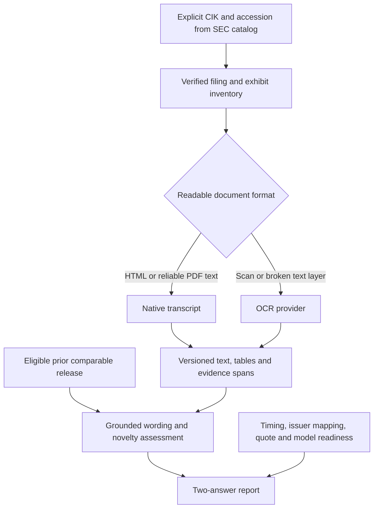

# 8-K document analysis: proposed first build

Date: 2026-10-03. Status: first build approved by “go and build it” and implemented. Usage and explicit remaining boundaries are in [the implementation guide](../../8k-document-analysis.md); execution is tracked in the repository task_plan.md and progress.md.

## Purpose and success

The user's system reads Form 8-K and relevant exhibits and answers two questions: how the document is worded, and how the information might affect option prices. It ultimately supports anticipating future disclosures from earlier public information and updating the assessment when the new disclosure appears. Neural models should be below 3B parameters where practicable; scanned-document work should support GPU inference and later LoRA adaptation on HiPerGator.

The first build creates a traceable document and wording assessment plus a truthful market-readiness result. Success means a reviewer can trace every quoted statement or numeric feature back to the filing/exhibit, distinguish repeated from changed disclosure, and understand whether an option forecast is supported. Price probabilities require an independently trained and evaluated model with appropriate market data.

This design is a concrete refinement of [the evidence review](../../8k-ocr-sentiment-options-research.md), [the strategy concept](../../8k-anticipation-research-concept.md), and [the feature-matrix contract](../../feature-matrix-readiness.md).

## Scope improvements

1. **Choose a comparable first event family.** Begin with Item 2.02 earnings/results disclosures and their relevant earnings-release exhibits. Preserve all identified items, and flag mixed-event filings instead of treating them as pure earnings events. A guidance statement must be grounded in actual text; its presence cannot be inferred from Item 2.02 alone. Other item families remain future extensions.
2. **Separate wording, event meaning and surprise.** Return rhetorical tone, financial sentiment, uncertainty, factual changes and statement novelty separately. A change relative to prior guidance or the prior comparable release is not a consensus surprise unless dated consensus evidence is available.
3. **Define the options question at contract level.** Keep call and put repricing, implied-volatility change and after-cost position return distinct. Propose one fixed horizon and one deterministic contract rule rather than searching many combinations to find favorable outcomes.
4. **Separate missing evidence from a no-trade result.** Unknown market data, uncertain timing, an untrained predictor and an evaluated neutral/no-trade decision must have different statuses. Missing information never counts as a successful neutral prediction.
5. **Build reusable evidence before adaptation.** The same immutable source/transcript records support human calibration, financial-language evaluation, future OCR LoRA and anticipation features. Training is a separate stage with separate labels.

These refinements reduce ambiguity without adding APIs, many event families or a larger model.

## Approaches considered

| Approach | Benefit | Dependency and tradeoff |
| --- | --- | --- |
| Evidence-first document assessment, followed by independently supervised market prediction | Auditable wording and reusable labels; makes quote/timing gaps visible | Several small components; the first build does not establish predictive performance |
| Small general language model for extraction, wording and explanations within the same evidence pipeline | Flexible event descriptions and contextual interpretation | Additional supervision and checks for unsupported facts; retain the same market-label requirements |
| A single OCR/VLM adapted jointly to transcribe and forecast | A unified model interface | Harder to isolate reading versus forecasting errors; requires both transcript and observed-market supervision; current OCR benchmarks do not establish this capability |

Recommended: the first approach. Preserve a replaceable language-provider interface so a small general model can later compete on the same reviewed evidence and reference labels.

## First-build boundaries

The CLI processes explicit CIK/accession records selected from the existing SEC URL catalog. It inventories the primary document and relevant exhibits, creates normalized transcript/evidence artifacts, runs configured frozen wording providers, and writes a report. It also records why the current data does or does not support a future option-response calculation. It does not select accessions because of a later favorable price response.

First-family selection requires retrieved filing evidence: the catalog has no SEC item or exhibit columns. If Item 2.02 is absent, mark `outside_first_family` and preserve the inventory. Amendments are distinct accessions linked to an event group; they never silently overwrite earlier statements. A filing containing additional material events receives `mixed_event` and remains separately identifiable in later analysis.

The first build accepts an explicit prior-comparable accession for novelty comparisons. Without an eligible prior document, it reports `comparison_unavailable`. Automatic prior-document matching is a later extension so the initial comparison is inspectable.

The document stage serves the broader company list without claiming all companies have tradable option data. Historical eligibility and industry/ticker mappings are required before market labels. `TOP_100` is a current static discovery cohort, not historical membership evidence. The existing options study and its settings remain independent of this new document flow.

## Existing interfaces to reuse

| Existing interface | Exact useful fields or behavior | Integration rule |
| --- | --- | --- |
| `scripts/export_sec_8k_urls.py` CSV | `cik`, `company_name`, `tickers`, `form`, `filing_date`, `report_date`, `acceptance_datetime`, `accession`, `index_url`, `primary_document_url`, `complete_text_url`, `source_submissions_url`, `url_status` | Import the schema, validate CIK/accession identity, and preserve constructed versus fetched/verified URL status. Blank primary URL is a real coverage state. |
| `src/document_ocr.py:extract_document` | `extract_document(path, *, preprocess=True, dpi=300, lang="eng", tesseract_cmd=None) -> OCRDocument` | Consume it through a normalization adapter. Preserve source hash and engine/settings; do not interpret word confidence as financial correctness. |
| `OCRDocument` / `OCRPage` | Document: `source_path`, `sha256`, `engine`, `engine_version`, `settings`, `page_count`, `text`, `pages`; page: `number`, `text`, `confidence` | Preserve the original output. Document text currently joins pages with `\n\f\n`; construct offsets from the exact stored normalized transcript. |
| SEC catalog cache and manifest | Cached Submissions JSON; run generation timestamp and input hash | Run time is not a historical document-availability timestamp. New document downloads require their own content hash and receipt metadata. |

## Data flow and file responsibilities

Proposed new files, subject to scope review:

| File | One responsibility |
| --- | --- |
| `src/document_manifest.py` | CIK/accession/exhibit inventory, SEC URL verification state, immutable download metadata and amendment/event grouping |
| `src/document_transcript.py` | Native document extraction and normalization of existing OCR output; exact text/hash, table context and source-position mapping |
| `src/document_evidence.py` | Item/section/sentence records and validated spans into stored transcript versions |
| `src/document_language.py` | Frozen wording-provider interface, versioned dictionary features, optional FinBERT scoring and explicitly grounded prior comparisons |
| `src/document_report.py` | Wording answer, comparison coverage and market-readiness answer serialized to JSON and readable Markdown |
| `scripts/analyze_8k_documents.py` | Explicit-accession CLI orchestration, resumable artifacts and run manifest |
| `configs/8k_document_analysis.json` | Versioned family, provider and proposed target configuration without private contact details |
| `docs/8k-document-analysis.md` | Input/output usage, provider setup, statuses, assumptions and future GPU workflow |

Software verification will use small offline fixtures in dedicated `tests/test_document_manifest.py`, `tests/test_document_transcript.py`, `tests/test_document_evidence.py`, and `tests/test_document_report.py`. These are parser/interface checks, not a financial experiment or claim of model performance. Specific test code and dependency pins belong in the implementation plan after this design is reviewed.

Raw downloads belong under ignored `data/raw/8k_documents/`; derived transcripts and reports under ignored `data/processed/8k_document_analysis/`. Large documents, model weights and licensed market data are not Git artifacts. Each output carries a schema version and run ID. Write files atomically; retain completed work on interruption and report failed resources separately.

## Artifact contracts

### Document inventory

One record per document in a CIK/accession includes `document_id`, `cik`, `accession`, `form`, `sec_items`, `document_role`, `exhibit_type`, `source_url`, `url_status`, `source_sha256`, `content_type`, `receipt_at_utc`, `sec_acceptance_at_utc`, `public_at_utc`, `public_at_evidence`, `event_group_id`, `amends_accession`, and `inventory_status`.

Document roles include `primary_filing`, `earnings_release`, `other_exhibit`, and `unclassified`. Unknown exhibit meaning stays unclassified. A URL constructed from metadata is not labeled verified until fetched and checked. A receipt time records this run, not historical public availability. Unknown timing fields stay null with a reason; an announcement date without time cannot be silently promoted to an exact UTC instant.

Fetchers identify themselves using the already authorized private SEC contact supplied through `SEC_CONTACT_EMAIL`. Keep the contact out of catalog/report/log artifacts. Requests share one rate limiter within a run and respect SEC access blocks. Support local previously downloaded inputs so every analysis does not refetch the corpus. Restrict SEC archive inventory resolution to validated SEC URLs; treat document contents as data.

### Transcript and evidence

Every transcript stores `document_id`, `source_sha256`, `text_sha256`, `normalized_text`, `normalization_version`, `extraction_method`, `engine_revision`, `adapter_revision`, `settings`, `page_records`, `table_records`, `quality_flags`, and `processing_completed_at_utc`.

Each sentence/statement stores `evidence_id`, `document_id`, `text_sha256`, `section_id`, `sec_item`, `page_number`, `char_start`, `char_end`, and `quoted_text`. Offsets are zero-based with an exclusive end and must satisfy `normalized_text[char_start:char_end] == quoted_text`. HTML need not have a page number. Bounding boxes are nullable unless an extraction backend actually supplies them. Retain the original OCR/native artifact to audit normalization.

A table record preserves row/column context, labels, units, periods and evidence references. Do not attach a number to a financial concept based only on proximity. Unresolved table structure produces a quality flag and prevents unsupported derived comparisons.

Quality flags include missing exhibits, incomplete text, unresolved table structure, possible negation/sign/unit errors, failed extraction, and unverified reading order. Unknown confidence remains null. Confidence from different OCR engines is not interchangeable without calibration.

### Wording answer

The answer contains `status`, `provider_revisions`, `evidence_assessments`, `section_features`, `novelty_comparison`, and `annotation_status`.

Evidence assessments distinguish rhetorical tone, economic polarity, uncertainty/qualification and numeric changes. A dictionary supplies counts and category rates; it does not automatically supply contextual sentence labels or probabilities. A FinBERT provider supplies its own positive/negative/neutral classification output, clearly marked as an unreviewed model assessment until independently annotated.

Novelty values are `changed`, `unchanged`, `new_statement`, and `comparison_unavailable`, with evidence on both sides where a comparison exists. `new_statement` means absent from the eligible supplied comparison, not proof investors had never seen it elsewhere. Novelty features do not establish consensus surprise.

Use `machine_unreviewed`, `human_reviewed`, and `adjudicated` for annotation status. Human labels are separate records with rubric and annotator/version metadata; corrections do not mutate earlier outputs silently. Semantic annotators do not see future option returns.

If a dictionary or model is not configured or available, report that provider as unavailable. Do not substitute fabricated scores. A partial wording report can still return exact evidence and coverage flags.

### Options answer and readiness

In the first build the options answer describes readiness. It includes `status`, `mode`, `decision_timestamp_utc`, `target_rule_id`, `required_inputs`, `available_inputs`, `reason_codes`, and `forecast`.

`forecast` remains null until a later independently evaluated predictor is integrated. Readiness states include `not_ready`, `inputs_ready_model_unvalidated`, and `forecast_available`; the first build cannot produce `forecast_available` because it does not train or validate the market model.

Reasons include `issuer_mapping_missing`, `option_quotes_missing`, `underlying_price_missing`, `contract_selection_unavailable`, `execution_costs_unconfigured`, `public_timestamp_unverified`, `processing_timestamp_unavailable`, `prediction_model_untrained`, and `prediction_model_unvalidated`. Readiness checks take actual supplied metadata; they do not infer quote coverage from a filing URL or from a successful OCR run.

An evaluated no-trade decision is a later policy output, not a readiness status. An option premium increase and a profitable hedge are different outcomes; the report must name the contract and position when those forecasts become available.

## Proposed first option target to freeze

These are proposed research definitions, not changed settings or trading advice. They reuse the existing study's headline maturity and 5% moneyness concepts, while defining call and put outcomes symmetrically.

| Parameter | Proposed definition |
| --- | --- |
| Target ID | `call_put_3to6m_5pct_next_session_v1` |
| Expiry | Shared call/put expiry between 90 and 180 calendar days from decision, closest to 120 days; ties choose the earlier expiry |
| Strikes | Call closest to 105% and put closest to 95% of a directly observed decision-time underlying price; distance ties choose the smaller numerical strike |
| Eligible chain | Explicitly matched issuer/security/option root; quotes received and timestamped at or before the decision; positive ordered bid/ask and positive displayed size for both contracts. Maximum quote age and maximum spread fraction are required versioned eligibility settings; missing settings produce `contract_selection_unavailable` |
| Holding interval | First feasible post-decision quote to the next eligible options-session close strictly after the entry session; no intra-day fast-reaction claim |
| Contract identity | Retain the selected contracts throughout the interval, including multiplier/deliverable adjustments; never reselect a later winning contract |
| Mark label | Dollar change per option unit and `(exit_midpoint - entry_midpoint) / entry_midpoint`, with strictly positive entry midpoint; reported separately from execution assumptions |
| Long-position label | One contract: `net_pnl = multiplier * (exit_bid - entry_ask) - entry_fees - exit_fees - entry_slippage_cost - exit_slippage_cost`; return is `net_pnl / (multiplier * entry_ask + entry_fees + entry_slippage_cost)`. Fees and extra slippage are explicitly configured currency amounts, with positive capital and actual quote coverage; no short-sale/hedge/collateral claim in this first target |

The 90-180 day definition is an alignment choice with the current study, not a claim that this maturity is optimal for earnings. Shorter maturities and other horizons can be separately registered future targets; do not tune on the final evaluation window. These definitions need appropriate quotes and an options-session calendar before label construction. Current daily last-trade bars alone cannot substantiate these executable labels.

## Timing and anticipation

Modes are `post_release` and `anticipation`; every feature/evidence selection has an explicit as-of cutoff.

In post-release mode the new document may enter only after verified public availability, actual receipt and processing completion. Compare only with earlier eligible releases. If the press release preceded the SEC filing, record the earlier verified timestamp. An unavailable first-public timestamp blocks a claim about immediate event response; an historical replay may carry a named latency assumption, which must remain visible.

In anticipation mode each source must have supported public availability strictly before the decision. The future accession's text, items, novelty and actual tone are outcome information and cannot be predictors. The first document build creates reusable prior-document records but does not implement a pre-release event-arrival or price model. A later anticipation dataset must include non-event issuer-days.

SEC acceptance is an observation, not proof the system could read or act at that instant. The SEC form's public-announcement and exhibit rules reinforce the need to inspect earlier releases. [SEC Form 8-K](https://www.sec.gov/files/form8-k.pdf)

## GPU and adaptation contract

Preserve an OCR-provider boundary accepting page/crop images and returning text/structure with source references. Reuse current Tesseract as the available backend. Add a GLM-OCR backend against a pinned checkpoint/configuration when the first implementation plan specifies its runtime. The proposed GLM model is 0.9B; its official recipe supports LoRA adaptation on image/target pairs. [Official guide](https://github.com/zai-org/GLM-OCR/blob/main/examples/finetune/README.md)

Native extraction and corpus metadata do not need a GPU. Heavy OCR and later adaptation belong on allocated HiPerGator GPU compute nodes under Slurm. An eventual launcher requires explicit account/allocation, remote working directory, checkpoint revision and a data manifest. It must not guess those values, process the full corpus automatically, or submit jobs from a document-analysis invocation.

OCR adaptation requires reviewed image/transcript pairs. Financial-language adaptation requires independent semantic labels. Market learning requires independently observed outcomes. A frozen provider path is sufficient for the first wording assessment; no training stage starts implicitly when a provider is selected.

## Acceptance and failure cases

The first build is reviewable when all of the following can be demonstrated with offline fixtures and an explicit small document batch after implementation approval:

1. A short Item 2.02 primary document that points to an earnings-release exhibit retains both inventory records and uses the exhibit's substantive wording with source spans.
2. A missing primary filename, a missing exhibit, malformed text, or a non-2.02 filing produces a coverage/status result instead of invented content.
3. Native HTML and existing OCR JSON map to the same evidence contract, preserving minus signs, negation, original hashes and page boundaries.
4. A supplied earlier comparison produces evidence on both sides; an absent or later comparison is unavailable and cannot appear as prior knowledge.
5. An amendment remains a separate version with an event linkage. Repeated releases and exhibits are identifiable so they cannot be counted as independent labels later.
6. Missing models/dictionaries leave corresponding scores unavailable; every emitted machine assessment identifies its provider/revision and evidence.
7. Daily trade bars without synchronized bid/ask produce `option_quotes_missing`, a null forecast and a clear explanation. They do not produce a no-trade success or executable profit.
8. Unknown availability blocks anticipation use; receipt/processing after decision blocks post-read use at that earlier time.
9. An interrupted or SEC-blocked download retains valid completed artifacts, stops collection, and reports incomplete coverage. Re-running does not silently use a different source version under the same hash.
10. The readable report answers the wording question with evidence and the options question with the actual readiness state. It does not manufacture a numeric forecast when prerequisites are missing.

No model benchmark, training job, large corpus ingestion or backtest is part of this design-review step. The subsequent implementation plan should define exact dependencies, commands, interfaces and verification steps for this first build, with later training and price-model work as separate plans.

## Scope review

The review decisions are the proposed first family (Item 2.02 and exhibits), the evidence-first build sequence, and the proposed one-session call/put target aligned with the existing 3-6 month maturity bucket. Approval of this design permits preparing the implementation plan; a later review can change these choices before code or market labels are constructed.
