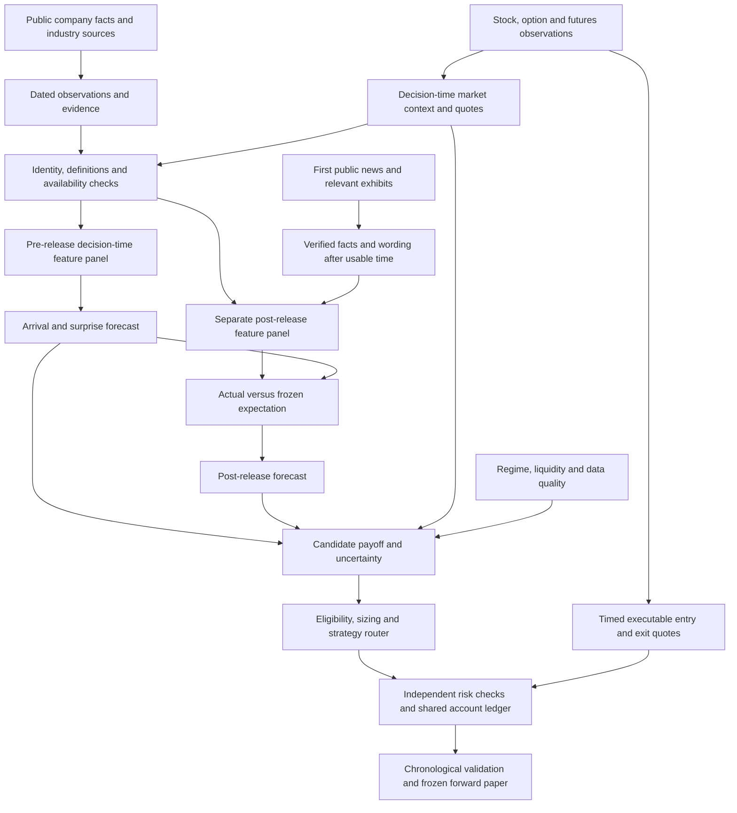

# the solution

**Project synthesis and research plan — October 3, 2026 (America/New_York).** This overview connects the repository documentation, active chats, the whiteboard explanation and the new regime/risk research. It distinguishes existing study results, local development, verified processing and proposed experiments. Documentation and chat status are changing during concurrent work; this is a dated snapshot.

Related context: [the living project discussion](https://github.com/jrile018/QuantHacks/discussions/2) and [the regime/risk research extension](https://github.com/jrile018/QuantHacks/discussions/2#discussioncomment-18737287).

## 1. What QuantHaxs is trying to solve

QuantHaxs is a **systematic trading research project in fintech and capital markets**, originating in the Gator Quant Hacks “Trade the 8-K” options study. It is developing a way to connect company financial condition, public disclosures, industry exposures and market expectations to decisions in equities, listed options and futures.

The central hypothesis is that a dated company benchmark can help estimate **economic surprise relative to what investors already expect**, and that some of this information may remain useful at a feasible trading price. That hypothesis requires testing. Company quality, favorable language, a correct event forecast and a profitable trade are different outcomes.

The whiteboard's **FDS means financial data sheets**. EDGAR supplies company disclosures and financial facts; the two general-source branches refer to collected API candidates; industry-specific URLs supply specialized context. Pharma, prepackaged software, biological products and REITs were examples from earlier research, rather than a chosen priority list. “English to math” means source-grounded facts, quantities and probabilities, with independent outcome labels.

The intended sequence is:

1. Reconstruct what was publicly available and usable at each decision.
2. Build a financial benchmark, exposure map and dated expectations for the company.
3. Before a future event, estimate arrival and content/surprise using earlier public information. Known earnings calendars and unscheduled events require different tests.
4. Compare the forecast with stock/options prices and any relevant, permitted prediction-market observations.
5. Choose an exposure only when its expected after-cost payoff and capital requirements satisfy the portfolio constraints.
6. After the first public release, read the actual facts and wording, compare them with the frozen benchmark, and evaluate a separate response or position-update policy.
7. Record feasible execution, costs, cash, positions, uncertainty and losses in one account ledger.

An issuer release can precede its 8-K. “Before the filing” therefore does not automatically mean “before public news.” A post-read model can only claim returns from the time it could actually act. [SEC Form 8-K](https://www.sec.gov/files/form8-k.pdf).

**Accepted research objective:** net portfolio growth within hard risk limits. Research includes both risk gating/sizing and automatic strategy switching, with comparisons across asset universes. Numerical limits and permission for live exposure remain unresolved.

## 2. Sectors, assets and study populations

The project's business sector is quantitative finance; its issuer coverage spans multiple economic industries. **REITs are the current detailed industry pilot**, with property REITs, commercial mortgage lenders and agency/residential mortgage investors treated differently. The broader event tracks include earnings/guidance, FDA/deals and REIT/rates.

| Population or asset family | What it represents | Boundary to preserve |
| --- | --- | --- |
| Existing options configuration | A current 100-name list used in the original study | Historical membership and survivorship need repair; it is not the full company universe |
| Original CFO study | 34 events, 89 event/expiry groups, 4,527 dependent result rows | More contract/strategy rows do not create more independent events |
| SEC source catalog | 1,630 CIKs and a broad accession/URL inventory | Cataloged URLs are not downloaded, verified documents or usable option coverage |
| REIT expansion | Validated U.S.-listed REITs in batches, with dated membership and related entities | The 53-CIK SIC screen is a candidate screen, not a validated tradable cohort |
| Equity and listed-option books | Issuer-level market outcomes and specified contracts | Prices, quotes, deliverables, borrow and calendars need dated evidence |
| Futures research | ES/MES first, with rates and energy/metals in the wider research scope | Standalone profit and portfolio hedge benefit are separate tests |

January 2024 onward is the accepted primary evaluation scope in the related plans; earlier history is still needed for opening balances, prior company facts and market-state warm-up. Broader loan relationships may include non-REIT counterparties. A shared company name or correlation alone does not establish an economic exposure.

## 3. How the project is being built

### Feature matrix: the shared input layer

**Where it belongs:** after source evidence is dated and checked, before forecasting. Think of it as a company's information snapshot at a particular decision: financial condition, industry exposure, relevant market expectations and explicit missing values. The company benchmark uses this snapshot; forecasts, later outcomes and portfolio profits are separate records.

The implementation plan already included the feature matrix, but its producer-to-consumer path needed an explicit explanation. **Benchmark owns the existing matrix and financial observations; Post Benchmark owns the canonical decision-time FeaturePanel, registry and evaluator.** The other chats contribute qualified industry, text and numerical observations through their reviewed boundaries. The regime/risk layer consumes qualified inputs and evaluated forecasts, with separate sizing/execution gates.

| Layer | What it does | What it does not yet establish |
| --- | --- | --- |
| Benchmark producer | One wide row per `(CIK, decision timestamp, horizon, matrix feature version)`, plus long cell provenance | Historical execution availability or portfolio profitability |
| Reviewed observation adapter | Preserves producer IDs, definitions, units, source hashes and usable clocks; maps to canonical decisions | Equivalence between differently named sources without a pinned mapping |
| Post Benchmark FeaturePanel | Produces features, lineage and missing reasons per `decision_id`, using its typed registry and availability rules | A forecast, target or executable fill |
| Forecast and economic evaluation | Tests matched baselines/challengers; then costs, risk and cash consequences | An edge from merely adding more columns |

Benchmark's basic selector uses facts publicly released strictly before the decision and valid at that decision. Its public/retrieved/valid clocks are useful provenance, but retrieval does not gate that selector and it lacks receipt/processing fields. **The canonical consumer must enforce actual usable times or an explicitly registered replay assumption.** Unknown clocks stay unknown; missing values stay missing. Matrix versions and individual feature-definition versions remain distinct.

The native financial readiness exporter takes long observations from Benchmark's bridge into source-hash-locked canonical code; it does **not** import the wide `matrix.csv`. Its `sec-native-xbrl` registry, the general consumer's `sec_as_filed`, and the separate bundle importer's `benchmark_native_as_filed` identify distinct routes. Each accepted capsule must name its chosen route and pin the exact source/feature/definition mapping and registry hash. A producer smoke or fixture diagnostic does not establish general financial handoff acceptance.

**Why this placement helps:** it preserves an auditable frozen information set, lets models compare the same eligible opportunities, and keeps a correct prediction separate from an attractive trade. Pre-release panels cannot receive future filing text. Post-release panels use that text only after a separately evidenced usable time. Labels and training-fold transformations stay separate; scheduled issuer rows include dates without later news.

**Grill-me iterations:** source inspection resolved four branches—row identity, direct CSV versus canonical observations, public versus usable clocks, and whether optional features should block the pilot. The resulting sequence is a small qualified baseline first, then separately test industry, OCR/text, prediction markets, geometry and regime additions on matched eligible rows. More cells/horizons do not create independent events. The existing expectations-card plan provides a readable company/decision view with freshness, lineage and exclusions.

Implementation detail and acceptance checks are recorded in `docs/coordination/feature-matrix-integration.md`. Benchmark's existing `docs/feature-matrix-readiness.md` documents the producer; Post Benchmark's `research_validation/features.py` and registry remain canonical. These are local managed-checkout implementations, not a claim of merged code or a completed costed backtest.

### Extraction and experimental models

The original Python/notebook study collects event/option observations and calculates six strategy families: synthetic stock, long call, covered call, protective put, collar and cash-secured put. Its daily marks and per-event capital helpers are useful diagnostics, but do not form an executable portfolio simulation.

New development adds modular Python source inventories, native document/XBRL extraction, targeted OCR, exact evidence spans, financial-language measurements, dated feature tables, market-label builders and evaluation tools. Raw source bytes, hashes, accession/CIK identities, parser/checkpoint versions, corrections and missingness remain reproducible. An optional Tiger/Postgres integration supports storage; a bounded database smoke run is not a deployed production platform.

Native text and tagged financial facts come first. OCR handles scanned or broken text layers. GLM-OCR supplies document transcription; FinBERT and a versioned financial dictionary supply wording measurements; a separate learner needs independent market outcomes. OCR adaptation does not teach an option-return relationship. Important financial checks include signs, scale, currency, dates, entity role, table columns and negation.

The options-learning software defines separate call/put premium changes and after-cost returns. Its current contract policy selects a shared 90–180-day expiry nearest 120 days, then calls near 105% and puts near 95% of spot, using decision-time data. Contracts remain fixed at exit. Quote clocks and receipt times are preserved; daily trade bars cannot substitute for synchronized bid/ask outcomes. These are software and experiment definitions, rather than demonstrated trading results.

**Lattice supplies experimental numerical context.** Its equity pipeline turns return correlations into distances and peer relationships, with MDS visualization. Peer selection uses the distance matrix; visualization coordinates do not currently drive that signal. The corrected matched-control study failed to demonstrate positive peer-reversion value at any of five horizons. Geometry, boundary depth and other states therefore enter as separately registered challengers. They are not an established source of alpha.

## 4. Where the active chats fit

| Exact chat title | Responsibility in the shared solution | Required handoff |
| --- | --- | --- |
| **Benchmark** | Dated company features, financial benchmarks and extraction calibration | Numeric features plus source/version/availability evidence and explicit missing reasons |
| **Benchmark pt. 2 industry spec** | Industry sources, REIT documents, typed money records and relationship histories | Dated economic exposures, entity roles, units, confidence and review status |
| **Post Benchmark** | Release/document interpretation, supervised market outcomes and cross-asset validation integration | First-public/usable clocks, verified text features, asset-specific labels and common evaluation records |
| **Assess Lattice repo fit** | Numerical market context, experimental geometry and multi-market acquisition | Versioned causal features and independently gated equity/options/futures observations |
| **Track work across project chats** | Evidence synthesis, skeptical research, grilling and the regime/risk extension | Shared assumptions, contradictions, promotion gates and dated discussion updates |

The canonical validation spine is `docs/superpowers/plans/2026-10-03-strategy-validation.md`. The modular build schedule is `docs/superpowers/plans/2026-10-03-parallel-8k-validation-and-learning.md`. The new research extension is `docs/research/2026-10-03-regime-risk-and-signal-optimization.md`.

The industry branch uses `docs/superpowers/plans/2026-10-03-reit-scale-parallel-plan.md` and the market contract in `docs/reit-market-build.md`. Its source/universe/relationship work feeds the common company benchmark; its strict arbitrage and expected-repricing experiments remain separate economic tests.

Reuse one instrument identity system, source registry, decision clock, experiment configuration, trial log, splitter and account evaluator. The A–G schedule covers decision records; independent options/equity/futures labels; company/industry features; OCR calibration; text measurements; validation/regime/risk; and optional numerical/expectations context. Asset baselines can progress independently of optional OCR adaptation, prediction markets or geometry.

The regime/risk work extends **lane F**. Numerical Lattice exports fit **lane G**. Integration owns the shared contracts and portfolio ledger; asset owners supply their instrument-specific cash flows and execution assumptions. This discussion makes those dependencies visible without transferring another chat's implementation or spending authority.

## 5. What the evidence establishes now

**Repository state:** the fresh remote `main` check returned `e1c5728c3f79ec77745e2240371283af1101909a`. The shared local branch is `codex/options-export`; it has substantial modified/untracked development, and other work continues in managed worktrees. New local modules, documents and chat milestones must not be described as merged just because they exist locally.

| Evidence level | Current finding | Limit |
| --- | --- | --- |
| Existing study artifacts | CFO event/contract results and capital diagnostics exist | Descriptive marks and synthetic stock calculations do not establish account profits |
| Independently verified bounded runtime | HiPerGator job 44620388 completed; all 25 collected artifact hashes were checked | Four native HTML documents plus one prose image; not five scanned filings, financial-table accuracy or model training |
| Verified transcription comparison | The checked prose image's 251 heading/body words matched; footer 45 was absent | A small transcription check, not broad OCR accuracy |
| Document/model readiness | Frozen wording assessments were produced; the document reports retain `not_ready` and null option forecasts | No validated option predictor or demonstrated LoRA improvement |
| Bounded REIT pilot | Four issuers, 35 documents; broader money extraction is partial; 14 selected native-text assertions passed a narrow check | Review candidates, omissions and unresolved coverage remain |
| Independent market acquisition | Exact-contract daily trade-bar files and a bounded bid/ask pilot exist | Trade bars are not executable quotes; full contract-pair coverage is still a separate gate |
| Newer local work under audit | Benchmark reports a first four-company/date matrix; Post Benchmark is reconciling expanded SEC records; Lattice reports finalized bounded purchases and an exploratory equity diagnostic | Owner reports and build artifacts require reconciliation before promotion |
| Research proposals | Prediction markets, cross-asset geometry, regime controls and strategy switching have defined tests | No project result currently proves their incremental trading value |

Historical failure logs and older “pending” sections explain how the project arrived here. Later verified receipts supersede those specific pending statements; they do not certify unrelated capabilities. Source URL checks establish limited accessibility/identity evidence, rather than the accuracy or historical availability of every financial observation.

**Newer worktree reports inspected during the reread:**

- **Benchmark:** the SEC diagnostic reports 2,092 issuer/date rows for AMT, AAT, BXMT and AGNC in 2024–2025, 838 financial states and 8,368 populated cells. It reports source-integrity checks and 95 branch tests after review fixes. This is a retrospective filing-state reconstruction using weekday 21:00 UTC decisions; it is not an exchange-session calendar, does not establish actual historical response receipts, and has no price labels or trading result.
- **Post Benchmark:** task reports describe implemented decision/source/release contracts, provenance/as-of features and typed relationships, then a bounded evaluator/trial ledger and standalone cash replay. Focused test results are documented, but a wider worktree run reported failures outside those tasks. An older progress checklist still says pending; the newer task reports establish the limited local implementation. No final holdout, real fitted model, completed protection comparison or arbitrage proof is reported. Expanded totals of 1,819 fact records and 944 filing records are later owner reports pending reconciliation.
- **Benchmark pt. 2 industry spec:** the new source-quality report describes an offline audit CLI and a retained 36-document audit, with 16 satisfying its primary-source policy and 20 requiring review. Financial accuracy, OCR/extraction fidelity and universe completeness remain unassessed by that audit. Universe/inventory builders have synthetic tests, but that new discovery lane has verified zero real securities as eligible and has not imported historical constituents. Existing four-issuer documents remain a separate bounded pilot.
- **Assess Lattice repo fit:** the latest execution document reports nine finalized bounded Databento purchases, with downloads still under verification. Two small feature packets were implemented. Its first 12-name, 6,024-observation equity diagnostic reports a 0.1327% relative forecast-error improvement for graph stability and a -0.3177% change for residual state; neither beats its simple substitute or clears the proposed practical floor, and intervals include zero. Neither packet is promoted. Risk/direct-signal measurements are uncosted mark diagnostics; futures and matched-options comparisons remain in progress and forward paper awaits historical promotion. Older acquisition notes are superseded for current order status. These are exploratory local results, not independent holdout or portfolio evidence.

These are inspected local reports, rather than fresh independent reruns of their tests or evidence that their work has merged.

The newest REIT market-build document adds a quote-first acquisition client, durable spending reservations, download-integrity checks and separate readiness gates. Its safety tests use simulated provider responses; they do not establish acquired executable REIT quotes. Strict American-option comparisons require exercise/dividend/borrow/funding and leg-risk checks; predictive repricing has different labels and horizons. Before further acquisition, the integration must reconcile the legacy order ledger, new reservations and concurrent market-data requests into one authoritative spending view. A readiness manifest records audit conclusions and cannot replace the underlying quote, timing or contamination audit.

## 6. The economic case—and what could invalidate it

The useful candidate mechanism is a **material surprise interacting with a dated issuer exposure**, potentially followed by incomplete or delayed repricing. For example, refinancing terms matter through funding costs and liquidity; an FDA decision matters through the particular product and company economics; a rate change affects different REIT balance sheets differently. Each mechanism must beat conventional financial, calendar, stock/option and macro inputs.

Five problems currently prevent a strong trading claim:

1. **Small, dependent samples.** Expand genuine decision/event coverage, preserve no-event observations and related episodes, and measure uncertainty jointly across shared market dates.
2. **Marks versus executable returns.** Use feasible prices, sizes, nonfills, fees, impact, financing, assignment and one shared account ledger.
3. **The public-information clock.** Track first release, receipt, extraction, feature completion and feasible entry. Historical latency assumptions remain explicitly hypothetical.
4. **An accurate forecast can buy an overpriced exposure.** Option premiums already charge for expected jumps and risk. Earnings research documents lower returns for some long event-risk positions despite greater movement; it does not prove every option policy fails or that selling event risk is safe. [Event-risk study](https://academic.oup.com/rof/article/29/4/963/8079062).
5. **Extra information must earn its complexity.** Add structured facts, tone, industry inputs, prediction markets and geometry separately on comparable decisions. An improvement in prediction alone is insufficient for portfolio promotion.

For one purchased option, a quote-side cash-flow calculation is multiplier × (exit bid − entry ask), less fees and additional impact/slippage. Spread is already included and must not be subtracted twice. Account growth must include cash and concurrent exposures; averaging rows normalized by premium, stock price and futures margin creates no meaningful common portfolio return.

## 7. Polymarket and Kalshi's place in the solution

Use prediction markets as an **optional expectations reference** for an exactly matched event, with rights, definitions, timestamps and quote quality checked first. “Probability of an EPS beat,” “FDA approval for a specific indication,” “deal completion by a deadline” and “a particular rate decision” are not interchangeable probabilities that an 8-K will be good.

Evidence is mixed. An earnings working-paper version reports information beyond analyst expectations, while another study's accessible abstract reports equity returns leading later odds updates. A Federal Reserve study supports testing macro forecasts but does not validate issuer-specific REIT returns. These comparisons have different benchmarks and do not establish executable options alpha. [Earnings paper record](https://papers.ssrn.com/sol3/papers.cfm?abstract_id=5933475), [stock/odds study abstract](https://papers.ssrn.com/sol3/papers.cfm?abstract_id=7324239), [Federal Reserve paper](https://www.federalreserve.gov/econres/feds/files/2026010pap.pdf).

The plan covers all three tracks: earnings/guidance, FDA/deals and REIT/rates. Confirm permitted collection/storage/use and actual historical coverage; retain timestamped observations; produce readable expectation cards; compare otherwise identical baselines with and without odds; allow trading influence only after useful frozen-holdout improvement after costs and within risk limits. Missing or ambiguous market coverage stays missing. Shared macro odds are not independent issuer evidence, and market prices need calibration before being treated as physical probabilities.

## 8. New regime detection, risk and signal-optimization plan

### Economic rationale

A regime layer can improve decisions if changing volatility, funding, liquidity or exposure alters expected payoff or loss capacity. It can also overfit a small sample, respond too late or add costly turnover. Research into regime allocation and volatility management supports testing the idea, with contrary evidence about real-time instability. It does not establish an HMM or volatility rule for these event options. [Regime allocation research](https://files.stlouisfed.org/files/htdocs/wp/2005/2005-002.pdf), [real-time volatility-management comparison](https://www.lehigh.edu/~xuy219/research/COWY.pdf).

Separate **market/macro state, issuer financial state, event stage, instrument execution conditions and data/model quality**. Start with observable continuous measures; test filtered probabilistic states and causal change alarms as challengers. Retrospective smoothed states cannot supply historical decisions. A change alarm detects evidence of change rather than predicting the next crisis. [Online change-point framework](https://arxiv.org/pdf/0710.3742).

### Work sequence and outputs

| Phase | Concrete work | Evidence required to proceed |
| --- | --- | --- |
| **A. Freeze contracts and assumptions** | Register clocks, event denominators, exposures, cash-flow units, costs, uncertainty and trial IDs using the existing validation spine | Reproducible source/quote/label eligibility; unresolved assumptions visible |
| **B. Build economic examples** | Work through earnings/guidance, FDA/deals, distinct REIT balance sheets and ES/MES profit/hedge cases | Payoff, funding and loss channels reconcile before complex modeling |
| **C. Test forecast conditioning** | Compare the same forecast with and without continuous state, then filtered-state/change features | Chronological incremental forecast value on matching decisions; no future-state or preprocessing leakage |
| **D. Test decision controls and switching** | Freeze forecasts; compare basic constraints, continuous controls, filtered-state or causal change-detector controls, and a finite strategy router including cash | Improvement survives uncertainty, switching costs and joint capital/liquidity constraints |
| **E. Evaluate and freeze** | Use development-only model/profile selection, one untouched final holdout and measured forward paper observations | Useful net-growth evidence and risk compliance; no promotion of an inconclusive result |

The policy comparison is **P0 basic constraints → P1 continuous controls → P2 preregistered filtered-state or causal change-detector challenger → P3 finite strategy routing**. Forecasts stay fixed for this policy comparison. Change alarms respond to observed innovations or run-length evidence; they do not forecast crisis arrival. P3 receives an independent final risk check. Develop all challengers without using final-test results to tune the next one. Compare forecast changes separately from sizing/routing changes so the source of any benefit is identifiable.

Risk profiles should be compared within each instrument book and then jointly. An illustrative defensive/balanced/active comparison uses 0.5×B, B and 1.5×B risk intensity; **B is unresolved and these are not approved limits**. Instrument permissions are a separate axis. Higher activity never overrides a hard cap. Avoid an unrestricted combination search across every model, profile, universe and exit.

The latest Lattice extension narrows its initial study to a 63-session lookback, at most six added scalar predictors, 22 primary cells and up to six preselected ablations. These belong in the same trial registry as regime/risk choices; new comparisons must not silently multiply that search or reopen a final test. Proposed promotion floors and capital caps remain specifications to settle.

Equities need borrow/financing and corporate-action treatment; purchased options need premium and nonlinear stock/IV/time scenarios; short options additionally need assignment and collateral; futures need contract multipliers, lifecycle/roll rules, collateral and variation cash flows. Futures margin is not maximum loss. Stress the combined positions under gaps, correlated news, volatility/skew changes, liquidity withdrawal and funding demands. Greeks describe local sensitivities; large jumps require contract repricing. Stops and drawdown responses do not guarantee an execution price or a loss ceiling. [OCC disclosure](https://www.theocc.com/company-information/documents-and-archives/options-disclosure-document), [CME margin explanation](https://www.cmegroup.com/education/courses/introduction-to-futures/margin-know-what-is-needed.html).

### Validation discipline

Use chronological, event-grouped development splits; purge overlapping outcomes; train preprocessing and state models only on available past data; admit labels only once mature; preserve shared calendar dependence when resampling. Compare full eligible coverage and covered subsets separately. Track every selected or discarded experiment. Report net account growth, drawdown, tail loss, liquidity/cash usage, concentration and turnover alongside forecast scores.

Do not infer an independent futures event each time one market observation is joined to another CIK. ES/MES outcomes need one market-level decision/position, with company information aggregated causally. Rates and commodity hedges need actual issuer exposure and basis risk. Strict arbitrage requires executable matched cash flows; expected convergence remains a risk-bearing forecast.

### Grilling decisions still open

Accepted: net growth within hard limits; both gating/sizing and automatic switching in research; comparison of profiles across asset universes. Pending: numeric loss/drawdown/cash limits, short-option/leverage/overnight permissions, exact daily clock, a minimum useful improvement and evaluation precision. The current interview also asks whether a family can receive zero capital if it lacks credible after-cost edge, and whether switching should lose trading authority if it fails simpler controls. Those questions have not been answered and no answer is assumed.

## 9. What success would look like

The next deliverable is a reproducible decision about whether a defined information block or control adds useful value: dated evidence → frozen expectation → feasible exposure → shared account outcome → independent comparison.

Advance when the improvement is practically useful, uncertainty is informative, the result survives reasonable cost/risk stress and the forward protocol confirms the system can obtain and process the inputs in time. Reject or redesign when gains rely on future knowledge, unrealizable fills, hindsight regimes, duplicated observations or a few selected episodes. Missing precision is an inconclusive result.

The current work supports continuing a bounded validation program. It does **not** yet demonstrate profitability, a reliable pre-release lead, a trained option predictor, an improved OCR adapter or a deployable regime-switching portfolio. This overview and its plan are the common context for testing those claims.

## Architecture coordination update — 2026-10-04 UTC

The user now authorizes the active project chats to communicate and reconcile their architecture continuously. This expands the earlier monitor-only scope. Four owner packets have been received, and scoped peer handoffs have begun. The coordination contract is saved locally at `docs/coordination/architecture-contract.md`; runtime contracts remain in Post Benchmark's declared integration checkout. Local documents and implementation are not automatically merged GitHub state.

### How the work fits together

| Workstream | Producer responsibility | Shared handoff |
|---|---|---|
| **Benchmark** | Original financial/native facts, general API context, numeric evidence and issuer/security reconciliation | Evidence-backed observations with explicit availability, units and feature versions |
| **Benchmark pt. 2 industry spec** | Industry/loan/relationship history, dated REIT universe, market acquisition and quote QA | Reviewed economic context, instrument definitions, quarantine and one spending gate |
| **Post Benchmark** | Documents/wording, canonical records/registry/clocks, consumer adapters and evaluator | One accepted integration capsule and class-specific readiness report |
| **Assess Lattice repo fit** | Numerical/context hypotheses, market-specific targets and matched comparisons | Versioned causal features, opportunity/rejection ledgers and diagnostic prediction packets |
| **Track work across project chats** | Reconciliation, dependency/decision record and GitHub context | Boundary decisions and independently verified status |

The user now explicitly assigns this chat as orchestrator, with Post Benchmark owning shared integration acceptance and peers negotiating their actual dependencies directly. All four owners have acknowledged that coordination approach, with current unqualified inputs restricted to diagnostics. Individual artifact acceptance is version-specific and tracked separately.

**Pipeline:** retained evidence → reviewed availability/identity adapters → canonical observations and decision records → causal features → simple baselines and context/Lattice challengers → matched forecast evaluation → separately registered regime/risk policies → instrument-specific execution replay and portfolio ledger.

The existing strategy-validation plan is the canonical research spine. Existing source owners retain their files. Producers adapt to that spine; there is one shared registry/evaluator rather than one per chat. Benchmark's locked exporter is a producer-side readiness smoke; Post Benchmark owns the central consumer adapter and integrated run.

### The compatibility rules that matter

1. **Keep experiment clocks and units explicit.** The issuer grid is 15:30 New York; the completed equity-close diagnostic is 16:00; futures diagnostics use 09:30 with their own sessions and sampled quote intervals. Adjusted-close fractional returns, points divided by prior risk and portfolio cash returns remain distinct. Combining them requires a registered causal adapter and matched information sets.
2. **Preserve the information clock.** Publication, actual receipt, retrieval, processing, effective date and assumed historical replay availability are separate. Original-accounting accuracy does not establish earlier public availability. Later filings cannot become earlier predictors.
3. **Qualify identity and source versions.** CIK and ticker text do not prove a dated security, option deliverable or futures contract. Retain raw hashes and exact spans. Source conflicts/quarantine, ambiguous mapping and missing outcomes propagate to consumer exclusions.
4. **Map definitions through reviewed adapters.** The present native adapter covers four instant entity-scope USD GAAP facts. Loans, commitments, proceeds, flows, FFO/AFFO, relationship roles, sentiment and geometry need their own registered definitions. Trustee/agent roles do not establish lender exposure.
5. **Use one paid reservation gate.** Industry and Lattice must reconcile existing stores/jobs and adopt the same atomic root ledger before parallel paid submissions. Until acceptance is verified, submissions remain serialized. Existing compute offload and spending limits stay in force.

### Communication and integration sequence

A producer sends an immutable packet: schema/protocol, source/checkout fingerprints, input/output hashes, identity/grain, clocks, units, exclusions and affected consumers. The consumer checks a small fixture and returns **accepted**, **accepted for diagnostics only** or **rejected** with evidence. The coordinator records the decision. Only the owning chat changes source/shared definitions, then publishes a new version and rechecks affected dependents.

Peers message at handoffs, breaking changes, failed gates and shared resource conflicts. They copy consequential decisions back to the coordinator. The existing 30-minute monitor now performs scoped follow-up and remains quiet on unchanged work; no repeated all-to-all status prompts.

The first incremental integration is a separately registered **2024-development-only close-to-next-close descriptive equity packet** from Lattice into Post Benchmark's thin canonical consumer adapter. The actual three-row fixture, pinned manifest, 18-row candidate/rejection ledger and three paired forecasts have now been imported by Post Benchmark for diagnostics only; exact consumer receipt checks are tracked separately. This handoff does not qualify 15:30 financial predictors or equity executions. The thin diagnostic consumer is now implemented and owner-reported exercised; an accepted costed portfolio capsule remains pending. Both 2024 and 2025 have been inspected by Lattice and cannot be relabeled an untouched shared final test.

Next come the native financial/source-clock adapter, reviewed industry observations, dated instrument/actions and class-specific market records. Each passes independently, so an unrelated incomplete lane need not prevent an eligible research comparison.

### What “ready to backtest” will mean

- **Diagnostic replay:** reproducible joins and coverage/exclusion reports; zero eligible trades may be the correct output.
- **Forecast comparison:** historically eligible features/outcomes, the same opportunities for all comparators, event-aware uncertainty and a frozen development protocol.
- **Executable portfolio backtest:** suitable quotes/fill assumptions, spreads/slippage/fees, capacity, cash/collateral/margin and the applicable corporate-action, expiry/assignment/delivery/roll/borrow/financing lifecycle. Hedging requires a funded portfolio-plus-hedge comparator.

The deliverable is one exact run capsule: command, source/environment, pinned input and protocol versions, outputs, gate results and risk/cost assumptions. Options, futures, equities, strict arbitrage and predicted repricing qualify separately. Current runtime infrastructure and descriptive studies do not establish executable profits. Numerical risk limits/instrument permissions and final-test access retain their existing decision gates.

The [living progress discussion](https://github.com/jrile018/QuantHacks/discussions/2) records accepted and verified milestones. The grill interview continues one decision at a time; its local capture is `docs/grill-sessions/2026-10-03-cross-chat-coordination.md`.

## ICM, Graphify and grill decisions — 2026-10-04 UTC

The architecture now has a small routing entry at `docs/coordination/CONTEXT.md`, five object cards, a first-backtest process and a change-impact index. The manually curated ICM boundary map has **25 concepts and 32 typed links**, with 42 source/contract/consumer fingerprints. An independent cold-walk checked routing, ownership, fingerprints and direct/transitive impacts; stale milestone and unit-check notes were corrected. This map is separate from the automatically extracted code graph.

Actual [Graphify](https://github.com/Graphify-Labs/graphify) ran on `home-pc`, in detached tmux with the shared compute lock, two threads and a 4 GB limit. The pinned code-only build (`graphifyy0.9.75`) scanned **73 Python files** across the shared root and two managed checkouts. Its native graph contains **940 nodes and 2,309 links**; output hashes and link endpoints were independently checked. `SOURCE_MAP.json`, `BUILD_RECEIPT.json`, the graph/report/HTML and an immutable archive are under `.planning/graphs`.

Treat it as an **archived source snapshot**. Three validation files changed afterward: the runner, conditional equity diagnostic and peer diagnostic consumer. Three inferred cross-checkout links remain unresolved; AST name matches do not prove runtime wiring. The native report summarizes 2,275 unique endpoint pairs; the JSON retains 2,309 individual relation records. Independent projection checks reconcile those counts. Refresh affected boundaries after settled edits, rather than rebuilding continuously. Code graphs also do not establish the economic relationships or signal value of a financial network.

### Decisions from the grill interview

1. **First delivery: a small validated slice with realistic costs, then expand.** Diagnostic fixtures are intermediate handoffs. Asset universes retain separate eligibility and economic gates.
2. **A valid eligible after-cost comparison may complete with explicit no trade**, followed by research targeted at the observed weakness. Missing clocks, quotes or eligible observations remain insufficient data; they are not proof of no edge.

The first thin peer integrations now have versioned owner receipts: Lattice's three opportunities/18 candidate rows/three paired forecasts are descriptive diagnostics; industry's three sample rows preserve source semantics and quarantine but have zero canonical joins and unknown availability. These do not establish executable returns. The Lattice/industry capsule hashes and the industry structural review were independently checked. Broader original-source evidence and class-specific economic acceptance remain distinct.

A concrete evaluator defect was reproduced: matching target name/horizon could admit the wrong return unit. Post Benchmark added a two-sided expected/label-unit guard; the exact revised source fingerprint is recorded, and the owner reports independent review cleared with focused tests; a hash-verified review receipt now records the independent reviewer's observations, including 30 focused tests; its raw console log was not retained. Legacy fixtures missing units cannot qualify a canonical experiment. This shows how the communication loop works: map a boundary, test a counterexample, route the correction to its owner, then publish a versioned acceptance record.

### Next integration work

Post Benchmark retains the single registry/evaluator and costed run capsule. Benchmark consumes the broker's original filings once and supplies reconciled financial/clock evidence. Industry supplies dated definitions/actions/quotes with quarantine retained, and owns the shared spending guard; legacy buyer adoption is still pending. Lattice supplies finite, registered diagnostic components, including separately authorized longer horizons, without duplicating central fits or reopening exposed final-test data. Prediction-market inputs remain optional planned research across earnings/guidance, FDA/deals and REIT/rates; no live adapter or verified incremental edge is implied.

Remaining promotion boundaries include causal first-public evidence, dated instrument identity, quote/fill/cost coverage, a frozen forecast-to-order policy, class-specific lifecycle and joint capital/risk rules. Local disk is constrained; large data moves directly to the remote host and compact verified receipts return. The 30-minute monitor now follows this map, coordinates changed dependencies only, and distinguishes delivered, diagnostics accepted, economically qualified, runtime validated and merged state. The integration goal remains a reproducible costed decision, including an honest no-trade finding. An insufficient-data report is useful intermediate work and does not fulfill that economic milestone.

## Autonomous context-carrying continuations — 2026-10-04

The user authorizes the orchestrator to recognize when a new chat is useful and continue approved project work from past Markdown context without routine supervision. The existing owners continue their current work. A new chat is appropriate for a ready separately scoped approved phase/dependency or recovery at a verified idle checkpoint; length or silence alone is not a reason to replace a healthy chat.

Before dispatch, the coordinator prepares a focused handoff: objective and authority, exact parent/owner/checkout/files, read order for project and lane.md plans/state, source/config/input/output/acceptance hashes, completed and failed experiments, pending jobs, unresolved eligibility/clock/cost/risk gates, concrete next actions and completion criteria. Past context is carried through authoritative pointers and state, with unknowns and negative results retained.

The policy and template live in docs/coordination/continuation-policy.md and continuation-handoff-template.md; continuations.json and the existing monitor state record creation intent, IDs and ownership. Current active work is checked before dispatch. Pending or unknown creation outcomes are resolved before any retry, so an incomplete chat list cannot trigger duplicate creation. For an idle managed-checkout continuation, a same-directory fork preserves its checkout/history; new independent project work uses the saved local QuantHaxs project. No new chat is created simply by enabling the policy.

The existing30-minute monitor applies the policy, follows startup and consumer acceptance, and reports material progress or required human input. It preserves existing purchase/risk/instrument/final-test permissions and the remote-compute/resource limits. Approved negative findings may close a research task; missing eligible inputs still cannot fulfill the first validated costed economic milestone.

## Skill routing, capacity and pilot priorities — 2026-10-04 UTC

The installed/cached skill audit found **444 definitions with 298 distinct names**. These include versions and copies; they are not 444 active skills. Full-body automated inventory/hash checks cover all five skill/cache roots; bounded semantic review concentrated on methods used by this project. Relevant methods belong in each lane, and loading every unrelated connector/design/marketing skill is unnecessary.

The shared guide `docs/coordination/skills-usage.md` was delivered to all six participants active at the initial audit checkpoint: Benchmark, Benchmark pt. 2 industry spec, Post Benchmark, Assess Lattice repo fit, Organize Benchmark Data Push, and Research Sharpe confidence intervals. Five have acknowledged their profile/workflow or were observed declaring its adoption; one natural-checkpoint acknowledgement remains pending. This records delivery/adoption evidence, not optimality or validated economic results.

The main corrections are actual Codex tool/model names instead of legacy Claude examples; inherited settings for full-history forks; one owned planning workflow; Post's root planning-file ownership; focused meaningful verification; and remote heavy work under the shared lock. No global settings/models/plugins were changed and no savings percentage is claimed. Local remote-compute/grill-me definitions remain absent; the human SSH rule and documented public grill fallback remain usable. Audit/catalog and conditional future-chat prompt: `docs/coordination/skill-audit-20261004/`.

**No additional chat is recommended for the first costed milestone now.** Current owners and their helpers cover the critical dependencies. A future lane needs a ready approved unowned task, immutable handoff and named consumer. Pending jobs, human gates or an unsettled interface do not become ready through another chat.

Directly read human messages in the Sharpe-chat interview selected **post-release information value** and **finish bounded work, then focus on the pilot**, and requested results for **USD1,000,000 hypothetical starting capital**. The coordinator's shared prioritization register is `docs/coordination/first-pilot-decision-register.md`; Sharpe owns its interview/research addendum. Finish bounded commitments, then agree one event family, one public signal, a feasible equity entry/exit, realistic costs and a matched baseline. Financial context can be empty for a separately qualified smaller text/market subset; optional unknown financial clocks must not block that subset. Disclose provisional sizing/exposure and report net P&L, Sharpe uncertainty when meaningful, trade win rate, drawdown, trade count, costs and baseline increment from a regular net account-equity ledger. Starting cash does not authorize live capital, risk limits or scaling diagnostic marks into portfolio returns. Daily/next-session and historical proof before paper are retained as relayed human choices. These choices do not yet constitute a frozen trading policy or production proof. Expansion layers and engine migration remain later decisions, without cancelling bounded in-flight work.

**Settled financial producer:** Benchmark's local clean commit `83eea30db9db13f00c6e10828aa775e16c4cf940` and the exact completion/readiness document hashes were independently checked. The documents record V7's 396 tests with zero skips/all phase exits zero and V8's nine sections/295 rehashed files; these are recorded producer execution evidence, not reruns by this coordinator. The portable packet is recorded at SHA-256 `fd39baea32a63349eabb4e043e4710a38add56e14ad55d0bd3650d6f6a7a2dc1`. Native audit scope is 45 originals; peer scope is 37 and is a separate proof role. The earlier Post consumer run reported 28 focused tests, exit 0, 110 output hashes, 109 input bindings and eight proof roles, accepting three descriptive AMT groups. The final capsule, manifest and guide hashes plus six compact raw receipt/log/mapping files now match independently. They record 690 tests, zero skips, exit 0 and a 196-file tested source freeze. The descriptive native consumer/disabled namespace milestone is complete; this coordinator did not rerun tests or rehash all 196 files. These are scoped descriptive adapter results, with zero canonical/gold eligible observations, and cannot produce portfolio P&L. Canonical historical feature/economic qualification remains pending; earliest-public status remains unknown and eligibility false. This is a local producer milestone, with no merge or executable-return claim. The five declared financial source fingerprints were refreshed against the settled checkout: universe_audit.py drift remains explicit; the original Graphify snapshot is retained.

Post's independently hash-checked English-feature research packet defines **50 proposed disabled features and zero computed features**, with train-only fitting and separate anticipation/reaction views. It is a reviewed plan, not an implemented text model or sample-optimal matrix. Its earlier 659-test continuation capsule had zero qualified costed targets and is distinct from Benchmark V7.

Local disk exhaustion caused Windows112/process-start failures. Owners recovered only their own hash-verified remote-backed intermediates; this audit removed one redundant 35 KB path-list. Command startup resumed, but space is still low and bulk data stays remote. A valid eligible after-cost comparison may conclude no trade; missing eligible clocks/quotes/data remains insufficient, not proof of no edge.

The next-pilot steering request to Post failed explicitly with the app's missing-active-turn-id error; delivery is not claimed. Direct human authorization and the exact handoff are saved in `docs/coordination/handoffs/post-release-pilot.md`. Existing Post jobs continue; this messaging fault does not justify a competing owner or replacement chat.

Human Q4 was directly verified: **wording-only pilot first; financial benchmark next**. The initial arm has zero mandatory financial features; it does not settle the separate financial-benchmark surprise hypothesis. A delayed-wording clock using a verified exact-version public upper bound plus registered historical latency remains a conditional method proposal. SEC acceptance alone is insufficient proof; actual unknown clocks remain unknown, and a delayed replay cannot claim the first-news response. Post owns any canonical acceptance.

A newly human-created chat, **Check remote desktop GPU access**, is included in the guide and resource coordination. It owns hardware/runtime/math feasibility, preserving numerical source owners and shared active jobs. GPU acceleration is conditional on useful verified equivalence/performance; it is not a new requirement for the small pilot. No chat was created by this orchestrator.

Current guidance coverage including the later GPU participant: seven delivered, five adoption acknowledgements/declarations, publication-guide and GPU natural checkpoints pending. No further chat is recommended for the first costed milestone.

<!-- quant-progress-dashboard:start -->
## Progress, goals and the route to the first backtest — 2026-10-04

The overall goal is an event-driven company/industry research system with validated after-cost portfolio comparisons. Current first milestone: one frozen **post-release wording equity pilot**, followed by the financial-benchmark arm and independently gated expansion.

**Critical path:** qualify exact inputs/timing and matching market dates → freeze recipe/account rules → run the costed account → assess uncertainty and review. No accepted costed account series exists yet. A valid no-trade result needs eligible after-cost evidence; missing data stays insufficient.

## Each chat's goal and progress

| Exact chat title | Goal / role | Bounded progress | Next dependency |
|---|---|---|---|
| Benchmark | Traceable company and wording inputs | Diagnostic producer **5/5 complete**;3scores/1truncated exclusion; matching2024packet in progress | Accepted exact2024text/public/model evidence and Post consumer adapter |
| Benchmark pt. 2 industry spec | Industry sources and usable market inputs | **7/7 complete** bounded producer handoff per final owner packet | Canonical consumer acceptance; overlapping equity dates, execution/actions/borrow/costs; broader history work remains open |
| Post Benchmark | Canonical acceptance and one-command account replay | Negative runner/capsule verified: **38checks**,8excluded,0orders; positive receipt adapter and252-session export active | Qualified2024inputs and reviewed real-source/execution/account acceptance |
| Assess Lattice repo fit | Full approved numerical/geometry completion, active by later human override | Continuation **3/7** per owner;45focused native cases reported;controlled study next | Fixed-target study/source qualification/review;no second account engine |
| Organize Benchmark Data Push | Source contribution/publication workflow | Intake **5/5** merged; review interview **5/5** per owner; qualified-only choice verified | Source alignment explanation and exact handoffs;no provisional performance |
| Research Sharpe confidence intervals | Honest inference on accepted account returns | Handoff **4/4**;production **0/3**;offline probe **4/4** delivered,receipt hash verified | Post integration/acceptance and qualified regular NAV before empirical inference |
| Check remote desktop GPU access | Optional math/compute throughput | Planning **5/5 complete**; implementation acceptance **0/10** | Supported runtime/access, implementation, parity and measured total speedup |
| Audit data dates and pilot gaps | P0 date/clock/coverage/acceptance audit | **5/6** per owner; storage binding and new2024candidate checks active | Final reviewed accepted/missing gate map, exact current source/restore pins |
| Push everything to the riley branch | Audited workspace backup/storage recovery | Riley1799747ref verified;6948backup-matched removals recorded;~4GBfree | Remaining held-data audit and exact remote runtime bindings |
| Track work across project chats | Reconcile interfaces, owners, decisions and accepted milestones | Architecture and continuation contracts delivered; progress instructions delivered **9/9** peers | Maintain this overview/Discussion3 and follow accepted costed capsule |

Checkpoint counts are owner reports unless explicitly independently checked. App delivery is not proof of continued skill use or consumer acceptance. The initial eight peers returned seven compact packets plus Lattice's checkpoint display. The newly active storage owner received the same instructions; its first packet is pending. Post now reports a six-checkpoint pilot; its earlier four-step display was a shorter presentation of the same bounded work.

The initial eight participating chats received the progress-bar/gsd-progress contract and showed checkpoints or returned packets. The new storage/backup owner also received it (nine peers total); its first packet is pending. Counts refer to each bounded milestone; no overall percentage or ETA is inferred. Use existing owned plans when the referenced GSD workflow is unavailable. Active helpers inherit the reporting contract; completed work is not restarted to generate status. The saved30-minute monitor now maintains these reports at changed milestones, remaining quiet when unchanged.

The hypothetical USD1m account permits equally sized eligible equity longs/shorts, maximum100% combined gross exposure and zero idle-cash yield. Actual dividend/action/borrow/collateral/cost accounting remains required. Post reports protocol v2 frozen, with acceptance/bridge pending. Human chose qualified inputs before performance; no provisional performance is authorized. Protected final test/live capital are unchanged.

**Main blockers:**2023 wording events versus2024/2024–25 scopes; exact-text publication/model-clock proof; execution/short-cost/lifecycle evidence; accepted regular net NAV. Disk exhaustion caused partial new wording files, which must be restored and verified before consumption. Bounded owner cleanup restored startup; bulk outputs stay remote. Source-intake PR4 is merged per its owner's retained readback; other local scopes are not implicitly merged. GPU planning completion has no measured speedup or economic implication.

Local living dashboard: `docs/coordination/project-progress.md`, linked from the architecture context. Audit data dates and pilot gaps owns `docs/data-date-audit/` only.
<!-- quant-progress-dashboard:end -->

<!-- minimal-backtest-active:start -->
## Keep the small integrated backtest moving — 2026-10-04

**Runnable engineering milestone:** root read the actual source/interface and verified compact receipt86c1355f: recorded38focused checks,0skips,exit0; actual8filing groups excluded,0eligible events/orders/closed episodes, economic metricsnull. The negative gate works. It is not a completed performance backtest or evidence of no edge. Root did not rerun the suite or all205source files.

**Next implementation/data boundary:** the current preflight explicitly refuses positive acceptance/qualified flags/any quotes until a validated external source/execution adapter exists. Post owns and continues that adapter, canonical acceptance, regular account marks and user-facing one-command capsule. Benchmark completed its2023diagnostic producer5/5; exact packet21d3d9f verified,3sentiment means/1truncated exclusion. Industry retained two2024release texts, and Benchmark is building the matching2024packet; source public/model/version and market/action/short/cost qualification remains pending. No synthetic/flat-cash result is promoted to historical alpha.

**Latest human priority:** continue work that actively advances the minimal backtest. Separately, the later explicit instruction 'continue the work on lattice though' keeps Lattice's full already-approved plan and healthy workers active in parallel; its2/7checkpoint and fixed-target controls are separate from Post's first run. Do not restart completed GPU work merely to keep it busy. CPU is default; shared heavy-job lock/bounds remain.

**Storage continuity:** the storage owner reports backup3/4/uploadrunning,cleanup1/3 and a verified private remote snapshot/archive manifest. Databento/Markdown retention and itsrileybranch ownership are preserved. Consumers were notified to verify original hashes and restore paths for moved non-Databento data; past runtime proofs remain past facts, while missing live paths stay unavailable until rerouted. No blanket archive/all-file verification by this coordinator is claimed.

Current research account choices remain USD1m,equal long/short eligible positions,max100%gross/no leveraged exposure,idlecash0%; costs/borrow/collateral/dividends/marks are mandatory. Qualified-inputs-before-performance choice, development2024/25 and protected-final-test restrictions remain. The saved30-minute monitor now preserves the active goal,Lattice override,healthy-owner continuation and remote evidence routing. Local completion plan: `docs/coordination/minimal-backtest-completion.md`.
<!-- minimal-backtest-active:end -->

<!-- qualified-reporting-storage:start -->
## Resolved reporting choice and current runnable checkpoint — 2026-10-04

The human directly selected **Wait for qualified inputs before reporting performance** in Organize Benchmark Data Push, message01a1060a-c9cb-7b91-9a3f-0668dbd47fae. All earlier pending-Q4 references are historical and superseded. Diagnostics/alignment repairs continue; provisional economic headlines are not authorized.

Post's actual negative-run capsule129de1147a00492838262f518b1e795d1d7514864a85cf0e283cf96caf0a536a and artifactmanifest349c958e21981c380f68003374152e379c984177e70e1dc52fe9e4e823ab95ab match root reads. The recorded38checks/8excluded/0orders remain insufficient, while Post actively builds the positive evidence adapter and cash-inclusive252-session export. Benchmark is scoring the completeFebruary2024release after source-link/hash checks. Public/model/version and execution/short/cost/account evidence still needs acceptance; no performance or no-edge claim follows.

The Sharpe offline input probe was delivered, receiptc3285a5e hashchecked; eight synthetic tests are owner/reviewer evidence, not economic returns or production-stage completion (production0/3). Source/publication review5/5 is complete per owner, current28275f75report hashchecked. Data/date audit5/6 tracks exact cohort/calendar/quote/restore mismatches; timing is not fixed by silent timestamp shifts.

Lattice remains fully active under the human's later explicit override, now3/7 per owner;45focused native tests/repairs are reported and the controlled study is next. They do not retroactively explain old Python pilot losses or establish edge. GPU planning remains complete/idle unless separately needed/requested.

Storage recovered roughly4GB. Root independently verified GitHubrefs/heads/riley=1799747cd8c1ae7d6df83f3e2e87879266183b9b. Cleanup summary8f3a90b6779446c63b3d03f2b3a1cd9065b9f034b3637c844f7b00069f146f94 records6948exact-backup-matched removals/onechangedskip and protected/held-path presence; root did not rehash every removed byte. Future source use needs the originalhash→verified private remote byte/restore binding. No coordinator cleanup or branch switch occurred. The active monitor preserves qualified-only reporting, minimal backtest continuation and the Lattice exception.
<!-- qualified-reporting-storage:end -->

